# 如何为自己的博客文章自动添加移动版本（目前仅支持博客园） 
> 原文发表于 2014-05-10, 地址: http://www.cnblogs.com/chenxizhang/archive/2014/05/10/3720166.html 

前言
==

 从2005年开始撰写第一篇技术博客，我也算是国内最早的一批技术博客作者之一了。其中中断过一段时间，但2008年重新启用之后，这个习惯一直保留到现在，目前已经累积的文章数量已经达到1226篇。这些文章绝大部分都是原创的，转载的有特别注明，文章内容大多是自己实际工作中遇到的问题和解决方案，或者我为企业做顾问服务、培训服务时解决的问题，我尤其喜欢在解决问题后做一点总结，并整理成一篇博客文章分享出来，一来是对思路的重新梳理，同时也希望也许日后能对其他人也有所帮助。

 [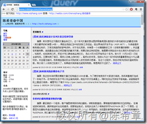](http://images.cnitblog.com/blog/9072/201405/101048248704699.png)

 这些年随着移动互联网逐渐占据主流，我也参与一些移动Web开发的实践中，有几次都想过这样一个问题：如何让这些博客文章更好地在移动设备上进行阅读呢？从技术上说，PC版本的浏览器，因为屏幕较宽，所以更加易于阅读博客文章，而同样的网页在手机上面来看，效果就会差很多。

 [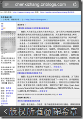](http://images.cnitblog.com/blog/9072/201405/101048281514002.png)

 大家可以看到，如果不做任何地处理，那么手机浏览器只会简单地将页面按照比例缩小。这样的结果往往就是字体很小，阅读困难。但如果像下面这样，是不是会更加好一些呢？

 

 从这些年的实践来看，我总结出来移动化Web页面应该有几个特点

 1.字体要略大一些，内容上应该要有所过滤，去除干扰元素，让用户可以专注内容

 2.布局上面要适应移动设备的宽度和高度

 3.交互方式，应该考虑到用户是用触摸，而不是用鼠标。链接和按钮要醒目。

 4.不要过多地让用户输入内容

  

 所以说，网站的移动化其实涉及到页面布局的重新设计。而可喜的是，在移动化Web 开发方面，已经有一些较好的框架。我很推荐的是jquerymobile。请参考官方的网站：

 [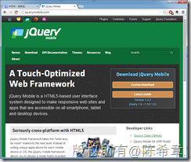](http://images.cnitblog.com/blog/9072/201405/101048326671548.png)

  

 解决方案
====

 今天早上起来花了一点时间，做了一个功能，能够直接将博客文章转换为手机的版本。使用方式是这样的：

 1. 找到你要转换的博客文章地址，例如 [http://www.cnblogs.com/chenxizhang/archive/2013/05/20/3088196.html](http://www.cnblogs.com/chenxizhang/archive/2013/05/20/3088196.html "http://www.cnblogs.com/chenxizhang/archive/2013/05/20/3088196.html") 

 在PC版浏览器看起来是下面这样的

 [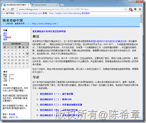](http://images.cnitblog.com/blog/9072/201405/101048357768564.png)

 2. 通过在这个地址前面添加一段前缀( <http://webfeed.azurewebsites.net/home/displayonlineblog?url>=) ,也就是说，完整的地址是：[http://webfeed.azurewebsites.net/home/displayonlineblog?url=[http://www.cnblogs.com/chenxizhang/archive/2013/05/20/3088196.html](http://www.cnblogs.com/chenxizhang/archive/2013/05/20/3088196.html "http://www.cnblogs.com/chenxizhang/archive/2013/05/20/3088196.html")](http://webfeed.azurewebsites.net/home/displayonlineblog?url=http://www.cnblogs.com/chenxizhang/archive/2013/05/20/3088196.html)。 如果有做过MVC开发的朋友一看就知道，这个是我设计的一个特别的Action。里面的功能其实也不难，就是先下载博客原文的内容，然后再结合框架进行重新格式化。

 【重要】需要注意的是，我做的这个功能，是会自动识别浏览器的，如果你仍然是用PC版浏览器打开上面提到的地址，那么看到的界面将是下面这样

 [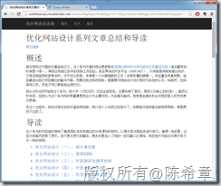](http://images.cnitblog.com/blog/9072/201405/101048383541253.png)

 但如果你真的使用移动设备，例如手机来访问，就会看到下面的效果

 [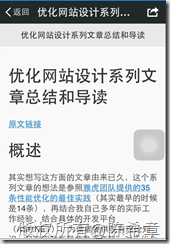](http://images.cnitblog.com/blog/9072/201405/101048400574040.png)

 值得一说的是，我并不是简单地改了部署，对其中的内容元素也会有些特殊的处理。例如针对图片，我会添加一个样式表，让他们能自动适应手机屏幕尺寸。（哪怕实际上它的宽度是很大的）。同时，对于博客文章一些内部链接（链接到博客园的任意其他文章），会自动将链接地址换成移动化版本的），细心的朋友可以从下图中看到实际上里面的链接地址是换掉了。

 [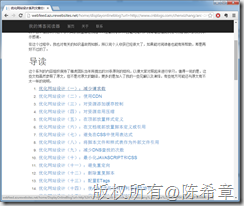](http://images.cnitblog.com/blog/9072/201405/101048412134727.png)

  

 上面说到的这个方法，很简单实用，你可以不受任何限制地使用这个地址格式，为你的博客文章自动“生成”一个移动的版本，你可以将这些链接分享给你的朋友，让他们在移动设备上面可以更好地浏览你的文章。

  

 【备注】大家可以会对webfeed.azurewebsites.net这个网站感兴趣，这是我最近的一个企业培训练习项目（大家还没有完全做完），这个网站分别演示了如何整合PC版浏览器和移动版浏览器（上面说到过了，他们会有不同的布局和交互功能），使用的技术是ASP.NET MVC 4 + jQuery Mobile + Knockoutjs 等。这个网站是托管在微软的Microsoft Azure中的，当前我使用的是免费模式，可能有时候比较慢。请见谅。

 【备注】我将一直会保留这个网站。

  

 改进的解决方案
=======

 我很快意识到，上面那个地址有点复杂，让你去每次拼接地址似乎有点麻烦。所以我想了一个办法，能不能让这些网页打开的时候，就自动地生成好移动化版本的链接呢？感谢javascript，我们能做到。

 首先，你可以进入你的博客管理后台

 [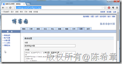](http://images.cnitblog.com/blog/9072/201405/101048424634442.png)

 你可以将下面这一段脚本引用放在任何你想要的位置

 

 例如，我是放在页面顶部的

 [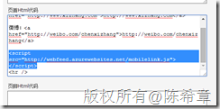](http://images.cnitblog.com/blog/9072/201405/101048432136071.png)

  

 保存设置后，在任何博客文章显示出来后，就会在顶部自动显示一个链接，如下图所示

 [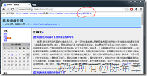](http://images.cnitblog.com/blog/9072/201405/101048442454785.png)

 【备注】你的博客首页，因为不是文章，所以实际上点击之后，不会产生具体的内容

 [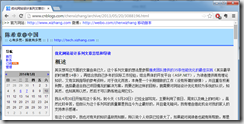](http://images.cnitblog.com/blog/9072/201405/101048449633872.png)

 如果你打开了具体的博客文章，则那个链接就会有作用了。

 [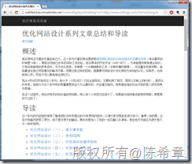](http://images.cnitblog.com/blog/9072/201405/101048467131674.png)

  

  

 顺便提一下，如果大家希望更好地搜索我所有的博客文章，可以直接访问<http://webfeed.azurewebsites.net> 

 [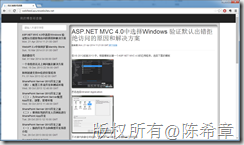](http://images.cnitblog.com/blog/9072/201405/101048493079132.png)

 在手机端访问的效果是下面这样的

 [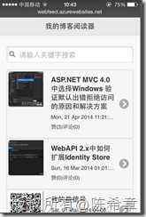](http://images.cnitblog.com/blog/9072/201405/101048512132449.png)

 这个网站甚至已经整合到了微信里面，如果有兴趣，可以添加 dev2db 这个微信公众号，直接在里面可以搜索博客文章，详情请参考下面这个文章

 [http://mp.weixin.qq.com/s?\_\_biz=MjM5ODEyNjE5OA==&mid=200117429&idx=1&sn=239ab455e80f4bfe1ac5bdeb9c94d41b#rd](http://mp.weixin.qq.com/s?__biz=MjM5ODEyNjE5OA==&mid=200117429&idx=1&sn=239ab455e80f4bfe1ac5bdeb9c94d41b#rd "http://mp.weixin.qq.com/s?__biz=MjM5ODEyNjE5OA==&mid=200117429&idx=1&sn=239ab455e80f4bfe1ac5bdeb9c94d41b#rd")

  

  

 以上，希望对大家有所帮助，抛砖引玉，如果大家有更好的做法，也欢迎分享。

