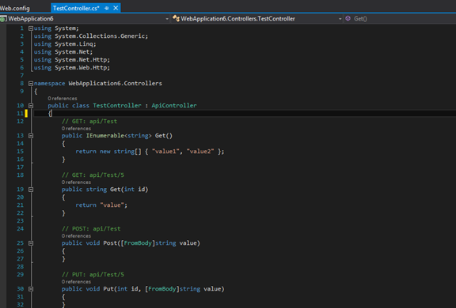
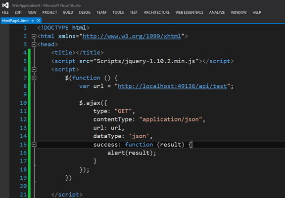
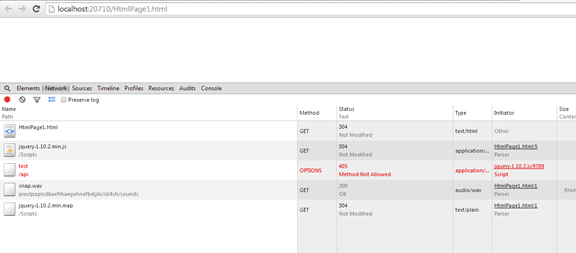
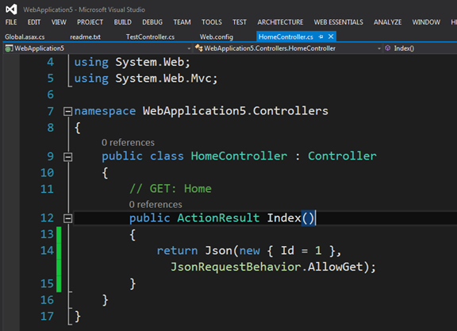

# 关于AJAX跨域调用ASP.NET MVC或者WebAPI服务的问题及解决方案 
> 原文发表于 2014-07-03, 地址: http://www.cnblogs.com/chenxizhang/archive/2014/07/03/3821703.html 

 

作者：陈希章

时间：2014-7-3

**问题描述**

当跨域（cross domain）调用ASP.NET MVC或者ASP.NET Web API编写的服务时，会发生无法访问的情况。

**重现方式**

1. 使用模板创建一个最简单的ASP.NET Web API项目，调试起来确认能正常工作

2. 创建另外一个项目，仅仅包含一个HTML页面，发起AJAX的调用

3. 在浏览器中打开这个网页，我们会发现如下的错误（405：Method Not Allowed）

 

【备注】同样的情况，也发生在ASP.NET MVC中。某些时候，MVC也可以直接用来开发服务，与WebAPI相比各有优缺点。下面是一个利用MVC开发的服务的例子

 

**原因分析**

跨域问题仅仅发生在Javascript发起AJAX调用，或者Silverlight发起服务调用时，其根本原因是因为浏览器对于这两种请求，所给予的权限是较低的，通常只允许调用本域中的资源，除非目标服务器明确地告知它允许跨域调用。

所以，跨域的问题虽然是由于浏览器的行为产生出来的，但解决的方法却是在服务端。因为不可能要求所有客户端降低安全性。

 

**解决方案**

针对ASP.NET MVC和ASP.NET Web API两种项目类型，我做了一些研究，确定下面的方案是可行的。

针对ASP.NET MVC，只需要在web.config中添加如下的内容即可

 <system.webServer>

 **<httpProtocol>**

 **<customHeaders>**

 **<add name="Access-Control-Allow-Origin" value="*" />**

 **<add name="Access-Control-Allow-Headers" value="Content-Type" />**

 **<add name="Access-Control-Allow-Methods" value="GET, POST, PUT, DELETE, OPTIONS" />**

 **</customHeaders>**

 **</httpProtocol>**

 <handlers>

 <remove name="ExtensionlessUrlHandler-Integrated-4.0" />

 <remove name="OPTIONSVerbHandler" />

 <remove name="TRACEVerbHandler" />

 <add name="ExtensionlessUrlHandler-Integrated-4.0" path="*." verb="*" type="System.Web.Handlers.TransferRequestHandler" preCondition="integratedMode,runtimeVersionv4.0" />

 </handlers>

 </system.webServer>

 

 

针对ASP.NET Web API,除了上面这样的设置，还需要添加一个特殊的设计，就是为每个APIController添加一个OPTIONS的方法，但无需返回任何东西。

 public string Options()

 {

 return null; // HTTP 200 response with empty body

 }

 

【备注】这个功能也可以进行一些研究，设计成Filter的形式可能就更好了。

