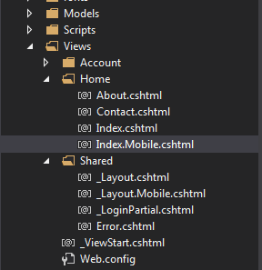
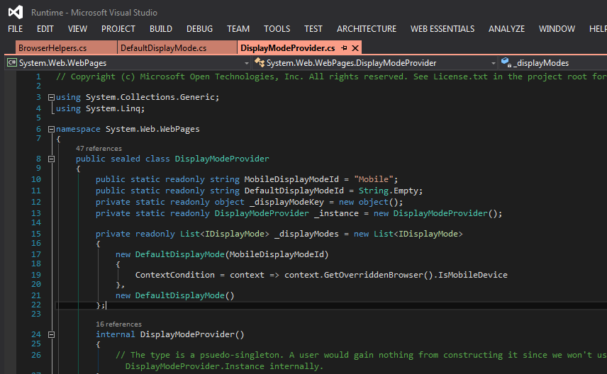
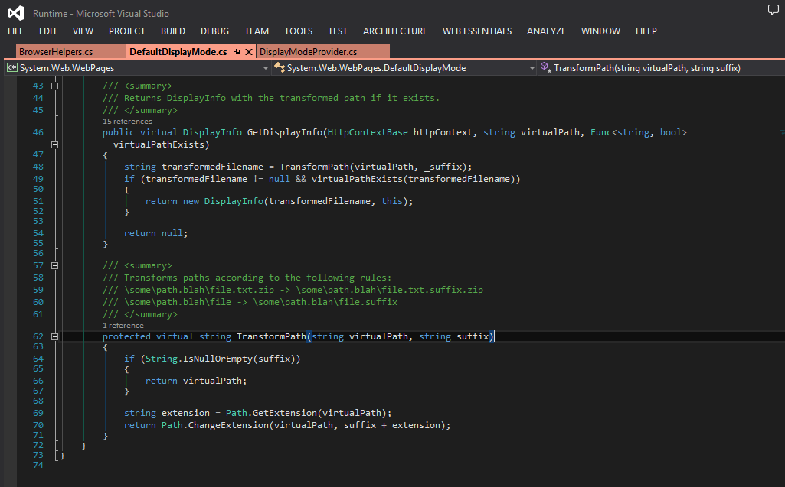
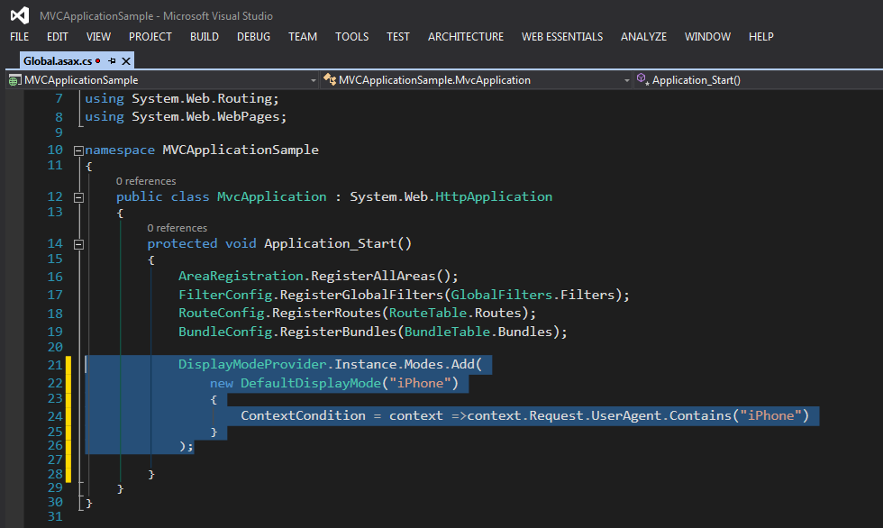
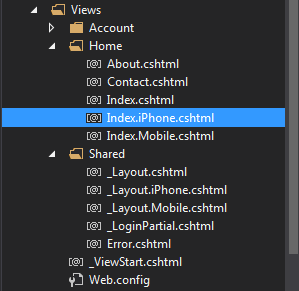

# ASP.NET MVC 4中如何为不同的浏览器自适应布局和视图 
> 原文发表于 2014-07-13, 地址: http://www.cnblogs.com/chenxizhang/archive/2014/07/13/3840733.html 

在ASP.NET MVC 4中，可以很简单地实现针对不同的浏览器自适应布局和视图。这个得归功于MVC中的"约定甚于配置"的设计理念。

默认的自适应
======

MVC 4自动地为移动设备浏览器和PC设备浏览器进行自适应。针对布局页面，默认的文件名为\_Layout.cshtml，这个默认会被所有的浏览器使用。但如果我们希望在移动设备上面，呈现一个不同的布局，只需要添加一个名称为\_Layout.Mobile.cshtml的布局页面就可以了。同样的规则，也适用于普通的视图页面。例如Index.cshtml默认是被所有的浏览器使用的，但如果添加了Index.Mobile.cshtml，则在移动设备上面，会自动使用这个新的视图进行呈现。如下图所示

那么，为什么会能够自动实现这样的功能呢？或者我们该问问，怎么样才能区分移动设备浏览器呢？其实，这个说起来是不难的

下面这个文章介绍了关于浏览器检测的一些基本概念<http://msdn.microsoft.com/zh-cn/library/x3k2ssx2(v=vs.100).aspx>

在ASP.NET MVC中，是在什么位置，通过什么样的方式来进行这个检测，并且据此进行布局或视图的选择的呢？

通过分析源代码（<http://aspnetwebstack.codeplex.com/> ），我们可以在下面的代码中发现端倪

所以，这个功能是在DisplayModeProvider这个类型中实现的。它默认注册了两个所谓的DefaultDisplayMode，其中第一个是有条件判断的，根据IsMobileDevice属性判断是不是移动设备浏览器，如果是，则使用一个固定的前缀Mobile。这个DefaultDisplayMode类型，会自动做路径的Transform。

 

自定义适应规则
=======

 

如果理解了上面的原理，我们就可以根据需要添加自己的规则。例如，我们可以为iPhone设备添加一个特定的显示模型，可以修改global.asax中的代码。

 

这样的话，只要添加下面的布局或者视图页面的话，就可以很简单地实现针对iPhone设备的呈现了。

