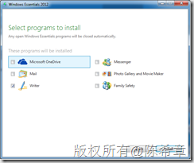
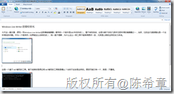
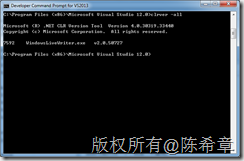
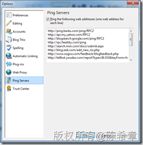
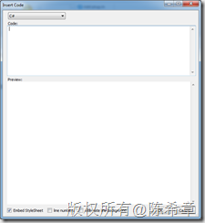

# Windows Live Writer 的昨日荣光 
> 原文发表于 2015-06-22, 地址: http://www.cnblogs.com/chenxizhang/archive/2015/06/22/4593014.html 

今天这一篇文章，想写一写Windows Live Writer这款博客编辑器（最早的一个版本是2007年发布的）。毫不夸张地说，这是为数不多的几款所见即所得的编辑器之一，当然，它的运行速度慢也是一个众所周知的问题。作为一个程序员（如果能这么自称的话），我一直不理解，为什么这么一款工具不能做得更好一些，尤其是以微软这样的实力来说。

 【备注】我的大部分博客文章都是用Windows Live Writer写成的，可以说是有很深的感情的呢

 

 

 这是一个基于.NET编写的工具。难不成微软是想证明.NET编写的工具就是慢么？当然不应该是这样的。原因可能只有一个，就是：不重视。随便举个例子，Fiddler是另外一款用.NET编写的神器，无论从用户体验，还是性能方面来说，都是一流的。

 

  

 今年的6月，有一个消息说是微软准备将这个工具开源

 [http://winsupersite.com/software-development/microsoft-open-source-windows-live-writer](http://winsupersite.com/software-development/microsoft-open-source-windows-live-writer "http://winsupersite.com/software-development/microsoft-open-source-windows-live-writer")

 我觉得这当然是不坏的消息，下面有一个网络帖子，在收集大家的签名，表示要让Windows Live Writer活下来

 [http://www.petitionbuzz.com/petitions/dontkillwlw](http://www.petitionbuzz.com/petitions/dontkillwlw "http://www.petitionbuzz.com/petitions/dontkillwlw")

 其实，如果是好产品，应该更加主动地拥抱用户，主动地改变，希望微软在这方面能做出更大的努力。开源也好，不开源也罢，这不是关键。目前也还能用，虽然是凑合。

  

 最后，我想说作为资深的用户，提示大家两点

 1. 安装完之后，可以设置一些Ping服务器，以便你的博客文章更快地通知到有关的搜索引擎或者内容网站

 [https://grafikdesign.wordpress.com/2009/11/10/pinging/](https://grafikdesign.wordpress.com/2009/11/10/pinging/ "https://grafikdesign.wordpress.com/2009/11/10/pinging/")

 

 2. 我最常用的一个插件Insert code

 [http://insertcode.codeplex.com/](http://insertcode.codeplex.com/ "http://insertcode.codeplex.com/")

 

