# 在Linux中运行Nancy应用程序 
> 原文发表于 2015-07-28, 地址: http://www.cnblogs.com/chenxizhang/archive/2015/07/28/4684260.html 


最近在研究如何将.NET应用程序移植到非Windows操作系统中运行，逐渐会写一些文章出来。目前还没有太深的研究，所以这些文章大多主要是记录我的一些实验。

 这篇文章记录了我如何利用NancyFx编写一个自托管（Self-host）的应用程序，并且将其发布到Linux系统中。

  

 什么是NancyFx？
===========

 简单地说，这真是一个神奇的框架。它给自己的定义是：lightweigh web framework for .NET。不用不知道，一用吓一跳哈

 [http://nancyfx.org/](http://nancyfx.org/ "http://nancyfx.org/")

 [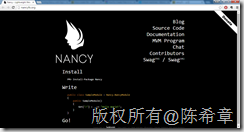](http://images0.cnblogs.com/blog/9072/201507/282031087031238.png)

 与微软官方的ASP.NET MVC或者ASP.NET Web API这种框架来比较，它确实是轻量级的。简单易用，而且基于模块化的设计，也确实有些自己的 特点。它实现了OWIN，所以可以托管在IIS，或者其他任何的程序里面。

 闲话少说，我们可以快速开发一个范例程序。

 创建一个自托管的Web应用程序
===============

 我这里使用的是Visual Studio 2013，创建了一个最简单的Console Application，命令为 ConsoleApplicationNancy 

 添加两个包的引用


```
Install-Package Nancy.Hosting.Self
Install-Package Mono.Posix
```

```
在Program.cs文件的Main方法中添加如下代码
```

```
using Mono.Unix;
using Mono.Unix.Native;
using Nancy.Hosting.Self;
using System;

namespace ConsoleApplicationNancy
{
    class Program
    {
        static void Main(string[] args)
        {
            var uri = "http://localhost:8888";
            Console.WriteLine("Nancy on :" + uri);
            var host = new NancyHost(new Uri(uri));
            host.Start();

            if (Type.GetType("Mono.Runtime") != null)
            {
                UnixSignal.WaitAny(new[]{
                   new UnixSignal(Signum.SIGINT),
                   new UnixSignal(Signum.SIGTERM),
                   new UnixSignal(Signum.SIGQUIT),
                   new UnixSignal(Signum.SIGHUP)
                });
            }
            else
            {
                Console.Read();
            }

            Console.WriteLine("Stopping Nancy");
            host.Stop();
        }
    }
}

```


.csharpcode, .csharpcode pre
{
 font-size: small;
 color: black;
 font-family: consolas, "Courier New", courier, monospace;
 background-color: #ffffff;
 /*white-space: pre;*/
}
.csharpcode pre { margin: 0em; }
.csharpcode .rem { color: #008000; }
.csharpcode .kwrd { color: #0000ff; }
.csharpcode .str { color: #006080; }
.csharpcode .op { color: #0000c0; }
.csharpcode .preproc { color: #cc6633; }
.csharpcode .asp { background-color: #ffff00; }
.csharpcode .html { color: #800000; }
.csharpcode .attr { color: #ff0000; }
.csharpcode .alt 
{
 background-color: #f4f4f4;
 width: 100%;
 margin: 0em;
}
.csharpcode .lnum { color: #606060; }


这段代码的意思是指，要在本地机器上面的8888端口启动一个NancyHost进行监听，并且如果检测到Mono运行环境的话，还要添加一些特的监听信号的功能。


接下来我们需要添加一个具体处理清楚的模块，NancyFx中的模块就是一个最普通的class文件，只要继承NancyModule就可以了。而且每个模块可以注册自己的路径解析规则。


```
using Nancy;

namespace ConsoleApplicationNancy
{
    public class HelloModule:NancyModule
    {
        public HelloModule()
        {
            Get["/"] = parameters => "Hello,Nancy......";
        }
    }
}

```

.csharpcode, .csharpcode pre
{
 font-size: small;
 color: black;
 font-family: consolas, "Courier New", courier, monospace;
 background-color: #ffffff;
 /*white-space: pre;*/
}
.csharpcode pre { margin: 0em; }
.csharpcode .rem { color: #008000; }
.csharpcode .kwrd { color: #0000ff; }
.csharpcode .str { color: #006080; }
.csharpcode .op { color: #0000c0; }
.csharpcode .preproc { color: #cc6633; }
.csharpcode .asp { background-color: #ffff00; }
.csharpcode .html { color: #800000; }
.csharpcode .attr { color: #ff0000; }
.csharpcode .alt 
{
 background-color: #f4f4f4;
 width: 100%;
 margin: 0em;
}
.csharpcode .lnum { color: #606060; }

 


现在就可以按下F5进行调试了。请注意，要将VisualStudio用管理员身份打开，因为这里涉及到了端口监听。


[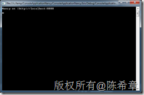](http://images0.cnblogs.com/blog/9072/201507/282031095782337.png)


[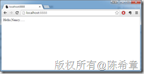](http://images0.cnblogs.com/blog/9072/201507/282031105311179.png)


很神奇的，不是吗？ 如果我们希望这个程序可以在非Windows操作系统（如Linux）中运行，是不是更有意思呢？


 


在Linux中运行Nancy应用程序
==================


我这里做实验用的是Ubuntu 15.04 LTS。


[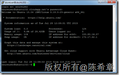](http://images0.cnblogs.com/blog/9072/201507/282031115478235.png)


 


为了在Linux中运行.NET的应用程序，目前需要首先安装Mono（很佩服这个项目组）。目前微软自己也在开发.NET Core，但还没有全部完成。


使用下面的命令可以很方便地安装mono（一句一句地执行）


```
sudo apt-key adv --keyserver keyserver.ubuntu.com --recv-keys 3FA7E0328081BFF6A14DA29AA6A19B38D3D831EF
echo "deb http://download.mono-project.com/repo/debian wheezy main" | sudo tee /etc/apt/sources.list.d/mono-xamarin.list
sudo apt-get update
sudo apt-get install mono-complete
```

通过mono –V 可以查看当前安装的mono的版本


[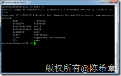](http://images0.cnblogs.com/blog/9072/201507/282031125943348.png)


 


接下来就是要将我们编译好的程序上传到我的服务器上面去了


首先，我在服务器上面创建了一个目录 /var/www/nancydemo，并且分配了必要的权限（可写入，可执行）


然后通过winSCP这个工具，将编译结果上传到该目录


[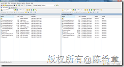](http://images0.cnblogs.com/blog/9072/201507/282031143287018.png)


[](http://images0.cnblogs.com/blog/9072/201507/282031155168088.png)


通过mono ConsoleApplicationNancy.exe 这样的指令就可以基于mono框架启动我们的应用程序了


[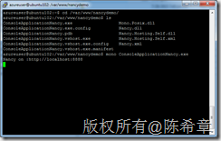](http://images0.cnblogs.com/blog/9072/201507/282031167193387.png)


然后，我们就可以通过以下的方式进行访问了


[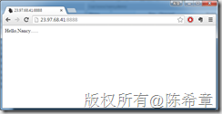](http://images0.cnblogs.com/blog/9072/201507/282031175632730.png)


看起来确实很不错，不是吗？没想到.NET应用程序可以这么简单地迁移到Linux中来运行吧？这个得感谢mono。没想到网站可以这么容易编写吧？这个得好好研究Nancy啊


不过，这样启动应用程序有一个问题，就是只要我的控制台被关闭，那么网站也就关闭了。有没有什么办法让这个程序一直运行呢？


[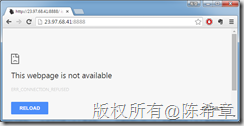](http://images0.cnblogs.com/blog/9072/201507/282031187667029.png)


使用supervisor将这个程序一直在后台执行
========================


首先，使用下面的命令安装supervisor


```
apt-get install supervisor
```

```
创建一个配置文件 /etc/supervisor/conf.d/nancydemo.conf  
```

```
在文件中输入如下的内容，并保存
```

```
[program:nancydemo]
command=mono ConsoleApplicationNancy.exe  -d
user=www-data
stderr_logfile = /var/log/supervisor/nancydemo-err.log
stdout_logfile = /var/log/supervisor/nancydemo-stdout.log
directory=/var/www/nancydemo/
```

然后，使用下面的命令切换到supervisor命令行


[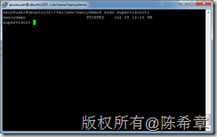](http://images0.cnblogs.com/blog/9072/201507/282031196106371.png)


最后，启动nancydemo这个应用程序吧


[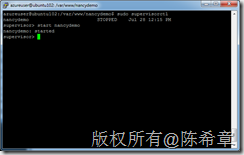](http://images0.cnblogs.com/blog/9072/201507/282031205476686.png)


这样的话，就算我们的控制台被关闭了，网站将一直在后台运行


[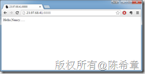](http://images0.cnblogs.com/blog/9072/201507/282031219066470.png)


 


如果什么时候想要停止nancydemo这个应用，可以使用下面的方式


[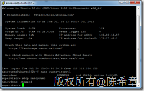](http://images0.cnblogs.com/blog/9072/201507/282031227971799.png)

