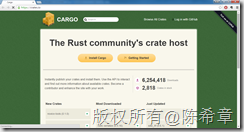
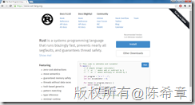
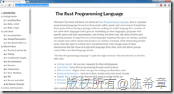
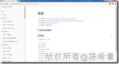

# Rust初步（一）：介绍 
> 原文发表于 2015-08-18, 地址: http://www.cnblogs.com/chenxizhang/archive/2015/08/18/4739105.html 

最近在研究Rust这个新的语言。那么Rust是什么呢？

 
>  Rust是一个注重安全与速度的**现代系统编程语言**，通过在**没有垃圾回收**的情况下**保证内存安全**来实现它的目标，这使它成为一个在很多其它语言不适合的用例中大展身手的语言：嵌入到其它语言中，在特定的时间和空间要求下编程，和编写底层代码，例如设备驱动和操作系统。它通过一系列的**不产生运行时开销**的编译时安全检查来提升目前语言所关注的领域，同时消除一切数据竞争。Rust同时也意在实现“零开销抽象”，即便在这些抽象看起来比较像一个高级语言的特性。即便如此，Rust也允许你像一个底层语言那样进行精确的控制。
> 
> 

 Rust的核心卖点是：

 1. **效率高**（目标是超越C++，逼近C），这得益于它的“没有垃圾回收机制”，“没有运行时”
2. **内存安全**，这似乎和上面这一点相悖，但他声称做到了。还没有机会看代码，不知道他是怎么做到的。
3. **开源**+社区支持 [https://github.com/rust-lang/rust](https://github.com/rust-lang/rust "https://github.com/rust-lang/rust") ，生态平台 [https://crates.io/](https://crates.io/ "https://crates.io/")

  

 Rust有一定的学习曲线（不是很容易学），不过值得一试

  

 官方网站：[https://www.rust-lang.org/](https://www.rust-lang.org/ "https://www.rust-lang.org/")

 

 官方社区 [https://crates.io/](https://crates.io/ "https://crates.io/")

 

  

 中文的社区 [http://rust.cc/](http://rust.cc/ "http://rust.cc/")

 

  

 官方的文档 [https://doc.rust-lang.org/stable/book/](https://doc.rust-lang.org/stable/book/ "https://doc.rust-lang.org/stable/book/")

 

 中文的文档，有几本，但下面这本最好

 [http://kaisery.gitbooks.io/rust-book-chinese/content/](http://kaisery.gitbooks.io/rust-book-chinese/content/ "http://kaisery.gitbooks.io/rust-book-chinese/content/")

 

