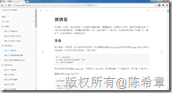
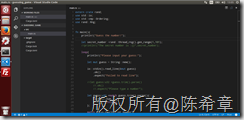
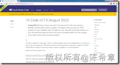
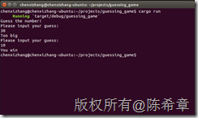
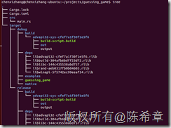
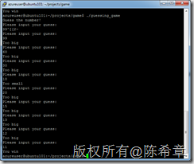
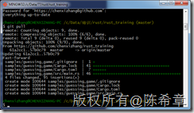
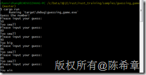
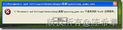

# Rust初步（二）：使用Visual Studio Code编写Rust程序（猜猜看游戏） 
> 原文发表于 2015-08-18, 地址: http://www.cnblogs.com/chenxizhang/archive/2015/08/18/4739535.html 

我是照着下面这篇帮助文档,完成了第一个完整的Rust程序: 猜猜看 游戏

 [http://kaisery.gitbooks.io/rust-book-chinese/content/content/3.1.Guessing%20Game%20%E7%8C%9C%E7%8C%9C%E7%9C%8B.html](http://kaisery.gitbooks.io/rust-book-chinese/content/content/3.1.Guessing%20Game%20%E7%8C%9C%E7%8C%9C%E7%9C%8B.html "http://kaisery.gitbooks.io/rust-book-chinese/content/content/3.1.Guessing%20Game%20%E7%8C%9C%E7%8C%9C%E7%9C%8B.html")

 

  

 我采用的开发工具是Visual Studio Code, 这应该是目前能找到的最"所见即所得"的编辑器了, 尤其对于我们这种重度Windows依赖症患者来说.

 不过需要提出的是,我是在Ubuntu中安装的Visual Studio Code进行开发。这得感谢微软最近一年多来的努力，Visual Studio正式支持Windows,Linux,Mac等不同平台了

 

 Visual Studio Code还在继续完善中，希望以后会更加方便吧

 

 

 运行起来的效果如下

 

  

 需要指出的是，Rust程序是不需要运行时（Runtime）的，也就是说，只有在开发的机器上面需要安装Rust及相关工具（其实主要是三个工具rustc ,cargo ,rustdoc），在目标运行的机器上面，是可以直接运行的。通过cargo build命令可以生成我们需要的二进制代码文件

 

 事实上我们只需要将guessing\_game这个可执行文件，复制到其他的机器就可以直接运行

 

 但需要注意的是，不同平台的可执行文件需要在对应的平台编译。也就是说，在Linux中编译的Rust程序，只能在Linux中运行。看起来还不是很完美，对吗？不能真正实现“一次编写，处处运行”吗？但其实这个问题很容易解决，如果你需要在Windows平台编译，只需要下载代码，运行相应的编译命令即可。

 例如，我做的这个猜猜看游戏，代码上传到了 

 [https://github.com/chenxizhang/rust\_training](https://github.com/chenxizhang/rust_training "https://github.com/chenxizhang/rust_training")

  

 你可以用git工具下载这些代码

 

 然后，在Windows中也可以很简单地运行下面这样的命令进行编译和运行

 cargo build

 cargo run

 

  

 需要注意的是，目前Windows XP及以下的版本是不支持rust编译出来的程序的（至少是有各种问题的），尝试运行上面编译出来的程序会遇到下面的错误

 

