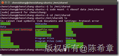

# 在Linux客户机与Windows宿主机之间建立共享（VitrualBox） 
> 原文发表于 2015-08-18, 地址: http://www.cnblogs.com/chenxizhang/archive/2015/08/18/4740521.html 

VirtualBox中，如果客户机和宿主机都是Windows的话，共享相对是比较方便的。一般是通过[\\vboxsvr\shared](file://\\vboxsvr\shared) 这样的路径访问即可。

 但是如果客户机是Linux的话，就略微麻烦一点（当然掌握了之后也很好理解）

  

 第一步：安装VirtualBox Additioanl Tools
=================================

 

  

 第二步：设置共享目录
==========

 

  

 第三步：创建一个特殊的设备目录（可选）
===================

 

 第四步：将共享目录mount（挂）到该设备目录
=======================

 **sudo mount –t vboxsf data /mnt/shared**

 这样就可以象访问本地目录一样访问共享目录了

 

