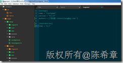
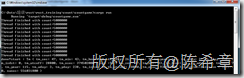
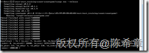
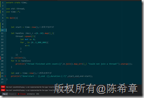
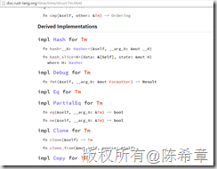
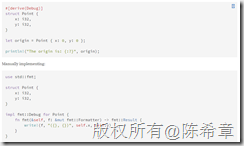
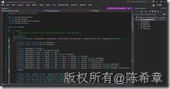

# Rust初步（四）：在rust中处理时间 
> 原文发表于 2015-08-26, 地址: http://www.cnblogs.com/chenxizhang/archive/2015/08/26/4760087.html 


这个看起来是一个很小的问题，我们如果是在.NET里面的话，很简单地可以直接使用System.DateTime.Now获取到当前时间，还可以进行各种不同的计算或者输出。但是这样一个问题，在rust里面，还是费了我一些时间的。当然，我觉得这种折腾也是有些益处的，从中可以更好地理解rust的一些内部原理。

 首先来看一下怎么做吧

 rust默认自带的std库，里面并没有针对时间的功能，如果我们要处理时间（获取当前时间，或者计算两个时间的间隔等等）的话，需要引入一个额外的库，名称就叫time

 [http://doc.rust-lang.org/time/time/index.html](http://doc.rust-lang.org/time/time/index.html "http://doc.rust-lang.org/time/time/index.html") 

 [](http://images0.cnblogs.com/blog/9072/201508/261304403599862.png)

  

 我们要做的是修改Cargo.toml文件

 [](http://images0.cnblogs.com/blog/9072/201508/261304416872836.png)

 然后，在需要使用这个功能的具体代码文件（rs）中，通过下面的语句导入这个库

 extern **crate** time; //crate是一个很重要的概念，类似于是package（包）的概念

 rust有一个对应的crate.io的网站，就是可以给全世界的rust开发人员，搜索或者发布crate的地方

 [](http://images0.cnblogs.com/blog/9072/201508/261304424227693.png)

  

 然后使用use语句，完成类型导入

 use time::*;

  

 常用的几个方法如下

 time::now()，获取当前完整时间，包括日期

 time::get\_time()，仅获取当前时间

  

 下面有一个实例，我为了统计某段代码运行的效率，在执行之前，获取了当前的时间，在执行完之后，再次获取当前的时间，然后两者的差就是耗时。


```
extern crate time;

use std::thread;
use time::*;

fn main(){

    
    let start = time::now();//获取开始时间

    let handles :Vec<\_> =(0..10).map(|\_|{
        thread::spawn(||{
            let mut x= 0;
            for \_ in (0..5\_000\_000){
                x+=1
            }
            x
        })
    }).collect();
    for h in handles{
        println!("Thread finished with count={}",h.join().map\_err(|\_| "Could not join a thread!").unwrap());
    }

    let end = time::now();//获取结束时间
    println!("done!start : {:?},end :{:?},duration:{:?}",start,end,end-start);
}

```

.csharpcode, .csharpcode pre
{
 font-size: small;
 color: black;
 font-family: consolas, "Courier New", courier, monospace;
 background-color: #ffffff;
 /*white-space: pre;*/
}
.csharpcode pre { margin: 0em; }
.csharpcode .rem { color: #008000; }
.csharpcode .kwrd { color: #0000ff; }
.csharpcode .str { color: #006080; }
.csharpcode .op { color: #0000c0; }
.csharpcode .preproc { color: #cc6633; }
.csharpcode .asp { background-color: #ffff00; }
.csharpcode .html { color: #800000; }
.csharpcode .attr { color: #ff0000; }
.csharpcode .alt 
{
 background-color: #f4f4f4;
 width: 100%;
 margin: 0em;
}
.csharpcode .lnum { color: #606060; }

最后运行的效果是这样的


[](http://images0.cnblogs.com/blog/9072/201508/261304441099008.png)


这个程序在debug模式下运行约需要0.55秒（nanos，是指纳秒，1纳秒=0.000 000 001秒）


[](http://images0.cnblogs.com/blog/9072/201508/261304450004680.png)


在release下面运行约需要0.001秒（相当于是1毫秒）


由这里可以看出，rust程序在debug模式和release模式的性能是差别很大的


 


需要指出的一个地方是下面这句代码中的红色部分


println!("done!start : **{:?},**end :**{:?}**,duration:{:?}",start,end,end-start); 


通常来说，我们在向屏幕打印的时候，会用{} 这样的占位符，但是我在之前这样用的时候，发现无法编译通过。（事实上，是 linter-rust 这个插件帮助我们检查出来的语法错误，关于linter-rust及插件机制，有兴趣可以参考 [http://www.cnblogs.com/chenxizhang/p/4759921.html](http://www.cnblogs.com/chenxizhang/p/4759921.html "http://www.cnblogs.com/chenxizhang/p/4759921.html")）


[](http://images0.cnblogs.com/blog/9072/201508/261304456875524.png)


这句话的意思是说time:Tm这个结构体（struct）没有实现fmt:: Display这个方法。我们去 [http://doc.rust-lang.org/time/time/struct.Tm.html](http://doc.rust-lang.org/time/time/struct.Tm.html "http://doc.rust-lang.org/time/time/struct.Tm.html") 这里看，确实是没有实现Display


[](http://images0.cnblogs.com/blog/9072/201508/261304463129881.png)


但是它实现了Debug这个方法。这个其实也是可以用来做输出的。只不过，它要求的占位符是 {:?} 


[](http://images0.cnblogs.com/blog/9072/201508/261304494066426.png)


有两种实现形式


[](http://images0.cnblogs.com/blog/9072/201508/261304531727044.png)


 


这让我陷入一定的思考。其实这个概念很类似于C#中所有类型的ToString方法。只不过C#中，因为所有类型都是继承自Object的，而Object的ToString方法有一个默认的实现（输出类型的完整限定名）。在特定的类型里面，我们会选择重写ToString方法实现自定义的输出。


这里有两个小疑问，我后续会再看看，抽时间写出来


1.怎么实现扩展方法？


2.能否继承并重写这个方法？


 


另外，想到DateTime，其实在C#里面，也是一个结构体（Struct），并不是元类型（Primitive Type）


[](http://images0.cnblogs.com/blog/9072/201508/261305008901636.png)

