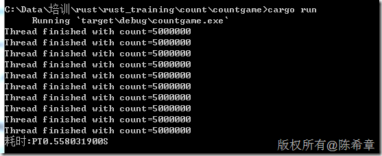
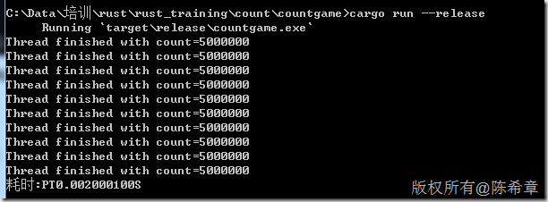
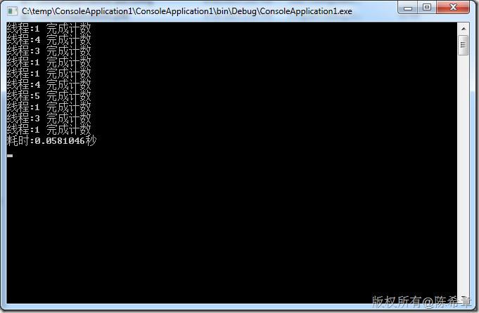
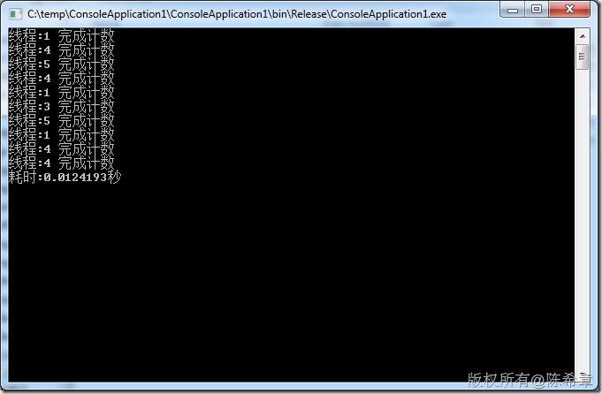
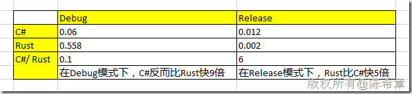

# Rust初步（五）：Rust与C#性能比较 
> 原文发表于 2015-08-26, 地址: http://www.cnblogs.com/chenxizhang/archive/2015/08/26/4760172.html 


我学习Rust的目的并不是说期望用它来取代掉现有的开发平台或语言。相反，我认为当前绝大部分研发团队，都不可能只用一个平台或者一个语言。

 当组织增长，他们越来越依赖大量的编程语言。不同的编程语言有不同的能力和弱点，而一个多语言栈让你在某个特定的编程语言的优点起作用的时候能使用它，当它有缺陷时使用其他编程语言。

 Rust 主要擅长的领域是：数值计算和线程。

 我下面用一个实例来比较一下Rust和C#的性能方面表现。这个实例很简单，我们准备开启10个线程，然后在每个线程里面运行一个数值累加的工作任务（500万次。

 注意，以下测试的耗时，可能在各位的电脑上面会因为配置的不同而不同。我的配置如下

 [](http://images0.cnblogs.com/blog/9072/201508/261344532032800.png)

 Rust的程序
=======


```
extern crate time;

use std::thread;
use time::*;

fn main(){


    let start = time::now();//获取开始时间

    let handles :Vec<\_> =(0..10).map(|\_|{
        thread::spawn(||{
            let mut x= 0;
            for \_ in (0..5\_000\_000){
                x+=1
            }
            x
        })
    }).collect();
    for h in handles{
        println!("Thread finished with count={}",h.join().map\_err(|\_| "Could not join a thread!").unwrap());
    }

    let end = time::now();//获取结束时间
    let duration = end - start;

    println!("耗时:{}",duration);
}

```

 


需要注意的是，为了做耗时统计，我们采用了time这个crate，如果有不清楚，请参考我之前的文章：
.csharpcode, .csharpcode pre
{
 font-size: small;
 color: black;
 font-family: consolas, "Courier New", courier, monospace;
 background-color: #ffffff;
 /*white-space: pre;*/
}
.csharpcode pre { margin: 0em; }
.csharpcode .rem { color: #008000; }
.csharpcode .kwrd { color: #0000ff; }
.csharpcode .str { color: #006080; }
.csharpcode .op { color: #0000c0; }
.csharpcode .preproc { color: #cc6633; }
.csharpcode .asp { background-color: #ffff00; }
.csharpcode .html { color: #800000; }
.csharpcode .attr { color: #ff0000; }
.csharpcode .alt 
{
 background-color: #f4f4f4;
 width: 100%;
 margin: 0em;
}
.csharpcode .lnum { color: #606060; }


#### [Rust初步（四）：在rust中处理时间](http://www.cnblogs.com/chenxizhang/p/4760087.html)


 


这个程序，在debug模式下运行的耗时大约是 0.55秒


[](http://images0.cnblogs.com/blog/9072/201508/261344568758687.png)


在release模式下运行的耗时大约是 0.002秒


[](http://images0.cnblogs.com/blog/9072/201508/261345116877214.png)


 


C#的程序：
======


```
using System;
using System.Threading.Tasks;
using System.Diagnostics;
using System.Threading;


namespace ConsoleApplication1
{
    class Program
    {
        static void Main(string[] args)
        {

            Stopwatch watch = new Stopwatch();
            watch.Start();

            Parallel.For(0, 10, i =>
            {
                var x = 0;
                for (int j = 0;  j< 5000000; j++)
                {
                    x += 1;
                }
                Console.WriteLine("线程:{0} 完成计数",Thread.CurrentThread.ManagedThreadId);
            });


            watch.Stop();
            Console.WriteLine("耗时:{0}秒", watch.Elapsed.TotalSeconds);
            Console.Read();
        }
    }
}

```

.csharpcode, .csharpcode pre
{
 font-size: small;
 color: black;
 font-family: consolas, "Courier New", courier, monospace;
 background-color: #ffffff;
 /*white-space: pre;*/
}
.csharpcode pre { margin: 0em; }
.csharpcode .rem { color: #008000; }
.csharpcode .kwrd { color: #0000ff; }
.csharpcode .str { color: #006080; }
.csharpcode .op { color: #0000c0; }
.csharpcode .preproc { color: #cc6633; }
.csharpcode .asp { background-color: #ffff00; }
.csharpcode .html { color: #800000; }
.csharpcode .attr { color: #ff0000; }
.csharpcode .alt 
{
 background-color: #f4f4f4;
 width: 100%;
 margin: 0em;
}
.csharpcode .lnum { color: #606060; }

 


在Debug模式下面运行的耗时约为0.06秒


[](http://images0.cnblogs.com/blog/9072/201508/261345494537984.png)


在Release模式下运行的耗时约为0.012秒


[](http://images0.cnblogs.com/blog/9072/201508/261346047654597.png)


 


汇总下来比较的结果如下


[](http://images0.cnblogs.com/blog/9072/201508/261346172035262.png)


应该说C#新版本中对多线程管理是有了很大的提升的（包括语法很简化）。在Release模式下还是比较慢，是因为Rust是没有运行时的，而C#是要经过CLR运行的。


不过，在Debug模式下，居然C#大幅度胜出了，我感到很意外。从数值上来说，只能说Rust在Debug模式下很慢（可能做了很多事情？）

