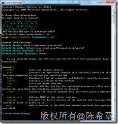
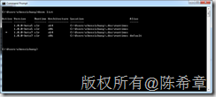
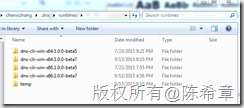
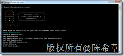
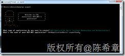
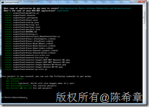
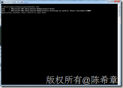
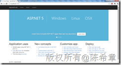
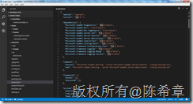

# 使用VS Code开发ASP.NET 5 应用程序 
> 原文发表于 2015-09-13, 地址: http://www.cnblogs.com/chenxizhang/archive/2015/09/13/4805616.html 


本文简要地翻译了 [https://code.visualstudio.com/Docs/runtimes/ASPnet5](https://code.visualstudio.com/Docs/runtimes/ASPnet5 "https://code.visualstudio.com/Docs/runtimes/ASPnet5") 并结合我的实践做了一些说明。

 准备工作
====

 1.安装VS Code  [https://code.visualstudio.com/](https://code.visualstudio.com/ "https://code.visualstudio.com/") 

 2.安装NODEJS  [https://nodejs.org/en/](https://nodejs.org/en/ "https://nodejs.org/en/") 

  

 安装DNVM
======

 DNVM的全称是.NET Version Manager，它是用于对新一代的ASP.NET进行支持的一个基础工具，已经支持跨平台（Windows，Linux，Mac）。

 [https://github.com/aspnet/home#upgrading-dnvm-or-running-without-visual-studio](https://github.com/aspnet/home#upgrading-dnvm-or-running-without-visual-studio "https://github.com/aspnet/home#upgrading-dnvm-or-running-without-visual-studio")

 在Windows下面运行cmd，然后执行下面的命令


```
@powershell -NoProfile -ExecutionPolicy unrestricted -Command "&{$Branch='dev';iex ((new-object net.webclient).DownloadString('https://raw.githubusercontent.com/aspnet/Home/dev/dnvminstall.ps1'))}"
```

```
为了检验是否安装成功，可以执行dnvm试试看，如果看到下面这样的输出，则表示你的安装是成功的
```

```
[](http://images2015.cnblogs.com/blog/9072/201509/9072-20150913210320309-888476103.png)
```

```
接下来安装必要的运行时（runtime）。dnvm就是用来管理不同的运行时的。目前支持两种不同类型得到runtime，一种是传统的.NET CLR，一种是精简版的CLR，目前微软定义的名称是CoreClr
```

这个coreclr完全开源了，请参考 [https://github.com/dotnet/coreclr](https://github.com/dotnet/coreclr "https://github.com/dotnet/coreclr")


你可以使用下面的命令安装最新版的运行时（需要动态下载，可能需要一定的时间）


dnvm install latest -arch x64 -r clr  安装64位的最新版的clr运行时（目前是4.5.1）


dnvm install latest -arch x64 -r coreclr  安装64位的最新版的coreclr运行时


 


安装成功后，可以使用如下的命令查看到所有的运行时


[](http://images2015.cnblogs.com/blog/9072/201509/9072-20150913210323715-1877889334.png)


在下面的目录中，也可以看到对应的文件


[](http://images2015.cnblogs.com/blog/9072/201509/9072-20150913210325856-1693868415.png)


 


安装必要的一些工具来生成ASP.NET 5的应用程序
==========================


```
npm install -g yo grunt-cli generator-aspnet bower
```

这个命令是使用npm这个包管理器，安装了一系列的nodejs模块，如果你目前对他们还了解不多，请直接忽略他们。以后再研究。


 


接下来就可以使用yo 这个工具，生成ASP.NET 5的应用程序了


输入 ：yo aspnet


[](http://images2015.cnblogs.com/blog/9072/201509/9072-20150913210328012-540726115.png)


选择“Web Application Basic (Without Membership and authorization） ”，回车后，为他取一个名字，例如aspnet5web


[](http://images2015.cnblogs.com/blog/9072/201509/9072-20150913210331215-503888882.png)


很快就生成好了一个应用程序（实际上应该是一个模板生成的过程）


[](http://images2015.cnblogs.com/blog/9072/201509/9072-20150913210334247-808873819.png)


然后，我们要依次执行下面的命令


cd aspnet5web


dnu restore（这个命令是用来为项目加载依赖的包的，从nuget网站）


 


运行这个项目
======


在cmd中运行dnx web 即可启用这个项目


[](http://images2015.cnblogs.com/blog/9072/201509/9072-20150913210336981-232398949.png)


默认情况下，这个网站是在5000这个端口进行监听的，所以在浏览器中打开<http://localhost:5000>可以看到下面的效果


[](http://images2015.cnblogs.com/blog/9072/201509/9072-20150913210342512-439337962.png)


 


使用VS Code打开项目
=============


在命令行中输入code .  


[](http://images2015.cnblogs.com/blog/9072/201509/9072-20150913210349544-1257906058.png)


这是一个我们熟悉又陌生的ASP.NET MVC项目，说熟悉，是因为它的基本项目结构我们还是比较了解的。说陌生，其实这个项目跟以前的MVC项目是有本质区别的，它是完全基于OWIN的，同时有很多脚本方面的特殊功能。据说视图语法也不一样了，我们找时间再研究研究吧


园子里面有“汤姆大叔”写了一个系列


[http://www.cnblogs.com/TomXu/p/4496545.html](http://www.cnblogs.com/TomXu/p/4496545.html "http://www.cnblogs.com/TomXu/p/4496545.html")

