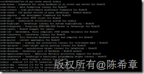
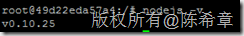
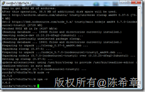
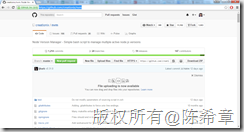

# 在Linux（ubuntu server）上面安装NodeJS的正确姿势 
> 原文发表于 2016-02-27, 地址: http://www.cnblogs.com/chenxizhang/archive/2016/02/27/5222918.html 


#### 上一篇文章，我介绍了 [在Windows中安装NodeJS的正确姿势](http://www.cnblogs.com/chenxizhang/p/5222410.html)，这一篇，我们继续来看一下在Linux上面安装和配置NodeJS。

 为了保持一致，这里也列举三个方法

 第一个方法：通过官网下载安装
==============

 [https://nodejs.org/en/download/](https://nodejs.org/en/download/ "https://nodejs.org/en/download/")

 [](http://images2015.cnblogs.com/blog/9072/201602/9072-20160227145447693-1785830721.png)

 这种方式的问题是我们需要自己去找网页，找到链接，然后下载

  

 第二个方法：使用apt工具进行安装
=================

  

 默认情况下，在apt的源中只有比较老的版本（注意，需要先apt-get update)

 [](http://images2015.cnblogs.com/blog/9072/201602/9072-20160227145450990-150777013.png)

 例如，如果运行apt-get install nodejs，安装完之后，需要用Nodejs -v查看版本，（请注意，不是node -v）

 [](http://images2015.cnblogs.com/blog/9072/201602/9072-20160227145453333-2135418229.png)

 这显然不是很让人高兴的一个事情（版本老，而且使用的方式都不一样）

 令人疑惑的是另外一个包，nodejs-legacy，安装完后，版本号也是0.10.25，但是运行方式则是node，而不是nodejs

 而nodejs-dev，使用的方式跟Nodejs是一样的，版本也是0.10.25

  

 所以关键的问题在于，apt的源里面没有最新的nodejs 这个package，那么怎么办呢？

 [https://nodejs.org/en/download/package-manager/#debian-and-ubuntu-based-linux-distributions](https://nodejs.org/en/download/package-manager/#debian-and-ubuntu-based-linux-distributions "https://nodejs.org/en/download/package-manager/#debian-and-ubuntu-based-linux-distributions") 这里提供了解决方法，node自己提供了源

 如果要安装5.x版本，那么可以运行下面两行命令


```
curl -sL https://deb.nodesource.com/setup_5.x | sudo -E bash -
sudo apt-get install -y nodejs
```

[](http://images2015.cnblogs.com/blog/9072/201602/9072-20160227145456161-1652133713.png)


 


第三个方法：使用nvm进行安装和管理
==================


在ubuntu中安装nvm的方法有点特别，需要下载源代码，然后运行Install.sh


[](http://images2015.cnblogs.com/blog/9072/201602/9072-20160227145503099-1346619502.png)


可以用如下的一句命令完成最新版的安装（注意，github'上面安装说明是0.31这个版本的，但我想最好是能不要依赖这种具体的版本号，所以稍作了修改，可以每次都安装最新版本）


git clone <https://github.com/chenxizhang/nvm.git> && ./nvm/install.sh && . ~/.nvm/nvm.sh  && rm –rf ./nvm


 


 


总结：
===


目前来说，我仍然是推荐第三种方法。当然，我更加希望apt工具能更加简单地安装到最新版本。

