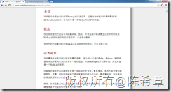
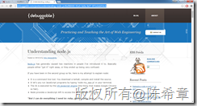

# 最好的简明NodeJS学习材料 
> 原文发表于 2016-03-21, 地址: http://www.cnblogs.com/chenxizhang/archive/2016/03/21/5303936.html 

[http://www.nodebeginner.org/index-zh-cn.html](http://www.nodebeginner.org/index-zh-cn.html "http://www.nodebeginner.org/index-zh-cn.html")

 

 [http://debuggable.com/posts/understanding-node-js:4bd98440-45e4-4a9a-8ef7-0f7ecbdd56cb](http://debuggable.com/posts/understanding-node-js:4bd98440-45e4-4a9a-8ef7-0f7ecbdd56cb "http://debuggable.com/posts/understanding-node-js:4bd98440-45e4-4a9a-8ef7-0f7ecbdd56cb")

 

