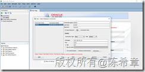
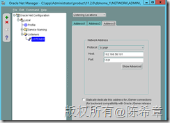
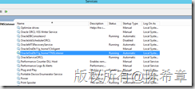

# 解决Oracle SQL Developer无法连接远程服务器的问题 
> 原文发表于 2016-04-19, 地址: http://www.cnblogs.com/chenxizhang/archive/2016/04/19/5410102.html 

在使用Oracle SQL Developer连接远程服务器的时候，出现如下的错误

 

 在服务器本地是可以正常连接的。这个让人想起来，跟SQL Server的一些设计有些类似，服务器估计默认只在本地监听，不允许远程访问的，这是为了提高安全性。

 解决的方法是，添加一个监听地址

 

 然后，重启服务

 

