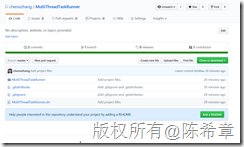
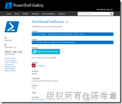
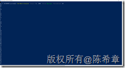

# 发布支持多线程的PowerShell模块 —— MultiThreadTaskRunner 
> 原文发表于 2017-06-03, 地址: http://www.cnblogs.com/chenxizhang/archive/2017/06/03/6936666.html 

应用场景
----

 多线程在需要批量处理一些任务的时候相当有用，也更加有利于充分利用现有计算机的能力。所有主流的开发语言都支持多线程。

 默认情况下，PowerShell作为一个脚本语言，是不支持多线程操作的，虽然有所谓的后台任务，但实际上控制起来相当麻烦。

  

 解决方案
----

 我很喜欢PowerShell，所以为此专门写了一个自定义的模块，来实现多线程的功能。该模块使用C#编写，源代码可以在下面的地址访问到

 [https://github.com/chenxizhang/MultiThreadTaskRunner](https://github.com/chenxizhang/MultiThreadTaskRunner "https://github.com/chenxizhang/MultiThreadTaskRunner")

 

  

 与此同时，这个模块已经打包发布到微软官方的PowerShell Gallery中

 [https://www.powershellgallery.com/packages/MultiThreadTaskRunner/1.0](https://www.powershellgallery.com/packages/MultiThreadTaskRunner/1.0 "https://www.powershellgallery.com/packages/MultiThreadTaskRunner/1.0")

 

  

 如何使用
----

 要使用该模块，首先需要进行安装（请用管理员身份打开PowerSehll）

 `Install-Module -Name MultiThreadTaskRunner`  ##### 

 ##### 接下来，准备一个用来测试的脚本块

 $script ={

 param($obj);

 Write-Host $obj

 }

 请注意，这里只是用最简单的代码做了实现，根据传入的一个参数，输出数据

  

 第三步，就可以进行快速使用了

 New-MultiTaskJob –Source 1..100 –Block $script –ThreadCount 10

 这个命令的意思是指，用10个并行的线程，处理传入的100个数字，实际上每个线程分配得到的数字是10个，然后使用此前定义好的脚本块执行它

 

 请注意，你可以看到此时输出的结果并不是按照1到100的顺序进行，这个可以证明实际上这些数字是被不同的线程进行处理的。

