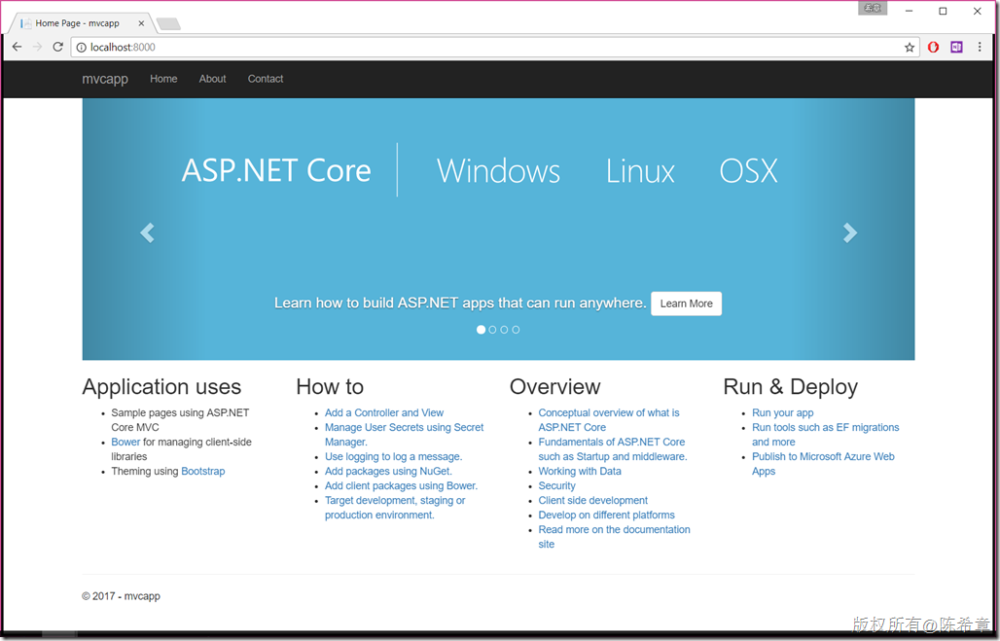

# 在Docker中运行asp.net core 跨平台应用程序 
> 原文发表于 2017-07-11, 地址: http://www.cnblogs.com/chenxizhang/archive/2017/07/11/7148657.html 

  

概述
--

Docker已经热了有一两年了，而且我相信这不是一个昙花一现的技术，而是一个将深远影响我们日后开发和部署、运营应用系统的一种创新（很多人将其作为devops的一种非常重要的基石）。学习docker的最好方式，莫过于它的官方文档 ，有兴趣 的同学请参考 [https://www.docker.com/what-docker](https://www.docker.com/what-docker "https://www.docker.com/what-docker") 

  

> 笔者最近在写一个Office 365的集成和扩展应用开发的系列文章（<https://aks.ms/office365devguide>) ，其中的范例也将基于docker来部署。
> 
> 

  

准备
--

为了进行后续的实验，请准备如下的环境

1. 基本条件
1. Windows 10 Enterprise, Professional, or Education - 64-bit Processor with Second Level Address Translation (SLAT). - CPU support for VM Monitor Mode Extension (VT-c on Intel CPU's). - Minimum of 4 GB memory.

3. Docker for Windows  请参考 [https://docs.docker.com/docker-for-windows/](https://docs.docker.com/docker-for-windows/ "https://docs.docker.com/docker-for-windows/") 和  [https://docs.docker.com/docker-for-windows/install/](https://docs.docker.com/docker-for-windows/install/ "https://docs.docker.com/docker-for-windows/install/")
4. Microsoft .NET Core SDK ，请参考 [https://www.microsoft.com/net/core#windowscmd](https://www.microsoft.com/net/core#windowscmd "https://www.microsoft.com/net/core#windowscmd") （我安装的是最新的2.0 preview2）

  

  

动手实验
----

1. 打开Powershell
2. 创建dotnet core mvc应用程序  dotnet new mvc –o mvcapp
3. 切换到该目录  cd mvcapp
4. 还原包（如果是dotnet core 2.0,则可以跳过这个步骤）  dotnet restore
5. 发布应用程序  dotnet publish –c release
6. 在当前目录下面创建一个DOCKERFILE，内容如下
FROM microsoft/dotnet:2.0.0-preview2-sdkWORKDIR /appCOPY bin/release/netcoreapp2.0/publish .ENTRYPOINT ["dotnet", "mvcapp.dll"]

8. 生成docker镜像  docker build –t mvcapp .
9. 运行docker镜像  docker run –p 8000:80 –e “ASPNETCORE\_URLS=http://+:80” mvcapp

  

> 以上命令如果不熟悉，请大家自行查看帮助。例如 dotnet new mvc –h 或者 docker build -h
> 
>   
> 
> 
> 

如此这般之后，你就可以打开本机的浏览器，输入<http://localhost:8000> 进行访问了

