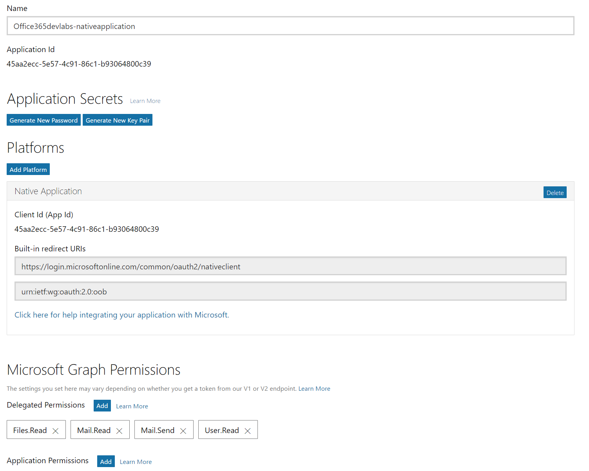
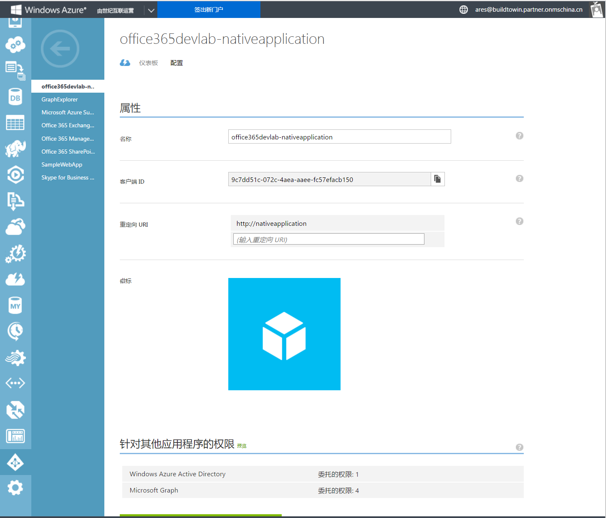
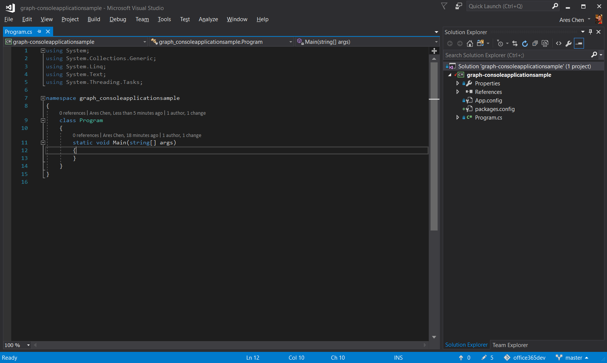
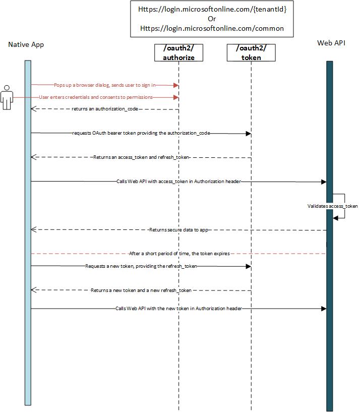
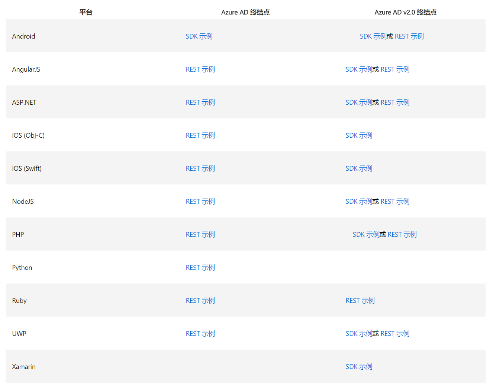
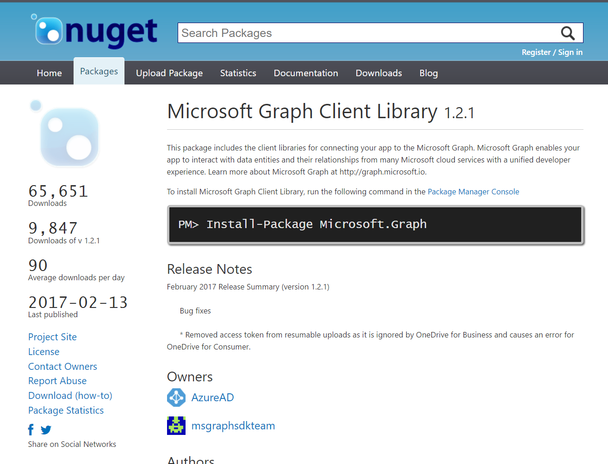
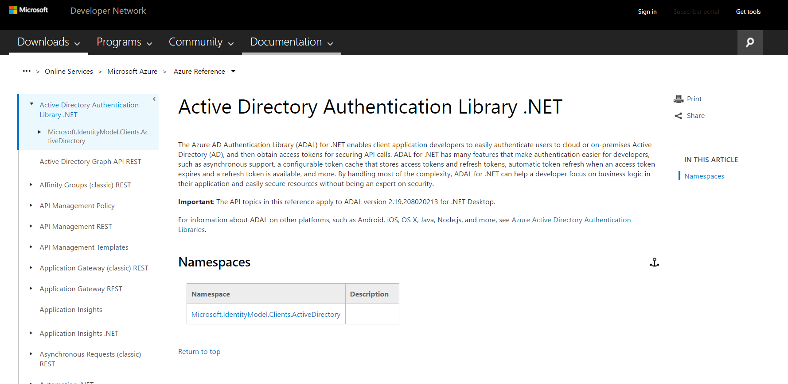
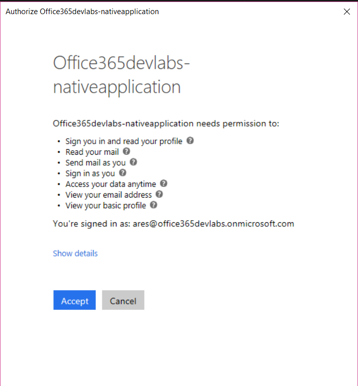
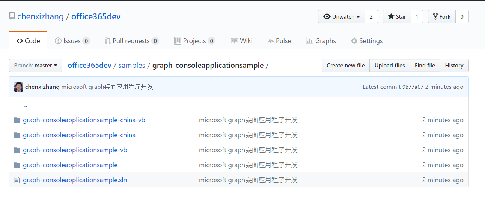

# Microsoft Graph 桌面应用程序 
> 原文发表于 2017-11-27, 地址: http://www.cnblogs.com/chenxizhang/archive/2017/11/27/7904255.html 


> 作者：陈希章 发表于 2017年3月22日
> 
> 

桌面应用程序，在我这篇文章的语境中，我是特指在Windows桌面上面直接运行的.NET应用程序，包括Console Application，WPF Application，Windows Forms Application, UWP Application，并且限于篇幅，我只会以Console Application作为演示，因为无论表现形式如何不同，它们从本质上是类似的。
> 本文所附带示例代码可以通过<https://github.com/chenxizhang/office365dev/tree/master/samples/graph-consoleapplicationsample>访问,这是由Visual Studio 2017编写,开发语言为C#,在Windows 10 Enterprise上面测试通过。请注意，作为演示目的，我尽可能在范例代码中仅包含最必要的代码。
> 
> 

注册Microsoft Graph应用程序
=====================

要进行具体的编程之前，你需要注册Microsfot Graph应用程序。本系列文章约定，针对国际版我将采用Azure AD 2.0这种方式进行注册，而针对中国版将采用Azure AD 1.0这种方式。这两种方式的详细操作步骤，以及我注册好的范例应用程序，请参考##### [注册Azure AD 2.0 应用程序](https://chenxizhang.gitbooks.io/office365devguide/docs/applicationregisteration2.0.html)

##### [注册中国版Microsoft Graph应用程序](https://chenxizhang.gitbooks.io/office365devguide/docs/chinaoffice365applicationregisteration.html)

创建Console Application
=====================

不要问我怎么做这个事情，你应该知道的。 



考虑安全认证功能
========

关键是，接下来你该如何考虑呢？有的人会联想到OAuth，这是一个很好的想法。我在此前已经提到过如何分三个步骤实现Microsoft Graph应用开发，第一步是注册应用程序，第二步是实现身份认证，第三步就是该怎么调用你就怎么调用。下图介绍了在Azure AD 2.0中支持的OAuth认证流程

 

简单地说，OAuth认证一般会有三个步骤1. 客户端代表用户发起认证请求（通常是/authorize 这个地址），这个会跳转到Office 365的登录页面，让用户输入账号和密码
- 如果用户提供了正确的账号和密码，并确认授权，Azure AD会向我们在注册应用程序时提供的回调地址（redirectUrl）POST一个请求过来，附上一个code，然后我们的应用需要继续用这个code去发起一个请求，申请访问令牌（通常是/token这个地址）
- 客户端得到令牌（Access\_Token），就可以代表用户访问Microsoft Graph的资源（通常是放在请求的头部里面）。这里需要注意的是，通常令牌都是会一定时间过期的，Micrsoft Graph的令牌默认为1小时有效。过期前可以通过一定的方式刷新令牌。

你当然可以在了解上述原理马上开始编写代码，但这里要请你了解，为了降低开发人员在这块的工作量，并且尽量进行标准化，Microsoft Graph针对不同的平台和语言都有对应的SDK。请参考 <https://developer.microsoft.com/zh-cn/graph/docs/get-started/get-started>  
具体到我们本篇文章的目标，如果Office 365是国际版，你可以使用Microsoft Graph Client Library <https://www.nuget.org/packages/Microsoft.Graph/> 

  




  


和 Microsoft Authentication Library <https://www.nuget.org/packages/Microsoft.Identity.Client/1.0.304142221-alpha>


> 目前这个 Microsoft Authentication Library 的状态是Preview，但是很值得期待，因为它还有针对.NET Core的版本
> 
> 

而如果是用中国版，你也可以使用 Active Directory Authentication Library .NET <https://msdn.microsoft.com/library/en-us/Mt417579.aspx> 

  




实现国际版Microsoft Graph调用
======================

首先，运行下面的命令安装上面提到的两个Library，并且进行更新
```
Install-Package Microsoft.Graph
Install-Package Microsoft.Identity.Client -IncludePrerelease

Update-Package

```
接下来，我们需要编写一个方法，封装一下Graph Authentication这个步骤.
> 备注，我认为这里还有可以改进的空间，最好是连这一步都可以省略掉。产品组是还没有完全想好，日后应该会加上这块实现。
> 
> 


```
class GraphAuthenticator : IAuthenticationProvider
{
    static string token;
    static DateTimeOffset Expiration;


    public async Task AuthenticateRequestAsync(HttpRequestMessage request)
    {
        string clientID = "45aa2ecc-5e57-4c91-86c1-b93064800c39";//这个ID是我创建的一个临时App的ID，请替换为自己的
        string[] scopes = { "user.read", "mail.read", "mail.send"};
        var app = new PublicClientApplication(clientID);

        AuthenticationResult result = null;
        try
        {
            result = await app.AcquireTokenSilentAsync(scopes);
            token = result.Token;
        }
        catch (Exception)
        {
            if (string.IsNullOrEmpty(token) || Expiration <= DateTimeOffset.UtcNow.AddMinutes(5))
            {
                result = await app.AcquireTokenAsync(scopes);
                Expiration = result.ExpiresOn;
                token = result.Token;
            }
        }


        request.Headers.Add("Authorization", $"Bearer {token}");

    }
}

```
有了这个类，接下来我们要调用Microsoft Graph简直可以说是易如反掌，请参考下面的代码
```
var client = new GraphServiceClient(new GraphAuthenticator());//创建客户端代理
var user = client.Me.Request().GetAsync().Result;//获取当前用户信息
Console.WriteLine(user.DisplayName);

var messages = client.Me.Messages.Request().GetAsync().Result;//获取用户的前十封邮件
foreach (var item in messages)
{
    Console.WriteLine(item.Subject);
}

client.Me.SendMail(new Message() //发送邮件
{
    Subject = "调用Microsoft Graph发出的邮件",
    Body = new ItemBody()
    {
        ContentType = BodyType.Text,
        Content = "这是一封调用了Microsoft Graph服务发出的邮件，范例参考 https://github.com/chenxizhang/office365dev"
    },
    ToRecipients = new[]
    {
        new Recipient()
        {
            EmailAddress = new EmailAddress(){ Address ="ares@office365devlabs.onmicrosoft.com"}
        }
    }
}, true).Request().PostAsync();


Console.Read();

```

> 完整代码，请参考 <https://github.com/chenxizhang/office365dev/blob/master/samples/graph-consoleapplicationsample/graph-consoleapplicationsample/Program.cs>
> 
> 

就是这么简单，就是这么任性，你可以马上运行这个应用程序看看效果了

  


 

输入你的Office 365账号和密码（请注意，需要是国际版），然后点击“Sign In”，Microsoft Graph将引导你进行授权确认

  


 

不出意外的话，你现在就可以在控制台窗口中看到当前登录的用户信息，十个邮件标题等信息了。VB.NET 开发人员看过来
==============

我不止一次听到开发人员反馈说，现在在网络上想一些VB或者VB.NET的代码范例比较难。这是一个事实，我自己对VB是有感情的，为了向这部分开发人员致意，我特别提供了一个VB.NET的版本。
> 我不能担保后续每一篇，每个范例都会提供VB.NET的版本，因为精力真的很有限。如果你有兴趣根据我的C#的范例转换为VB.NET代码，欢迎跟我联系。
> 
> 


```
Imports System.Net.Http
Imports Microsoft.Graph
Imports Microsoft.Identity.Client
''' <summary>
''' 这个是国际版Microsoft Graph的客户端应用程序范例
''' 作者：陈希章
''' 时间：2017年3月23日
''' </summary>
Module Module1

    Sub Main()

        Dim serviceClient = New GraphServiceClient(New GraphAuthenticator())
        Dim user = serviceClient.Me.Request.GetAsync().Result

        '获取用户基本信息

        Console.WriteLine(user.DisplayName)
        Console.WriteLine(user.Mail)

        '获取用户的邮件列表
        Dim messages = serviceClient.Me.MailFolders.Inbox.Messages.Request.GetAsync().Result
        For Each item In messages
            Console.WriteLine(item.Subject)

        Next
        '发送邮件
        serviceClient.Me.SendMail(New Message() With {
            .Subject = "调用Microsoft Graph发出的邮件（VB.NET）",
            .Body = New ItemBody() With {
                .Content = "这是一封调用了Microsoft Graph服务发出的邮件，范例参考 https://github.com/chenxizhang/office365dev",
                .ContentType = BodyType.Text
            },
            .ToRecipients = New List(Of Recipient) From {
                New Recipient() With {.EmailAddress = New EmailAddress() With {.Address = "ares@office365devlabs.onmicrosoft.com"}}
            }
        }, True).Request.PostAsync()

        Console.Read()
    End Sub


    Public Class GraphAuthenticator
        Implements IAuthenticationProvider

        Shared token As String
        Shared Expiration As DateTimeOffset


        Public Async Function AuthenticateRequestAsync(request As HttpRequestMessage) As Task Implements IAuthenticationProvider.AuthenticateRequestAsync

            Dim clientID As String = "45aa2ecc-5e57-4c91-86c1-b93064800c39" '这个ID是我创建的一个临时App的ID，请替换为自己的
            Dim scopes As String() = {"user.read", "mail.read", "mail.send"}
            Dim app As PublicClientApplication = New PublicClientApplication(clientID)
            Dim result As AuthenticationResult

            Try
                result = Await app.AcquireTokenSilentAsync(scopes)
                token = result.Token


            Catch ex As Exception
                If (String.IsNullOrEmpty(token) OrElse Expiration <= DateTimeOffset.UtcNow.AddMinutes(5)) Then

                    result = app.AcquireTokenAsync(scopes).Result
                    Expiration = result.ExpiresOn
                    token = result.Token
                End If
            End Try


            request.Headers.Add("Authorization", $"Bearer {token}")


        End Function
    End Class

End Module

```
实现中国版Microsoft Graph调用
======================

接下来我们该看看在中国版Microsoft Graph调用方面有什么不同。虽然因为没有封装好的Microsoft Graph Client，但是看起来基本代码也还算简单易懂，请参考。##### 安装下面这个Package


```
Install-Package Microsoft.IdentityModel.Clients.ActiveDirectory
Update-Package

```
##### 编写一个自定义方法获取用户的访问令牌


```
static async Task<string> GetAccessToken()
{
    var appId = "9c7dd51c-072c-4aea-aaee-fc57efacb150";
    var authorizationEndpoint = "https://login.chinacloudapi.cn/common/oauth2/authorize";//国际版是https://login.microsoftonline.com/common/oauth2/authorize
    var resource = "https://microsoftgraph.chinacloudapi.cn"; //国际版是https://graph.microsoft.com 
    var redirectUri = "http://nativeapplication";//其实这个应该去掉，目前必须要填，而且要跟注册时一样


    AuthenticationResult result = null;

    var context = new AuthenticationContext(authorizationEndpoint);
    result = await context.AcquireTokenAsync(resource, appId, new Uri(redirectUri), new PlatformParameters(PromptBehavior.Always));


    return result.AccessToken;
}

```
##### 编写一个自定义方法发起Microsoft Graph请求


```

/// <summary>
/// 定义这个方法用来进行Rest调用
/// </summary>
/// <param name="url"></param>
/// <param name="token"></param>
/// <returns></returns>
static async Task<string> InvokeRestReqeust(string url, string token)
{
    var client = new System.Net.WebClient();
    client.Headers.Add("Authorization", $"Bearer {token}");
    var result = await client.DownloadStringTaskAsync(url);
    return result;//请注意，这里直接返回字符串型的结果，它是Json格式的，有兴趣的可以继续在这个基础上进行处理
}

```
万事俱备，下面就可以在主程序中组合使用这两个方法进行Microsoft Graph调用了
```
static void Main(string[] args)
{
    ///获得用户的令牌
    var token = GetAccessToken().Result;

    //获得用户的基本信息
    var me = InvokeRestReqeust("https://microsoftgraph.chinacloudapi.cn/v1.0/me", token).Result;
    Console.WriteLine(me);

    //获得用户的邮件列表（前十封）
    var messages = InvokeRestReqeust("https://microsoftgraph.chinacloudapi.cn/v1.0/me/messages", token).Result;
    Console.WriteLine(messages);


    Console.Read();

}

```
VB.NET用户看过来
===========

我同样为这个范例准备了一个VB.NET的版本，请大家参考
```
Imports System.Net
Imports Microsoft.IdentityModel.Clients.ActiveDirectory

Module Module1

    Sub Main()
        '获得用户令牌
        Dim token = GetAccessToken().Result
        '获得当前用户基本信息
        Dim user = InvokeRestRequest("https://microsoftgraph.chinacloudapi.cn/v1.0/me", token).Result
        Console.WriteLine(user)
        '获得用户的邮件列表（前十封）
        Dim messages = InvokeRestRequest("https://microsoftgraph.chinacloudapi.cn/v1.0/me/messages", token).Result
        Console.WriteLine(messages)

        Console.Read()


    End Sub

    Async Function InvokeRestRequest(url As String, token As String) As Task(Of String)
        Dim client = New WebClient()
        client.Headers.Add("Authorization", $"Bearer {token}")
        Dim result = Await client.DownloadStringTaskAsync(url)
        Return result
        '请注意，这里直接返回字符串型的结果，它是Json格式的，有兴趣的可以继续在这个基础上进行处理
    End Function

    Async Function GetAccessToken() As Task(Of String)
        Dim appId = "9c7dd51c-072c-4aea-aaee-fc57efacb150"
        Dim authorizationEndpoint = "https://login.chinacloudapi.cn/common/oauth2/authorize"
        '国际版是https://login.microsoftonline.com/common/oauth2/authorize
        Dim resource = "https://microsoftgraph.chinacloudapi.cn" '国际版是https://graph.microsoft.com
        Dim redirectUri = "http://nativeapplication" '其实这个应该去掉，目前必须要填，而且要跟注册时一样

        Dim result As AuthenticationResult
        Dim context = New AuthenticationContext(authorizationEndpoint)
        result = Await context.AcquireTokenAsync(resource, appId, New Uri(redirectUri), New PlatformParameters(PromptBehavior.Auto))

        Return result.AccessToken

    End Function


End Module

```

> 从上面的代码对照来看，Azure AD 1.0的方式，需要开发人员处理更多细节，例如身份验证，服务调用结果处理等等。如果有兴趣并且有能力的朋友，欢迎在这个基础上做一定的封装，简化开发。
> 
> 

本文所有代码范例，可以通过 <https://github.com/chenxizhang/office365dev/tree/master/samples/graph-consoleapplicationsample> 查看或者下载 

  




结语
==

本文完整地介绍了针对国际版和中国版Office 365，在桌面应用程序中如何实现Microsoft Graph的集成。针对国际版，我采用的是Azure AD 2.0的方式；针对中国版，我采用的是Azure AD 1.0的方式。同时，为了照顾到VB.NET的开发人员，本文所有范例都提供了VB.NET的版本。


