# Office 365 机器人（Bot）开发入门 
> 原文发表于 2017-11-27, 地址: http://www.cnblogs.com/chenxizhang/archive/2017/11/27/7904487.html 


  


> 作者：陈希章 发表于 2017年7月29日
> 
> 

前言
==

作为人工智能技术的一个主要的表现形式，这些年机器人（bot）的应用越来越广泛。不管是有实物的，还是纯软件的，现在的机器人技术应该说已经走入寻常百姓家了。这一篇文章探讨的是，在微软提供的Bot Framework基础上快速开发和部署一个软件的机器人，并且将其与 Office 365 或其他应用无缝地整合起来，为用户带来全新的基于会话的人机交互体验。#### 基本概念

本文会用一个实例带领大家入门，如下的几个基本概念稍作说明1. Bot Framework —— 这是微软提供的一整套工具和服务的集合，它的访问地址是 [https://dev.botframework.com](https://dev.botframework.com/) 。它主要包括了
	* Bot注册和管理、运行服务
	* 多种开发模板和SDK（Bot Builder SDK）以及在线的开发和部署服务（Azure Bot Service）
	* 用于调试的模拟器 （Bot Framework Emulator）
	* 在线的应用商店（Bot Directory）- Bot —— 这是我们最终开发出来的一个逻辑上的对象，它主要包含了一组API代码，一个描述文件。
- Channel —— 上面提到过了，我们开发出来的机器人（Bot）是一个逻辑上的对象，真正与用户交互的，必须要有一个合适的界面，这些界面，如果能跟用户最常用的应用程序整合在一起，则可能是一种更加好的体验。Bot Framework的设计理念是让Bot一次编写，处处能运行，它通过所谓的Bot connector service来连接不同的用户界面。这些用来使用我们Bot的应用程序，我们称之为Channel。目前已经有十几个Channel是受支持的。详情请见：<https://docs.microsoft.com/en-us/bot-framework/portal-configure-channels>.


> 截至本文发稿，我发现Bot Directory这个服务已经不再接受新的提交了，现在的政策改为Bing Channel来提供服务。
> 
> 

注册一个Bot
=======

要进行Bot开发，你首先需要在Bot Framework中进行注册。你可以使用个人账号（Microsoft Account）和工作账号（Office 365账号）登陆 [https://dev.botframework.com](https://dev.botframework.com/)，然后选择“My bots”，进行如下操作完成注册。[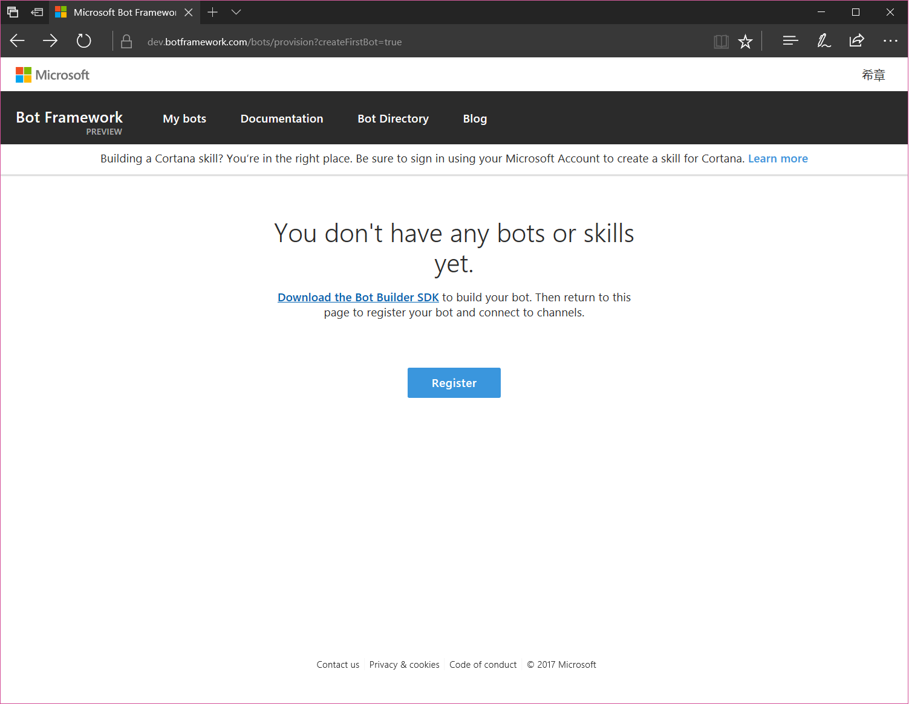](https://github.com/chenxizhang/office365dev/blob/master/docs/images/createbot.png)在下面这个页面中，Bot handle是你的bot的标识符，不能包含空格，请保存这个名字，后续会用到。另外，Messaging endpoint此时可以不填。最关键就是要点击“Create Microsoft App ID and password”，并且请保存返回的AppID和Password信息，后续会用到。[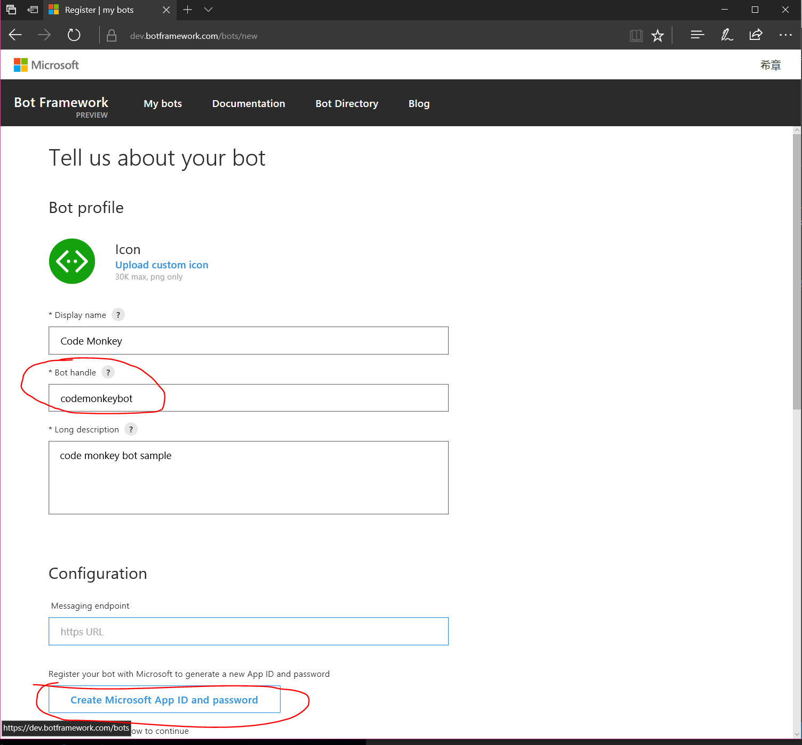](https://github.com/chenxizhang/office365dev/blob/master/docs/images/createbotdetails.PNG)使用Visual Studio 模板进行快速开发
========================

目前Bot Framework支持四种开发方式 —— [.NET](https://docs.microsoft.com/en-us/bot-framework/dotnet/bot-builder-dotnet-quickstart)、[NodeJS](https://docs.microsoft.com/en-us/bot-framework/nodejs/bot-builder-nodejs-quickstart)、[Azure Bot Service（preview）](https://docs.microsoft.com/en-us/bot-framework/azure/azure-bot-service-quickstart)、[REST](https://docs.microsoft.com/en-us/bot-framework/rest-api/bot-framework-rest-connector-quickstart). 基于.NET的开发是在Visual Studio 2017中进行，基于NodeJS的开发则一般在Visual Studio Code完成，后面两种则无需特定的编辑器，在线或者通过文本编辑器即可。限于篇幅，我不会逐个展开，本文的案例将基于Visual Studio 2017和C#来进行演示，而且为了快速进行开发，我们将采用官方提供的模板来进行开发。请下载下面三个模板1. [Bot Application](http://aka.ms/bf-bc-vstemplate),请将这个zip文件放在%USERPROFILE%\Documents\Visual Studio 2017\Templates\ProjectTemplates\Visual C#\下面
- [Bot Controller](http://aka.ms/bf-bc-vscontrollertemplate)，请将这个zip文件放在%USERPROFILE%\Documents\Visual Studio 2017\Templates\ItemTemplates\Visual C#\ 下面
- [Bot Dialog](http://aka.ms/bf-bc-vsdialogtemplate)，请将这个zip文件放在%USERPROFILE%\Documents\Visual Studio 2017\Templates\ItemTemplates\Visual C#\下面

[](https://github.com/chenxizhang/office365dev/blob/master/docs/images/bottemplate.PNG)完成上面的操作后，重新打开Visual Studio 2017，我们可以在新建项目的时候看到下面的模板[](https://github.com/chenxizhang/office365dev/blob/master/docs/images/createbotcodemonkey.png)通过模板创建出来的项目，其实是一个标准的ASP.NET Web API项目，其中最关键的两个代码文件如下[](https://github.com/chenxizhang/office365dev/blob/master/docs/images/botsample.png)为了帮助大家快速入门，我在这里暂时不解释代码结构，也不去做任何修改。你现在需要做的是，在web.config中将Bot注册时我提醒你保存的三个信息填写进去。我的例子信息如下：
```
<appSettings>
    <!-- update these with your BotId, Microsoft App Id and your Microsoft App Password-->
    <add key="BotId" value="codemonkeybot" />
    <add key="MicrosoftAppId" value="89403745-7fe4-453a-ae0a-e53caf84866b" />
    <add key="MicrosoftAppPassword" value="7LLQHqUYYWU72dY3c6OvBG4" />
</appSettings>


```
完成这些之后，你就可以按下F5键进行调试了，如果不出意外的话，你将看到浏览器被打开并显示如下的页面[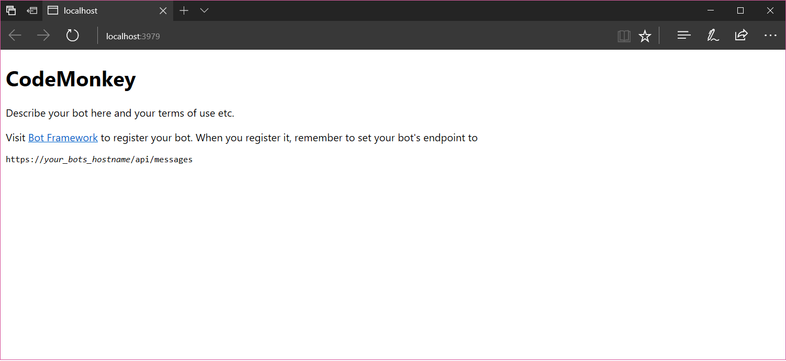](https://github.com/chenxizhang/office365dev/blob/master/docs/images/botsampledebug.png)那么，这有什么用呢？目前来说，确实还看不出有什么用。因为现在来说，我们还只是构建了Bot中的服务部分，并没有将其与对应的Channel连接起来，所以也就没有用户界面来进行调用它。事实上我们还不要那么着急，在真正去跟Channel绑定之前，建议在本地进行测试和调试。为此，Bot Framework中很贴心地为开发人员准备了一个模拟器，下一节我将介绍如何使用它。使用Bot Framework 模拟器进行本地测试
=========================

首先，你需要通过<https://github.com/Microsoft/BotFramework-Emulator/releases> 下载和安装最新版本的模拟器。
> 值得注意的是，这个模拟器可以在PC,Mac上面运行。
> 
> 

打开模拟器，并且输入服务地址，和应用ID及密钥后，点击“Connnect”按钮[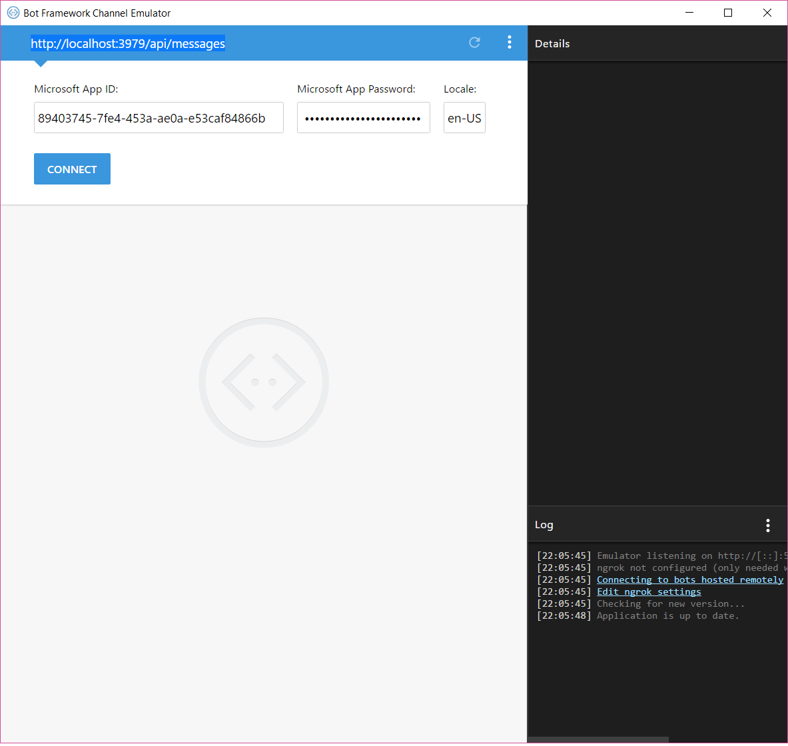](https://github.com/chenxizhang/office365dev/blob/master/docs/images/botframeworkemulator.png)确保在右侧的"Log"中看到的返回信息是 “-> POST 200 [conversationUpdate] ”，这个就表示连接成功了。然后我们在左下角的文本框，可以随便输入一些文字，点击回车后模拟器会将信息包装起来，发送给后台服务，正常情况下我们会很快看到Bot的回复文本。我的范例如下[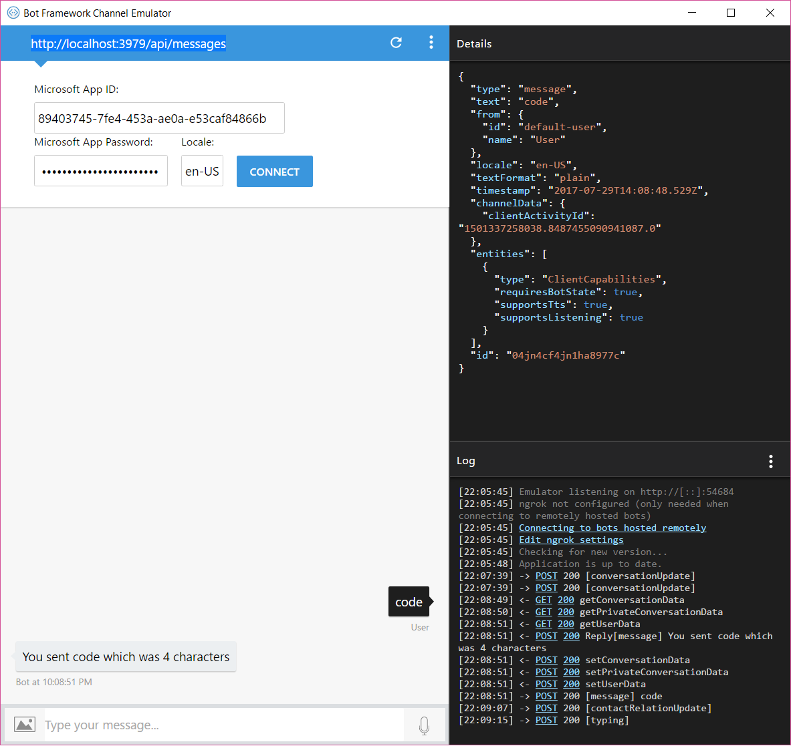](https://github.com/chenxizhang/office365dev/blob/master/docs/images/botframeworkemulator2.png)在这个标准模板中，机器人（Bot）只是很简单地将用户发送过来的指令原封不动地返回给用户，并没有做任何实质性的工作。但其实，这已经是一个很好的起点了，我们至少确保机器人正确地收到了指令，至于如何根据这些指令进行响应，可以在下一步来完善。通过Bot Framework模拟器进行本地测试和调试的好处是，可以直接在Visual Studio中设置断点，一步一步地调试，便于发现和解决问题。将Bot应用部署到Azure App Service
==========================

在完成本地的开发和测试后，下一步是需要将我们开发好的API Service发布到一个合适的生产环境，以便其他用户能够访问到这个服务。这个API Service是一个标准的ASP.NET项目，你可以自行选择合适的托管环境，只要有IIS并且支持.NET Framework 4.6的Windows Server就可以。我这里演示的是，如何将这个应用部署到Azure 的App Service中，这是Azure 提供的PaaS服务，它可以将很多运行环境的细节隐藏掉，开发人员不需要关注操作系统和IIS怎么安装，负载均衡怎么做等基础性工作，而是将全部精力集中在应用开发上面。关于Azure App Service的更多细节，已经超出了本文的范畴，有兴趣的朋友可以直接参考 <https://azure.microsoft.com/en-us/services/app-service/>.[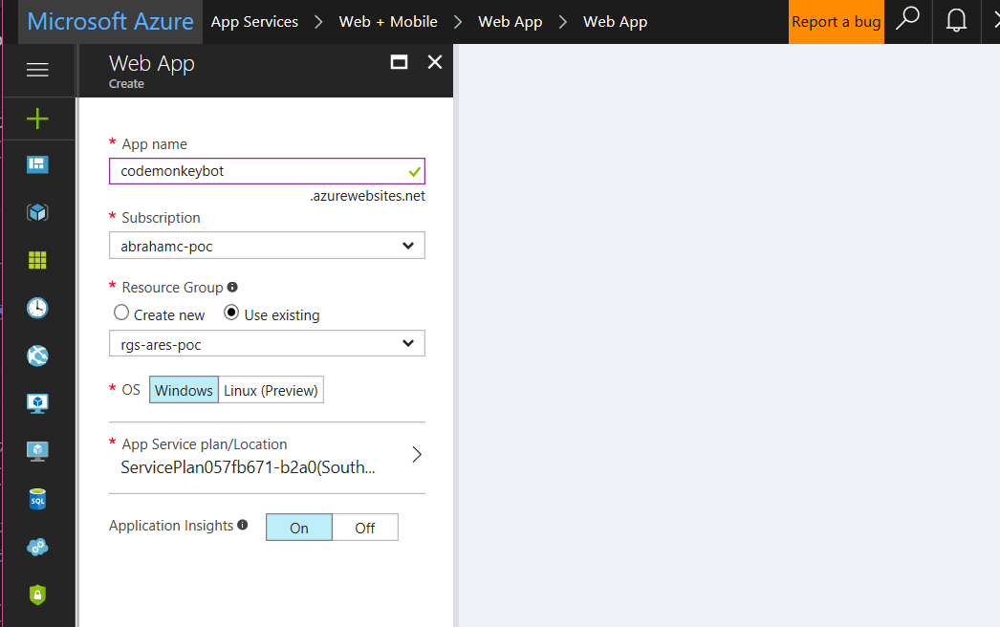](https://github.com/chenxizhang/office365dev/blob/master/docs/images/createazureappservice.PNG)在App Service的Overview页面中，点击”Get publish profile“[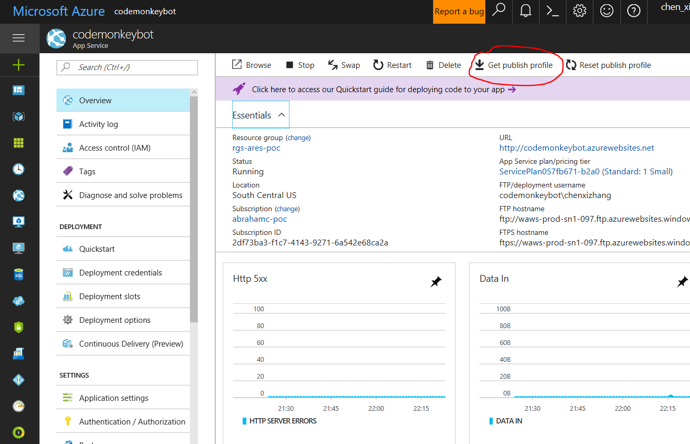](https://github.com/chenxizhang/office365dev/blob/master/docs/images/createazureappservice2.PNG)在Visual Studio中，停止调试，然后选中项目，在右键菜单中选择“Publish”，在属性页面中，选择“Import Profile”[](https://github.com/chenxizhang/office365dev/blob/master/docs/images/codemonkeypublish.PNG)Visual Studio会自动对项目进行编译并且完成第一次发布，如果一切顺利的话，你将很快看到一个新打开的浏览器窗口[](https://github.com/chenxizhang/office365dev/blob/master/docs/images/codemonkeypublish2.png)请注意浏览器中的地址<http://codemonkeybot.azurewebsites.net/>,你可以换成 <https://codemonkeybot.azurewebsites.net/> 也是能正常工作的，这其实是Azure App Service的一个福利，所有部署到App Service的应用，都默认拥有https访问的功能，不需要自己去申请证书。要知道，在生产环境使用Bot的时候，我们是强烈推荐https的。看起来跟本地也没有什么不一样，对吗？这不是重点。我们接下来要完成一系列的配置，使这个Bot真的能在一些常见的Channel中运行起来。使用Azure App Service，你可以专注应用开发，在Visual Studio中做了代码修改之后，只需要再次发布即可。与Microsoft Teams进行集成
====================

我们前面完成了几个关键步骤，包括Bot注册，Bot应用开发和发布，接下来是时候让它实际地为我们的用户进行服务了。首先，我们需要修改Bot的注册信息，让它使用我们上面提到的Azure App Service来提供服务。[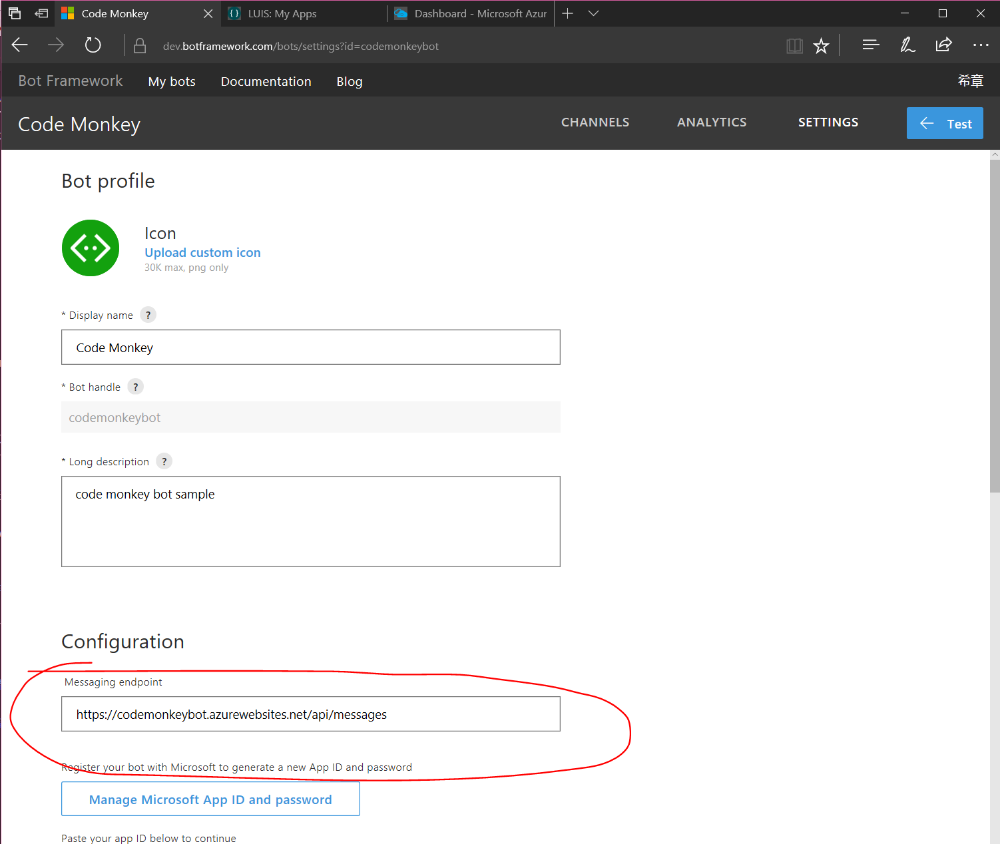](https://github.com/chenxizhang/office365dev/blob/master/docs/images/codemonkeybot.PNG)保存设置后，你可以在当前页面完成测试，确保其能正常工作[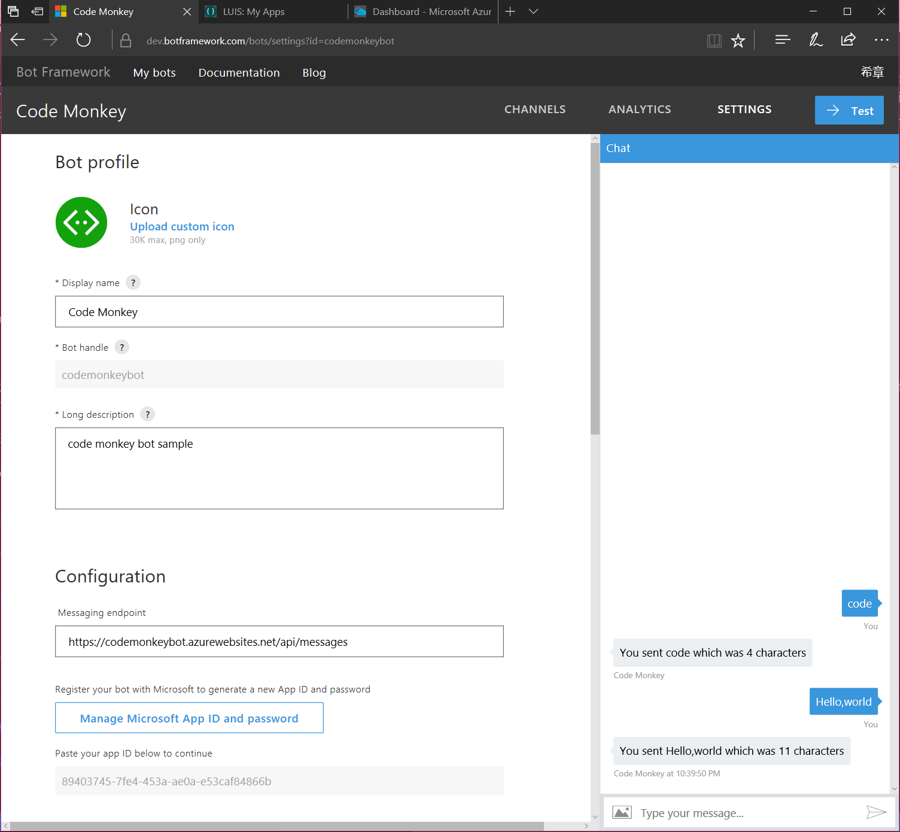](https://github.com/chenxizhang/office365dev/blob/master/docs/images/codemonkeytest.PNG)现在，万事俱备，只欠东风了。我需要隆重给大家介绍Office 365家族中的新成员——Microsoft Teams。它是一款全新的以聊天为基础的协作沟通工具，整合了Office 365的很多服务，并且作为Office 365的一站式前端应用为用户提供了聊天，团队和项目协作，会议等功能。Microsoft Teams既提供了桌面端应用，网页应用，也提供了移动端应用，关于它的更多细节，请有兴趣的朋友参考 [https://teams.microsoft.com](https://teams.microsoft.com/)。[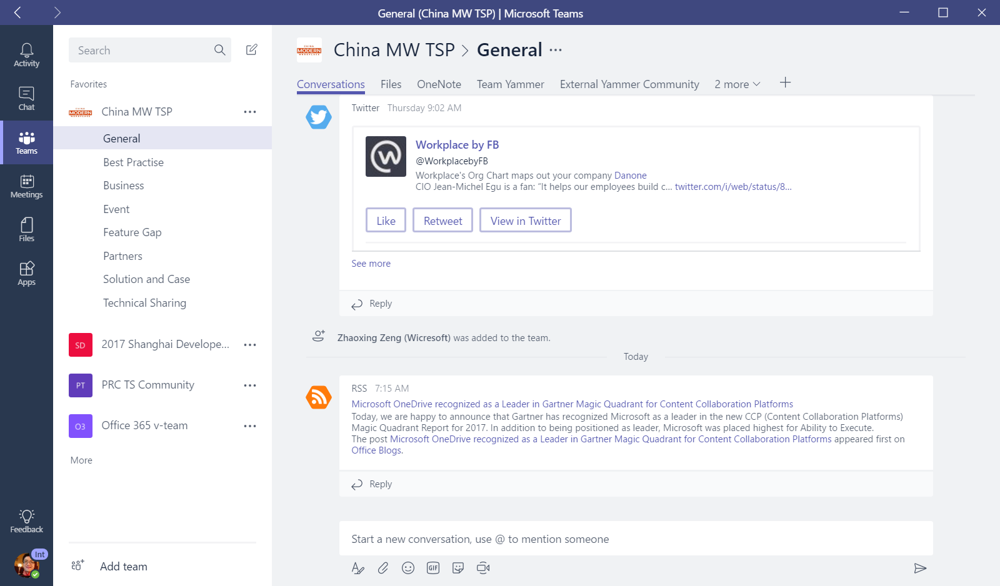](https://github.com/chenxizhang/office365dev/blob/master/docs/images/microsofteams.png)接下来我们重点来看一下，如何将此前配置好的Bot与Teams连接起来，让Teams的用户可以愉快地跟它对话起来。在Bot的设置页面，点击“CHANNELS”按钮，可以看到默认情况下连接好了两个Channel，一个是Skype（这是针对个人的一个即时通讯服务，由微软提供），另外一个是Web Chat，这是支持在任意的网页应用程序中，通过iframe的方式嵌入这个Bot，相当实用。接下来我们要做的是，在下方“Add a channel”的列表中选择“Microsoft Teams”的图标，将其加入当前这个Bot的Channel中来。[](https://github.com/chenxizhang/office365dev/blob/master/docs/images/codemonkeychannel.PNG)完成配置后，在新的Channel列表中点击“Microsoft Teams” 这个链接[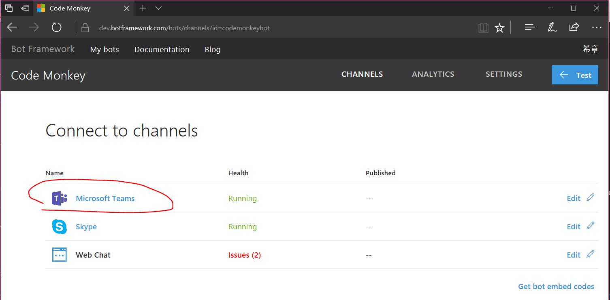](https://github.com/chenxizhang/office365dev/blob/master/docs/images/codemonkeychannel2.PNG)它会要求打开Microsoft Teams客户端，并且会自动将这个Bot添加到你的联系人列表中来。[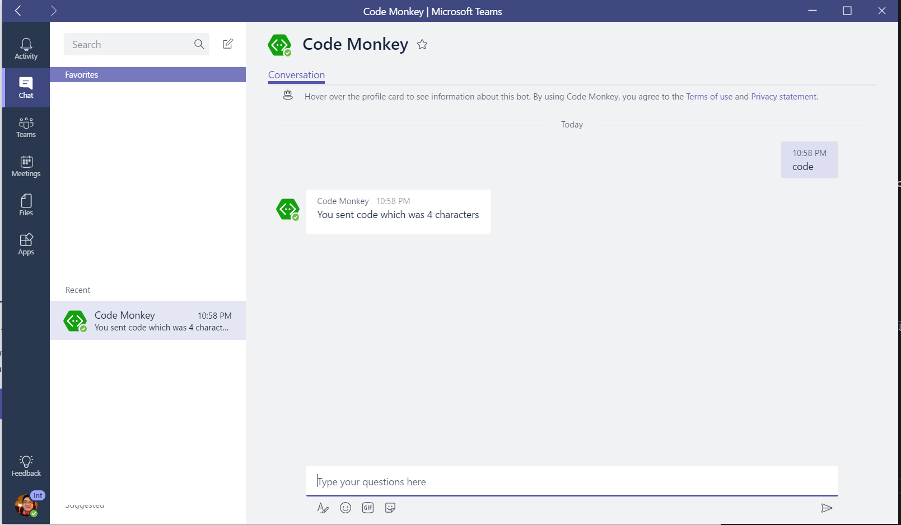](https://github.com/chenxizhang/office365dev/blob/master/docs/images/codemonkeyonteams.PNG)如果你想邀请你的同事也添加这个Bot进行测试，那么你需要做的是将注册Bot时获得的App Id（通常是一个GUID字符串，例如我的Code Monkey的ID是 89403745-7fe4-453a-ae0a-e53caf84866b，欢迎大家添加 ）提供给他（她），然后他们可以在Microsoft Teams中通过这个ID找到你的Bot，将其添加为好友后即可开始聊天了。使用ID来搜索当然不会是很友好的一个体验，如果你希望将你的Bot让更多的人使用到，而且希望直接用Bot的名字来搜索到，这个过程可能略微复杂一些，请参考 <https://msdn.microsoft.com/en-us/microsoft-teams/submission> 了解详细信息。另外，作为Office 365用户而言，大家可能对 Skype for Business 也是很熟悉的。Bot Framework目前也支持Skype for Business的整合，这个操作需要Office 365管理员才能完成，具体操作细节请参考 <https://msdn.microsoft.com/en-us/skype/skype-for-business-bot-framework/docs/overview>扩展开发提示
======

看起来还不错，不是吗？现在开发一个机器人，真的不再是一件非常难的事情，我并不是说你通过这篇文章就能开发出来很酷的机器人，但至少你能快速开始，并且你可以看到Bot Framework已经帮助我们将基础架构做得非常完善了，你唯一需要去花心思的是，具体你的这个机器人要提供什么服务，以及以什么样的交互形式提供等等。这些内容跟具体的业务场景有关，显然超出了本文的范畴，但我这里很乐意给大家提供一些思路和参考链接。1. Bot开发的一些原则 <https://docs.microsoft.com/en-us/bot-framework/bot-design-principles>- 为Bot添加更多智慧，如何跟微软认知服务整合 <https://docs.microsoft.com/en-us/bot-framework/cognitive-services-bot-intelligence-overview>- 如何设计交互和会话流 <https://docs.microsoft.com/en-us/bot-framework/bot-design-conversation-flow>

结语
==

本文通过一个实例介绍了基于Bot Framework的 Office 365 机器人开发流程，在人工智能的大背景下，这是一个很好的机遇：一方面可以为Office 365用户带来全新的基于对话的体验，另外最重要的是业务应用可以更加自然地与Office 365这样的平台实现融合，结合微软的认知服务则可以将机器人的智慧水平提升到一个新的高度，这些创新（虽然说还有改进空间）是看得见的生产力，也将对我们日后的人机交互形式产生深远的影响。


