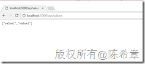
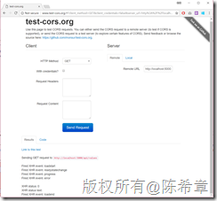
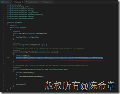
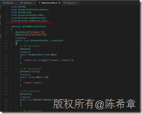
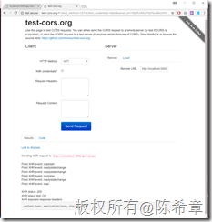
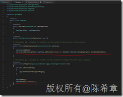
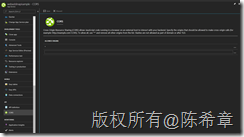

# 在dotnet core web api中支持CORS（跨域访问） 
> 原文发表于 2017-12-04, 地址: http://www.cnblogs.com/chenxizhang/archive/2017/12/04/7975521.html 

最近在写的Office add-in开发系列中，其中有一个比较共性的问题就是在add-in的客户端脚本中访问远程服务时，要特别注意跨域访问的问题。

   

 关于CORS的一些基本知识，请参考维基百科的说明：[https://en.wikipedia.org/wiki/Cross-origin\_resource\_sharing](https://en.wikipedia.org/wiki/Cross-origin_resource_sharing "https://en.wikipedia.org/wiki/Cross-origin_resource_sharing")

   

 那么，如果我们自己写一个服务，怎么样让他支持CORS呢？我下面用一个例子演示这个过程

   

 1. 使用dotnet new webapi 这个指令创建一个基于dotnet core的项目

 

 2.不要做任何修改，直接运行dotnet run

 3.在浏览器中，输入 <http://localhost:5000/api/values> 查看结果

 

   

 此时我们这个api其实是不支持跨域访问的，我们可以通过下面的免费的工具进行测试

 

   

 4.通过简单的两句代码即可让这个api支持跨域访问

 

 请注意，这一行代码需要写在AddMvc之后。

 然后在需要暴露出来的API Controller上面启用CORS

 

 5. 再次测试，我们就可以发现现在这个API已经支持跨域访问了

 

6.如果是需要给所有的API，都实现这个功能，那么下面这样的方式可能更加简化

7. 如果不想这么复杂，其实在对应的方法里面，显式地修改Response的Headers属性也是可以的。

Response.Headers.Add("Access-Control-Allow-Origin","*");  

8. 如果你选择将这个API部署到Azure，而且使用的是 Web App这个服务的话，甚至可以做到更好：代码中不需要定义CORS属性，而是在平台上面定义

