# 使用PowerApps快速构建基于主题的轻业务应用 —— 进阶篇 
> 原文发表于 2017-12-15, 地址: http://www.cnblogs.com/chenxizhang/archive/2017/12/15/8043265.html 

> 作者：陈希章 发表于 2017年12月14日
> 
> 

在上一篇 [使用PowerApps快速构建基于主题的轻业务应用 —— 入门篇](https://github.com/chenxizhang/office365dev/blob/master/docs/powerapps.md) 中，我用了三个实际的例子演示了如何快速开始使用PowerApps构建轻业务应用，你可能已经发现，我都是使用默认生成的设置，没有做任何修改。当然，那样做出来的应用看起来不那么酷，但已经可以运行了，作为一个起点，已经不错了，不是吗？但这样自动生成的应用，估计也不能直接用于咱们实际的工作中，为了达到这个目的，你还多多少少需要掌握一些“高级”知识，并且要多一些练习。这一篇将从如下几个方面展开介绍1. 布局与控件 
- 使用数据 
- 使用网关 
- 应用生命周期管理

布局与控件
=====

让我们再次回到之前自动生成好的基于Excel文件的订单应用吧。[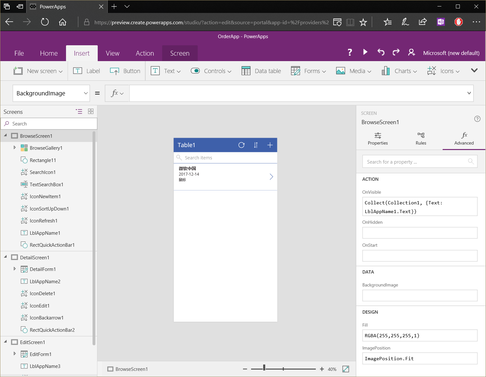](https://github.com/chenxizhang/office365dev/blob/master/docs/images/powerapps-orderapp-1.png)我们先从左侧开始来剖析一下这个应用。作为一个给最终的业务用户使用的应用，它是怎么构建用户界面的呢？这个应用虽然简单，但其实已经包含了我们常说的“增删改查”的四项基本功能。PowerApps的应用是由一个一个的Screen（屏幕）组成的，一个屏幕通常代表了某一项功能，例如1. BrowseScreen，这个一般是用来显示数据列表的，对应的数据操作是“查询列表”。 
- DetailScreen，这个一般是用来显示某条数据的详细信息的，对应的数据操作是“查询”。 
- EditScreen，这个屏幕比较有意思，它一般用来新建数据，或者编辑数据，对应的数据操作是“插入”和“更新”。

值得注意的是，以上名称只是推荐的做法，并不强制要求查询的屏幕名称必须叫BrowseScreen，也不要求你必须要上面三个屏幕。事实上，你随时可以添加自己需要的屏幕（Screen）。顺便要提一下的是，PowerApps的应用天生就是面向移动设备来使用的，所以它默认是有两种布局：手机的布局，和平板电脑的布局。我们此前自动生成应用的时候，是选择“手机的布局（Phone Layout），这个取决于模板的设置。但一旦熟悉之后，我们完全可以自己选择布局，然后开始设计。[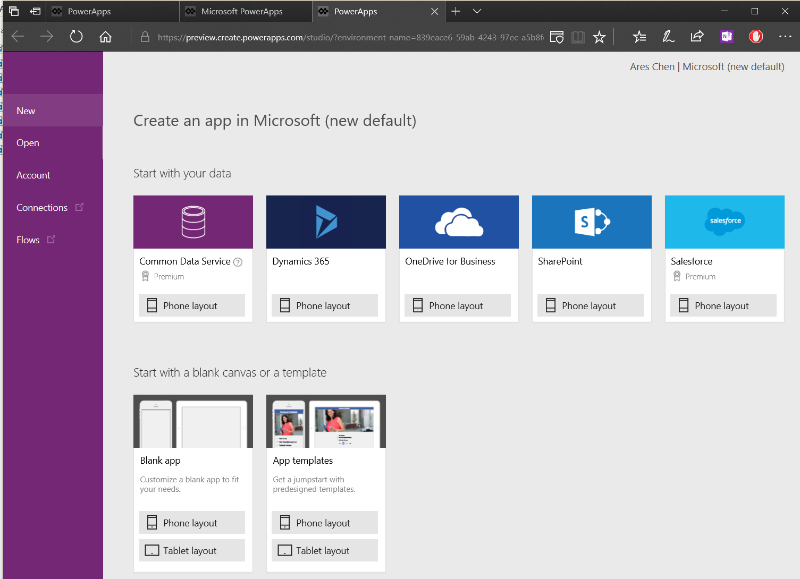](https://github.com/chenxizhang/office365dev/blob/master/docs/images/powerapps-layout.PNG)你可以从零开始做，也可以从一个模板开始做，但请注意这次选择“Tablet Layout”[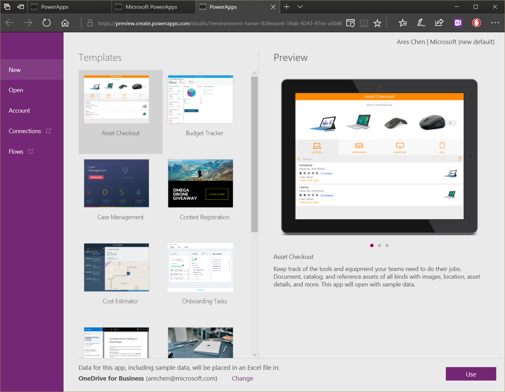](https://github.com/chenxizhang/office365dev/blob/master/docs/images/powerapps-layout-2.png)回到应用本身，我们刚才说了，PowerApps的应用是由一个一个屏幕组成的，那么屏幕又是由什么组成的呢？控件。PowerApps的控件，总体来说，分为两大类，一类是容器控件，一类是普通控件。容器控件是可以包含其他控件的控件。主要包括下面两类：1. Gallery 控件，这类控件主要用来显示列表数据。 
- Form 控件，这类控件主要用来显示数据或编辑数据。

相比较而言，普通控件则更多，也更加有意思。总体来说，可以分为下面几个类别，请注意粗体部分，这是PowerApps在移动优先这个目标之下的一些亮点功能。1. 文本
	1. 标签（Label） 
	- 文本框（Text Input） 
	- ***HTML文本框***（HTML text），支持用户输入HTML文本，显示富文本内容，例如显示链接 `<a href="xxxx">文本</a>`- ***手写笔输入框***（Pen input），支持用户通过手写或者电子笔之前签名，生成的图片可以保存起来。具体参考 <https://docs.microsoft.com/en-us/powerapps/controls/control-pen-input>- 控件
	1. 按钮（Button） 
	- 下拉框（Drop down） 
	- 组合框（Combo box） 
	- 日期选择器（Date picker） 
	- 列表框（List box） 
	- 复选框（Check box） 
	- 单选框（Radio） 
	- ***切换按钮***（Toggle） 
	- ***滑动框***（Slider） 
	- ***评分按钮***（Rating） 
	- ***计时器***（Timer） 
	- 导入数据（Import） 
	- 导出数据（Export） 
	- ***PDF查看器***（PDF Viewer） 
	- ***Power BI 磁贴*** （Power BI Tile） 
	- 附件（Attachments） 
	- 数据表控件（Table）- 多媒体空控件
	1. 图片（Image） 
	- ***摄像头***（Camera）,详情请参考 <https://docs.microsoft.com/en-us/powerapps/controls/control-camera>- ***码扫描器***（Barcode）,可以扫描一维码和二维码，详情请参考 <https://docs.microsoft.com/en-us/powerapps/scan-barcode>- 视频播放器（Video） 
	- 音频播放器（Audio） 
	- 麦克风（Microphone） 
	- 图片选择器（Add Picture）- ***图形控件***
	1. 饼图（Pie chart） 
	- 柱状图（Column chart） 
	- 折线图（Line chart）

现在你对于PowerApps所支持的一些图形化界面元素都有了一个基本的了解，接下来就是怎么真正地使用好它们了。你不需要去学一门编程语言，只需要知道这些控件的使用无外乎两个方面1. 为控件的属性赋值。一般是选中一个控件后，在右侧会有一个属性面板，列出了所有可以设置的属性。当然，如果你已经比较熟悉的话，则可以在工具栏下面的编辑栏中直接输入属性名和值，快速来完成设置。[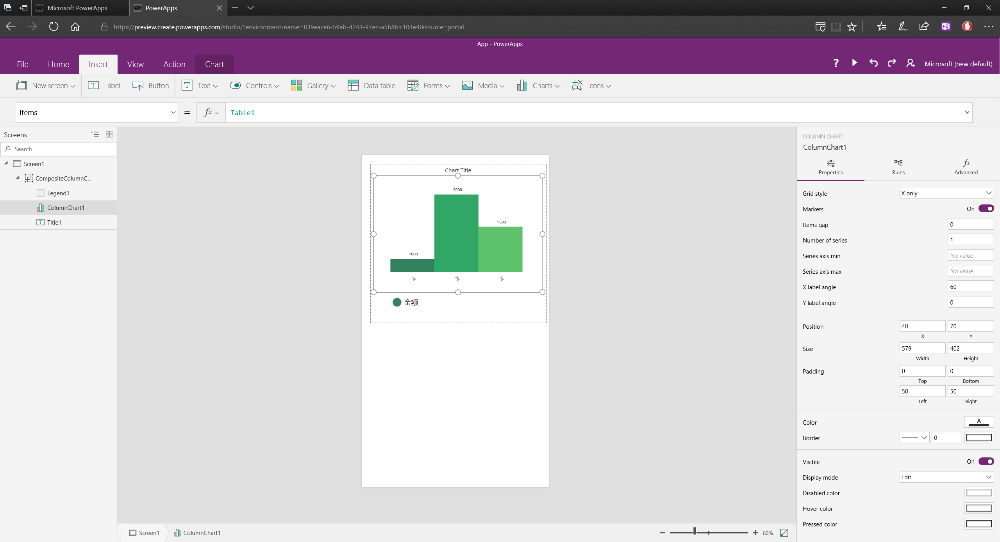](https://github.com/chenxizhang/office365dev/blob/master/docs/images/powerapps-control-props.png)

- 为控件的事件绑定表达式。除了纯粹显示数据的控件，大部分控件都是可以交互式操作的，例如接受用户的点击等。如何为这种行为做出响应呢？在编程中，我们的专业术语叫编写事件处理程序。PowerApps不需要编码，所以它提供了一些特殊的表达式来实现简单的事件处理逻辑。例如下面是一个最常见的按钮事件，当用户点击后，它会从第一个屏幕切换到第二个屏幕。这里用的是navigate函数（另外还有Back，Forward函数来表示后退和前进）。你其实不需要记住这些东西，选择你的控件后，在顶部的Action菜单中，一般会列出来该控件支持的常见的操作。Navigate是一个导航的功能，Collect是一个收集数据的功能（我在下一节会介绍），Remove则是删除数据的操作，跟Collect对应。Flows能够发起一个外部流程，这里先不做展开，后续有专门的文章介绍。[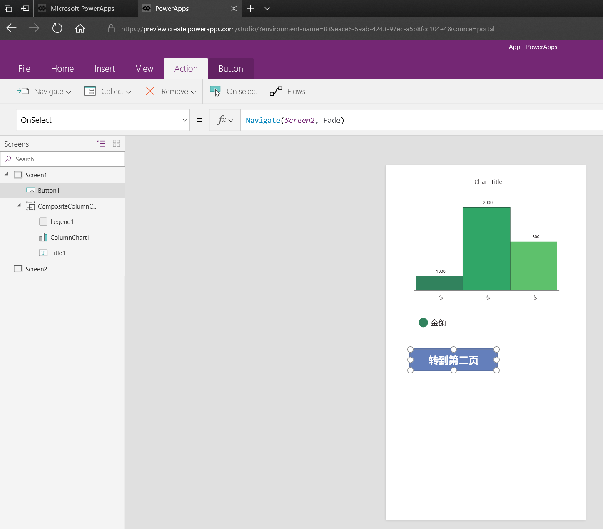](https://github.com/chenxizhang/office365dev/blob/master/docs/images/powerapps-button-event.PNG)

> 请注意，你可以在事件表达式中定义多个操作，只要用分号将他们分开即可，例如 `Collect(TestData,Dropdown1.Selected);Navigate(Screen2, ScreenTransition.Fade)`
> 
> 

在这里，我建议大家花个半天的时间，逐一地了解这些控件，理解常见的属性以及事件，只要大致做过一次，我相信对于你日后使用PowerApps将有极大的帮助。使用数据
====

接下来要谈一谈数据。大家知道，界面只是一个表象，真正用户在交互的其实是数据。我在 [入门篇](https://github.com/chenxizhang/office365dev/blob/master/docs/powerapps.md) 中已经介绍了Excel文件，SharePoint List，Dynamics 365的业务实体作为数据的场景。今天要进一步深入探讨一下。首先，你要知道的是，一个PowerApps的应用可以使用多个数据源，一个数据源反过来也可以用于多个PowerApp的应用中。在顶部菜单中找到View，点击Data Source可以查看到当前这个应用中能用到的所有数据源，当然也可以添加你需要的其他数据源。[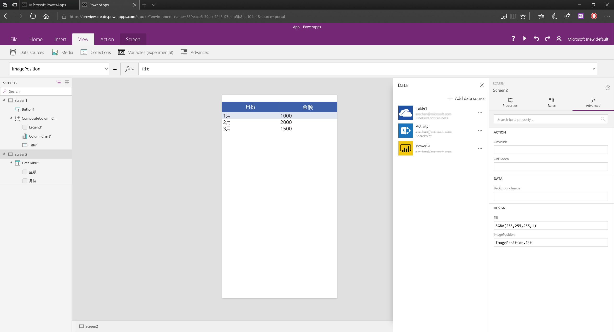](https://github.com/chenxizhang/office365dev/blob/master/docs/images/powerapps-datasource.png)其次，你需要掌握几个常见的数据筛选函数。虽然一个应用中能支持多个数据源，但是它没有办法像PowerBI 那样在这些数据源建立映射和关系。那么，当我希望根据用户的选择，决定对某个数据集合进行筛选、排序等操作时应该怎么办呢？答案是使用数据筛选函数。PowerApps提供了三个非常强大的函数：Filter、Search 和 LookUp。我非常推荐大家要详细阅读 <https://docs.microsoft.com/zh-cn/powerapps/functions/function-filter-lookup> 这篇文章并且进行实际的操作来加深了解，这是你从会做一个Hello world这样的应用到一个实际能用在工作中的应用必须要学会的。最后，你需要了解如何在屏幕传递数据。如果我们需要从一个屏幕切换到另外一个屏幕，如何将前一个屏幕的数据传递过来呢？PowerApps提供了上下文变量的概念，而且在很多函数中都自带了这个功能，例如Navigate函数，就可以在第三个参数定义要传递下去的变量和值。下图定义了一个Language的变量，仅在这个Navigate的生命周期内有效。[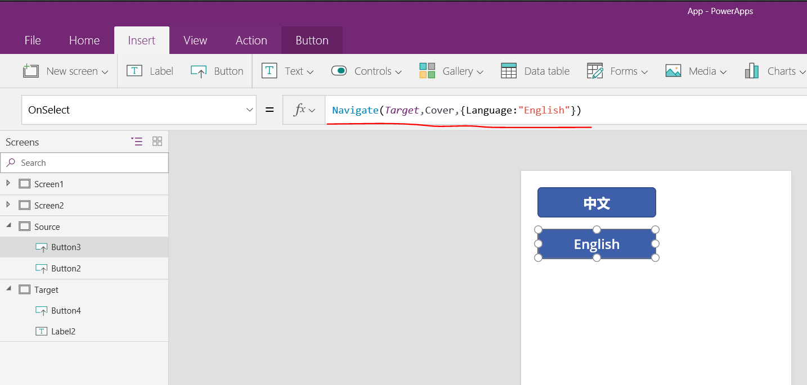](https://github.com/chenxizhang/office365dev/blob/master/docs/images/powerapps-context-function.PNG)你还可以通过下面的功能查看所有的变量，以及它们被使用的情况关于PowerApps的上下文变量的细节，请参考 <https://docs.microsoft.com/zh-cn/powerapps/functions/function-updatecontext>如果想要定义在整个应用程序都能用的全局变量，请参考Collect函数 <https://docs.microsoft.com/en-us/powerapps/functions/function-clear-collect-clearcollect>
> 对于绝大部分数据源来说，每次都是以当前用户的身份去访问的。所以不管你是一个Excel文件放在OneDrive for Business，还是一个SharePoint List，在分享给同事们之前，你需要确保他们是有权限访问到的。
> 
> 

PowerApps也提供了一个专门的函数（User），用来获取当前用户的邮箱，显示名称，个人头像这三个数据。使用网关
====

PowerApps默认支持上百种数据源，尤其是对于云端的SaaS应用有极好的支持。但是，假设你的数据不在支持列表中，或者你的数据是在公司内部的服务器，能否一样享受到PowerApps带来的好处呢？答案是可以，PowerApps通过一个网关（gateway）的技术，可以在你授权的情况下安全地连接到你私有的数据。[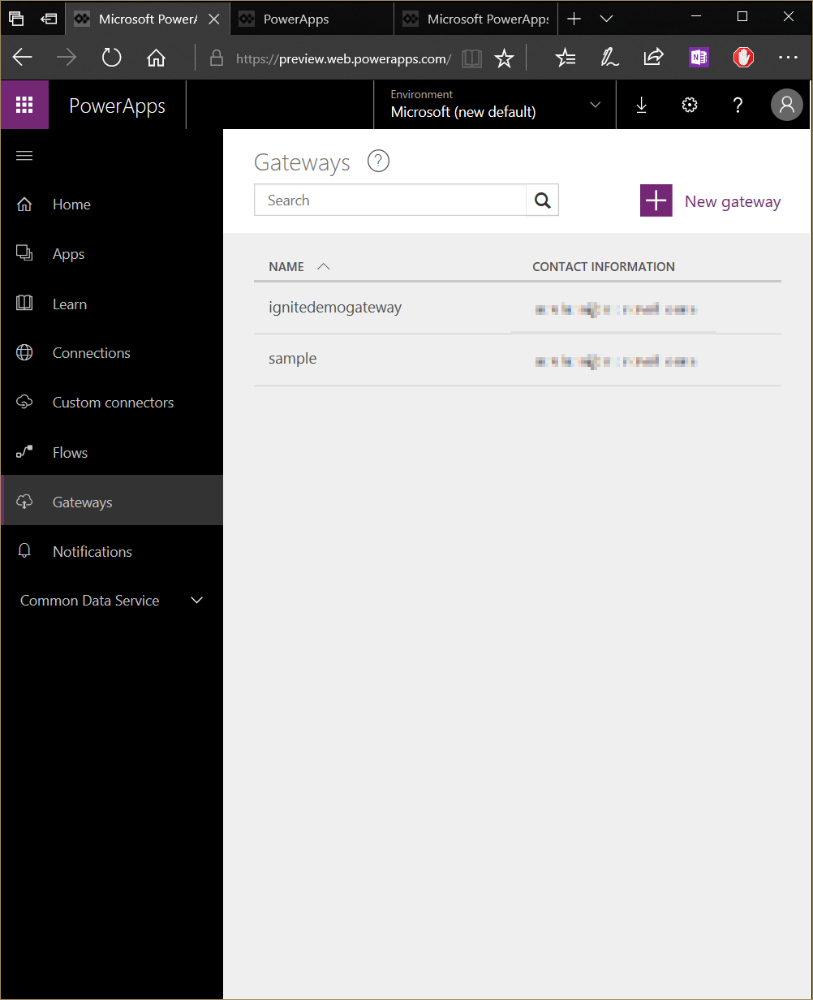](https://github.com/chenxizhang/office365dev/blob/master/docs/images/powerapps-gateway.png)点击右上角的New Gateway按钮，你将被引导到一个下载界面[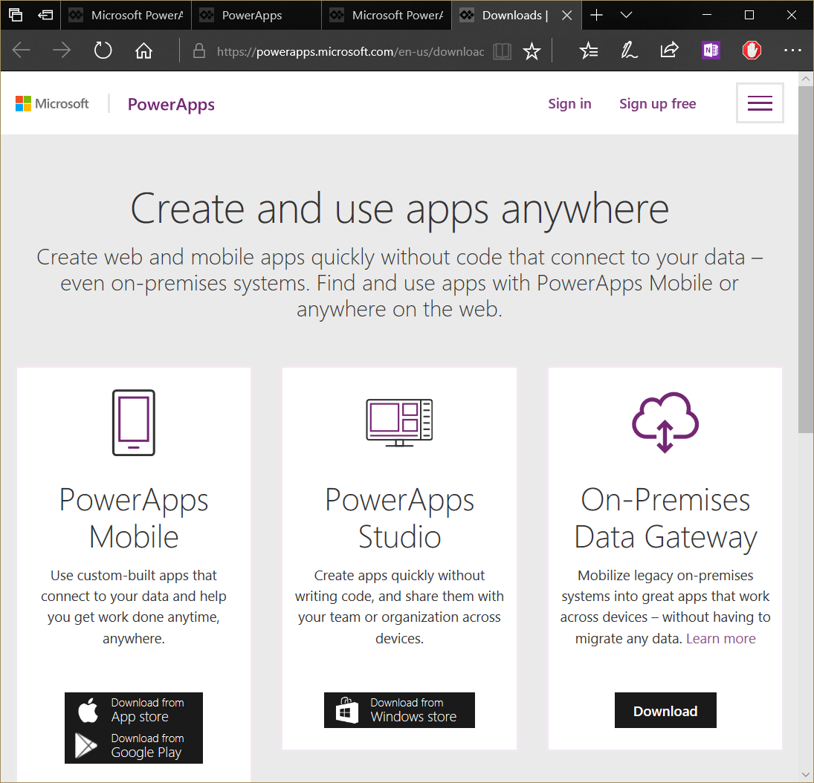](https://github.com/chenxizhang/office365dev/blob/master/docs/images/powerapps-downloadgateway.png)下载完成后双击安装，最后输入你能登录到PowerApps的账号进行身份认证[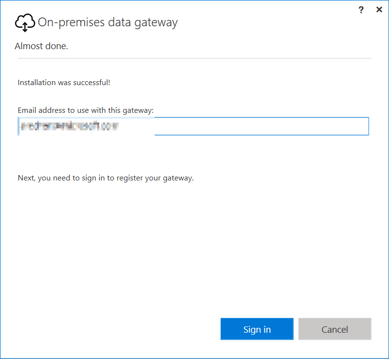](https://github.com/chenxizhang/office365dev/blob/master/docs/images/powerapps-gateway-install.png)如果你看到下面这样的界面，则表示配置成功了。我们发现PowerApps，Microsoft Flow，Power BI是共用Gateway这个基础设施的，无需配置三套。[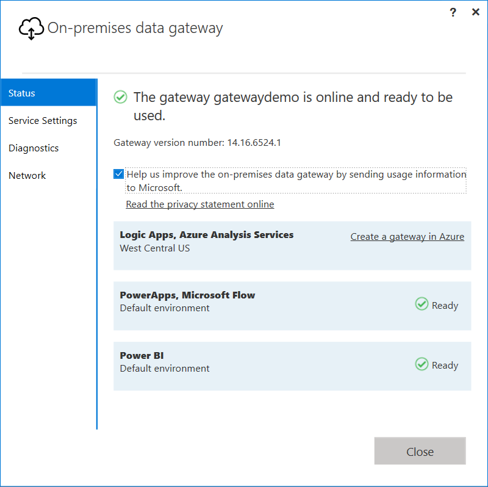](https://github.com/chenxizhang/office365dev/blob/master/docs/images/powerapps-gateway-2.png)那么怎么使用这个网关呢？我们还是要回到网关的管理界面，你看到现在多出来一个gatewaydemo的网关[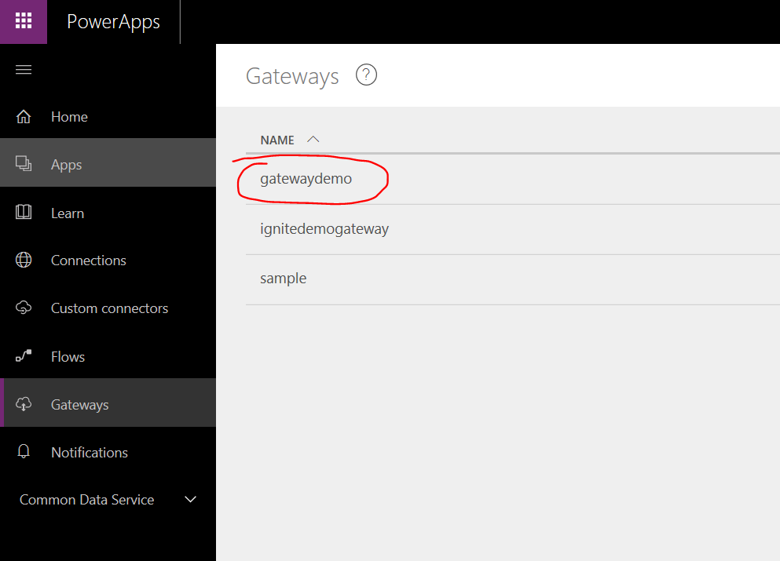](https://github.com/chenxizhang/office365dev/blob/master/docs/images/powerapps-gateway-3.png)接下来，你在新建连接的时候，选择你的数据源类型（例如SQL Server）后，在具体配置的时候，选择使用Connect using on-premises data gateway[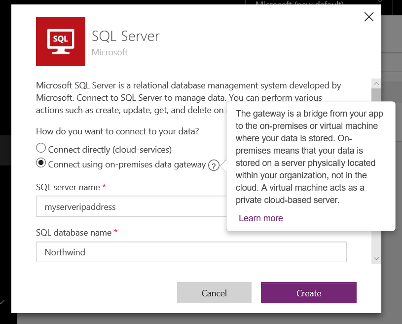](https://github.com/chenxizhang/office365dev/blob/master/docs/images/powerapps-gateway-4.PNG)详细步骤你还可以参考 [这篇文章](https://powerapps.microsoft.com/en-us/blog/connect-to-your-on-premises-data-sources-using-on-premises-data-gateway-from-powerapps/)应用生命周期管理
========

本文的结束，我想要给大家介绍关于PowerApps的应用生命周期管理的概念。PowerApps是面向业务用户、快速开发和迭代的一个平台，只有这样才能满足随需应变的业务需求。所以，你会快速开始工作，发布你的应用，然后在使用过程中，根据反馈再快速调整设计，然后又重新发布。这样就带来一个版本管理（或者再往大里说——应用生命周期管理）的问题。PowerApps会为每次发布保存一个版本，例如下图可以看到我的AppTest这个应用，目前两个版本，而版本2是目前在使用的(Live)[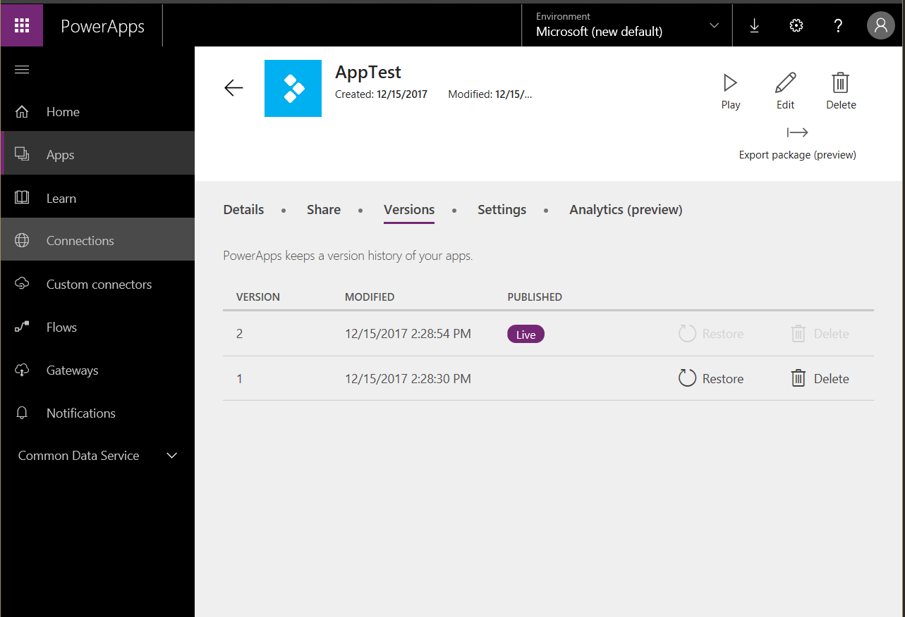](https://github.com/chenxizhang/office365dev/blob/master/docs/images/powerapps-versioncontrol.PNG)如果你发现版本2并不是很稳定，或者某些功能并不是你所预期的那样正常工作，你完全可以在这里回滚到版本1，通过点击版本1的Restore按钮即可。

