# 为PowerApps和Flow，Power BI开发自定义连接器 
> 原文发表于 2017-12-20, 地址: http://www.cnblogs.com/chenxizhang/archive/2017/12/20/8072543.html 


> 作者：陈希章 发表于 2017年12月20日
> 
> 

前言
==

我在之前用了几篇文章来介绍新一代微软商业应用平台三剑客（[PowerApps](https://github.com/chenxizhang/office365dev/blob/master/docs/powerapps.md)，[Microsoft Flow](https://github.com/chenxizhang/office365dev/blob/master/docs/microsoftflow.md)，[Power BI](https://github.com/chenxizhang/office365dev/blob/master/docs/powerbi.md)），相信对于大家会有一种跃跃欲试的冲动，他们看起来真的不难，因为他们的定位是要给业务部门的用户直接使用的。那么现在问题就来了1. 他们为什么能这么灵活和强大？ 
- 如果这些活儿都是业务部门用户自己去做了，那么IT部门人员，开发人员该干嘛呢？

好问题啊！但是这两个问题其实是相关的，而且第二个问题的答案就是第一个问题所描述的结果。因为可以将IT专业人员（IT Pro）和开发人员（Developer）从日常的轻量级业务应用的工作中解放出来，所以，他们可以去做一些更加擅长的技术、通用性的业务支撑组件的开发。我们再来看一张已经多次展示过的图片[](https://github.com/chenxizhang/office365dev/blob/master/docs/images/businessplatformarc.png)在应用的基础架构这部分，Common Data Service我此前已经[介绍](https://github.com/chenxizhang/office365dev/blob/master/docs/commondatamodel.md)过了，Gateways也已经在 [PowerApps进阶篇](https://github.com/chenxizhang/office365dev/blob/master/docs/powerappsadv.md)中讲解过。Pro dev extensibility 在目前这个系列中我不准备展开。那么就余下了Connectors（连接器了）。当然，实际上我们早就使用过了连接器，例如在Microsoft Flow中内置了将近200个连接器，如下[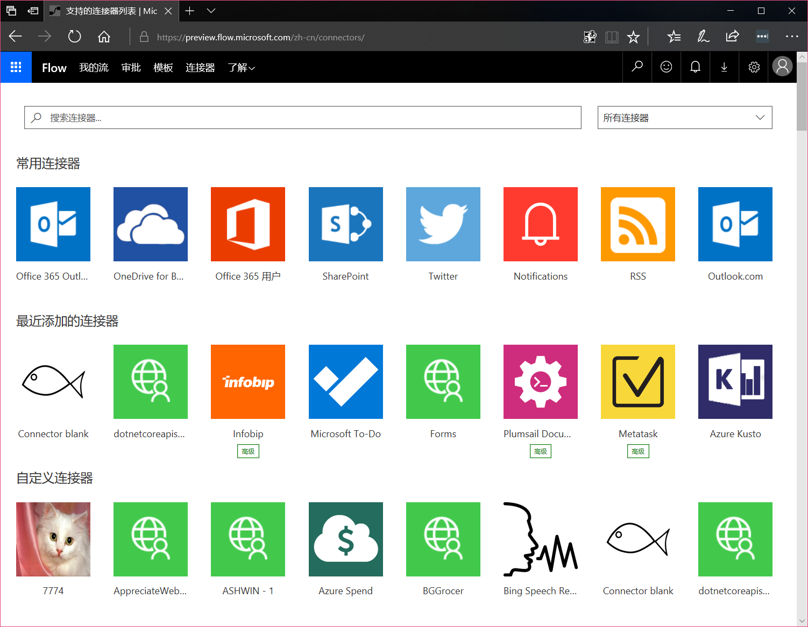](https://github.com/chenxizhang/office365dev/blob/master/docs/images/2017-12-20-08-56-29.png)但是，如果我们需要的某个功能，上面的连接器并没有提供，而你有正好有一定的开发能力，那么本文将很适合你。我们将以一个实例介绍如何自定义连接器。从某种意义上说，PowerApps和Flow是共用连接器的，而Power BI的连接器则更特殊一点。本文的内容将包括1. 编写一个Web API服务（适合于PowerApps和Flow） 
- 在Flow中创建自定义连接器 
- 在Flow中使用自定义连接器 
- 在PowerApps中使用自定义连接器 
- Power BI自定义连接器的开发思路

编写一个Web API服务
=============

可以这么说，绝大部分的连接器，都是一个Web API服务。我们将一些业务逻辑封装在服务器端(或者准确地说是云端)，然后有选择性地暴露出来一些接口，供PowerApps和Flow在需要的时候调用。所以，在开始自定义连接器之前，你需要做的就是编写一个Web API服务。你可以用任何熟悉的语言和平台完成这个工作，但我已经完成了一个使用C#编写的，基于dotnet core框架的Web API服务的例子，因为本文的重点不是将具体如何创建Web API服务以及部署，所以我用另外一篇文章专门讲解了这个过程，请参考[使用 dotnet core 和 Azure PaaS服务进行devOps开发 (Web API 实例)](http://www.cnblogs.com/chenxizhang/p/8067824.html)该项目的代码，可以通过 <https://github.com/chenxizhang/dotnetcoreapisample> 下载到。[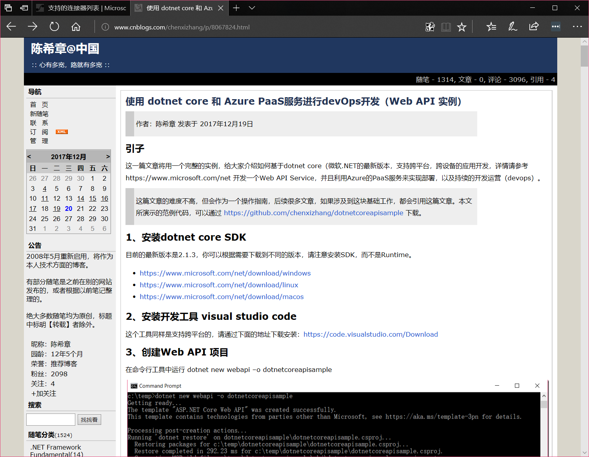](https://github.com/chenxizhang/office365dev/blob/master/docs/images/2017-12-20-09-04-50.png)但是，在PowerApps或Flow中定义自定义连接器的时候，如果有一个服务描述文档，则会大大简化操作。所以，我们需要在上面这个成果的基础上添加一个功能，让它能自动生成一个服务描述文档。微软官方的建议是用swagger的规范。关于swagger，如果有兴趣，可以参考他们的官网：<https://swagger.io/specification/>在上述项目中添加swagger的支持，请参考下面的步骤1. 使用该命令导入一个包 `dotnet add package Swashbuckle.AspNetCore`，然后进行还原 `dotnet restore`- 在Startup.cs文件中，添加两个命名空间的引用 `using Swashbuckle.AspNetCore`和 `using Swashbuckle.AspNetCore.Swagger`- 在ConfigureServices方法的底部增加如下代码 
```
services.AddSwaggerGen(_=>{
    _.SwaggerDoc("v1",new Info(){
        Version ="1.0",
        Title ="dotnet core api sample",
        Contact = new Contact(){Name="Ares Chen",Email ="ares@xizhang.com"},
        Description ="dotnet core api sample using swagger"
    });
});

```
- 在Configure方法的底部增加如下代码 
```
app.UseSwagger();
app.UseSwaggerUI(_=>_.SwaggerEndpoint("/swagger/v1/swagger.json","v1"));

```

完成上面的工作后，请按照[使用 dotnet core 和 Azure PaaS服务进行devOps开发 (Web API 实例)](http://www.cnblogs.com/chenxizhang/p/8067824.html) 提到的步骤那样，将代码提交到Azure的Git存储库，然后在浏览器中访问 <https://dotnetcoreapisample.azurewebsites.net/swagger/v1/swagger.json> ,正常情况下你会看到如下的结果输出。
> 你的实际部署地址可能跟我不一样，因为Azure不允许同名地址。如果你不想自己去部署，你可以直接用我的这个地址查看输出结果，并且将其用在后续的自定义连接器中。
> 
> 

[](https://github.com/chenxizhang/office365dev/blob/master/docs/images/2017-12-20-09-20-57.png)这是一个JSON的文档。如果你用格式化工具来查看，它可能是这样的：[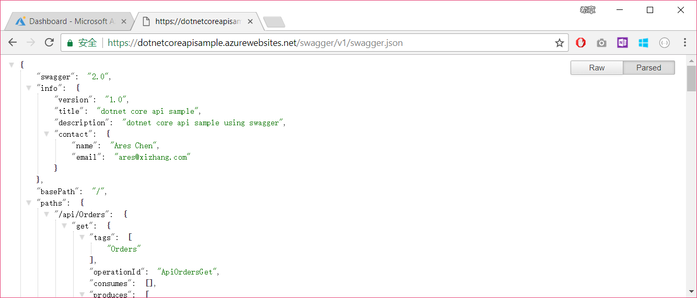](https://github.com/chenxizhang/office365dev/blob/master/docs/images/2017-12-20-09-21-07.png)查看它并不是重点，你现在需要做的是将点击右键，然后另存到本地（swagger.json），一会儿我们就会用到这个文件来自定义连接器。在Flow中创建自定义连接器
==============

准备好了上面这个Web API服务的话，接下来就可以在Flow中来自定义连接器了。[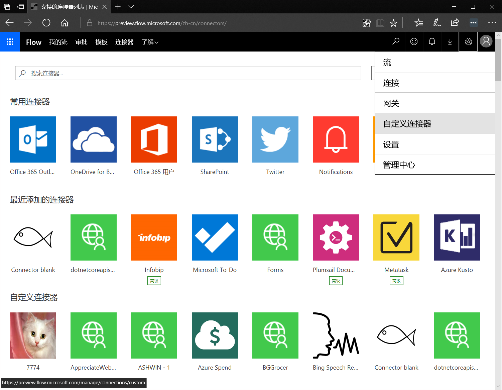](https://github.com/chenxizhang/office365dev/blob/master/docs/images/2017-12-20-09-29-30.png)在接下来的界面中选择导入现有OpenAPI文件来定义连接器[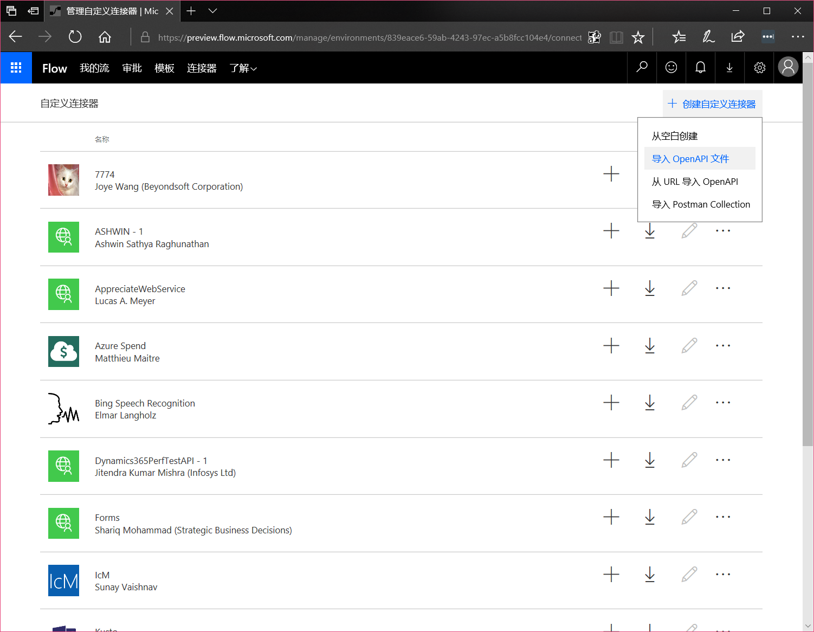](https://github.com/chenxizhang/office365dev/blob/master/docs/images/2017-12-20-09-30-29.png)接下来定义标题，并且找到此前保存在本地的swagger.json文件[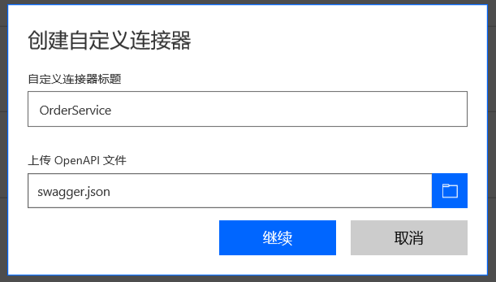](https://github.com/chenxizhang/office365dev/blob/master/docs/images/2017-12-20-09-33-40.png)点击“继续”，设置一些基本信息[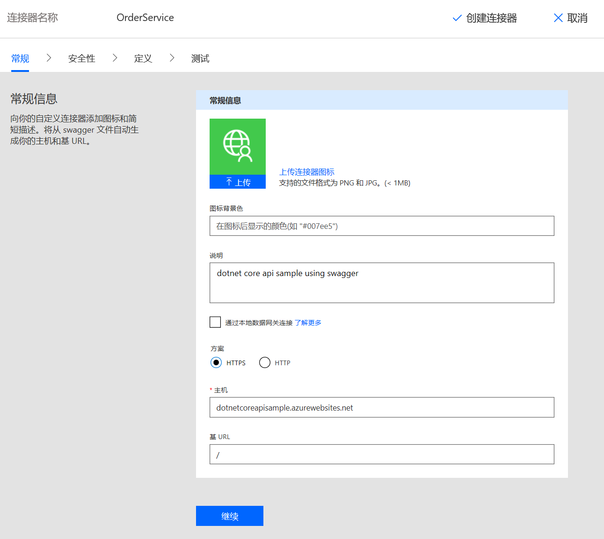](https://github.com/chenxizhang/office365dev/blob/master/docs/images/2017-12-20-09-34-57.png)点击“继续”，在安全设置这里暂时先选择 “无身份验证”[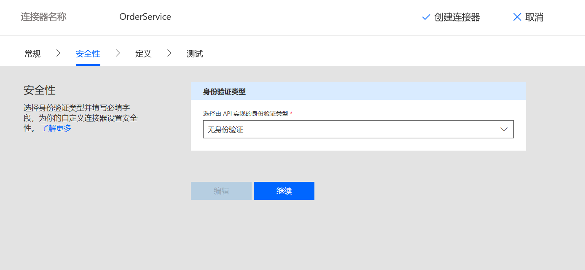](https://github.com/chenxizhang/office365dev/blob/master/docs/images/2017-12-20-09-36-06.png)
> 请注意，真正使用的连接器，是需要做身份验证的。建议在这个基础上，大家做一些针对性的实践。
> 
> 

点击“继续”，此时Flow会读取swagger文件中的定义信息，列出所有的操作[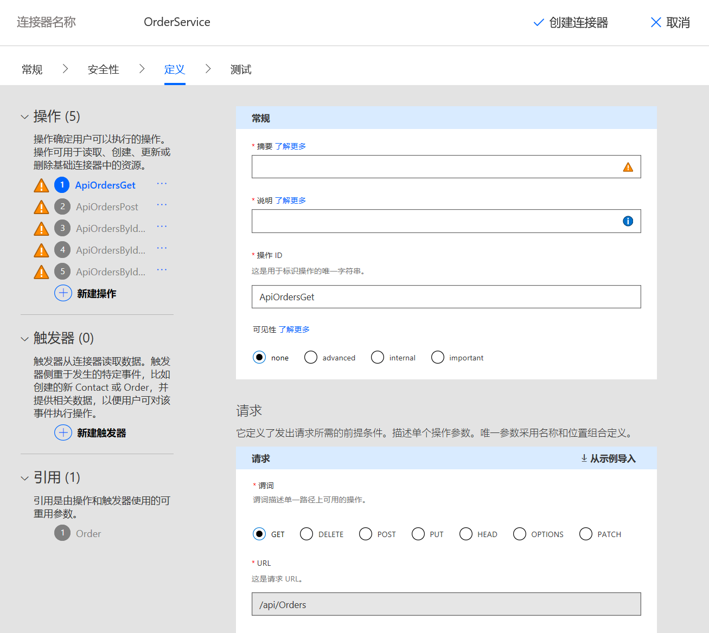](https://github.com/chenxizhang/office365dev/blob/master/docs/images/2017-12-20-09-37-28.png)你会发现我们有五个操作，对应了创建订单，修改订单，查询订单（列表以及单个订单的详情),删除订单。目前来说在这些操作上面有一个感叹号的提示，因为有部分信息还需要你做定义：摘要和说明。请补充完整即可。[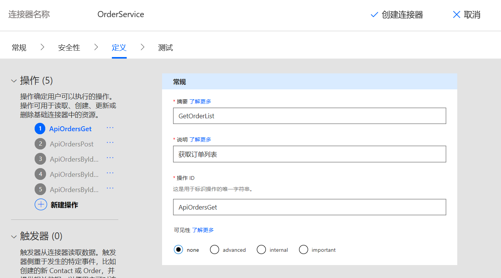](https://github.com/chenxizhang/office365dev/blob/master/docs/images/2017-12-20-09-41-30.png)如果你确认没有问题了，请点击“创建连接器”来完成操作。[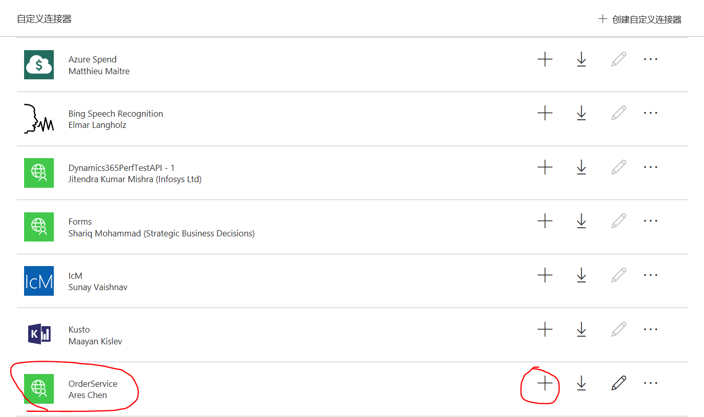](https://github.com/chenxizhang/office365dev/blob/master/docs/images/2017-12-20-09-43-54.png)然后点击加号，可以基于这个连接器（connector）创建一个用于当前环境的连接（connection）。[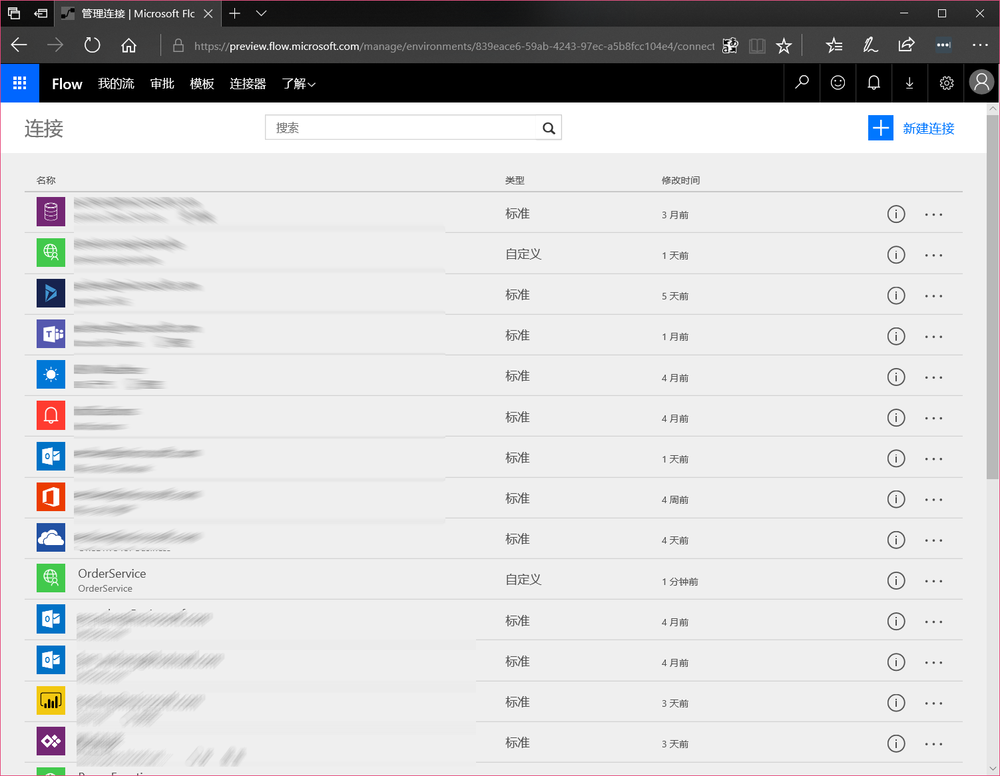](https://github.com/chenxizhang/office365dev/blob/master/docs/images/2017-12-20-09-48-28.png)在Flow中使用自定义连接器
==============

接下来我们“从空白创建”来体验上面这个自定义连接器的使用。为了便于测试，我选择用“手工触发流”。如果你对这个方面不熟悉，请参考 [这篇文章](https://github.com/chenxizhang/office365dev/blob/master/docs/microsoftflow.md)。[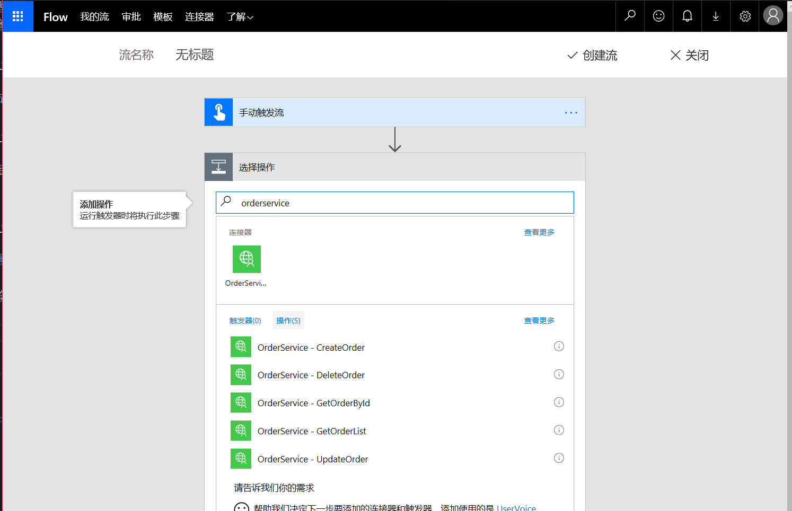](https://github.com/chenxizhang/office365dev/blob/master/docs/images/2017-12-20-09-57-17.png)在添加操作的时候，搜索Orderservice，你能看到有五个操作，下面我们添加CreateOrder，输入一些基本信息[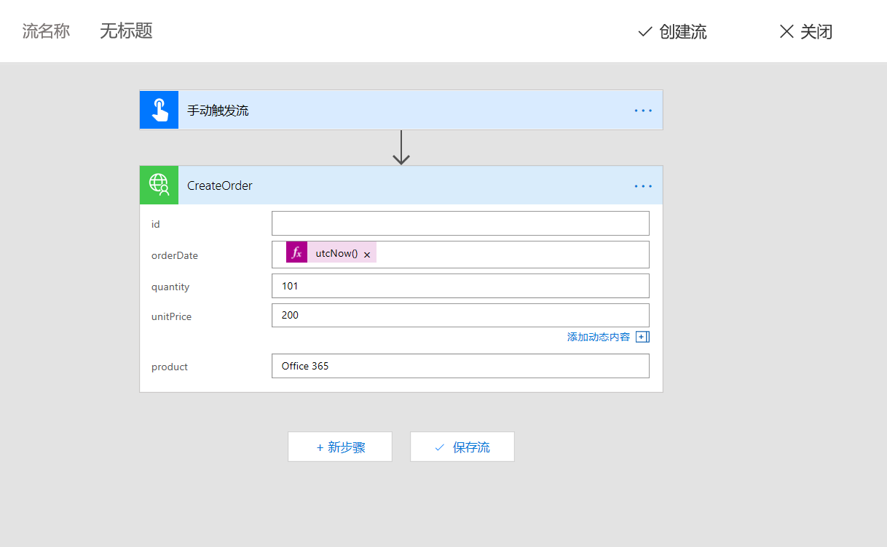](https://github.com/chenxizhang/office365dev/blob/master/docs/images/2017-12-20-10-02-36.png)当然为了让测试更加直观，我继续添加了一个获取订单列表的操作，然后将获取到的结果发送到一个服务器地址。[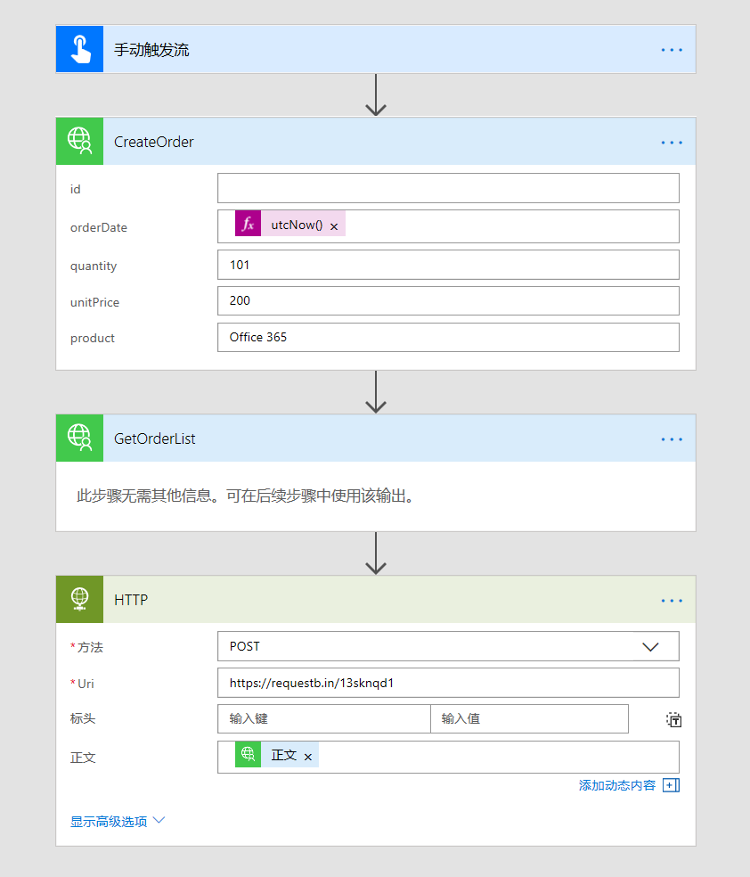](https://github.com/chenxizhang/office365dev/blob/master/docs/images/2017-12-20-10-10-59.png)点击“创建流”，然后点击“立即运行”按钮[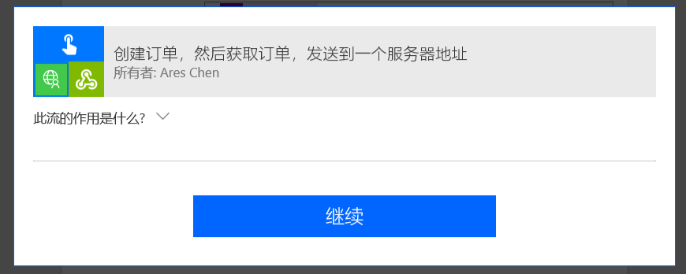](https://github.com/chenxizhang/office365dev/blob/master/docs/images/2017-12-20-10-07-58.png)点击“继续”[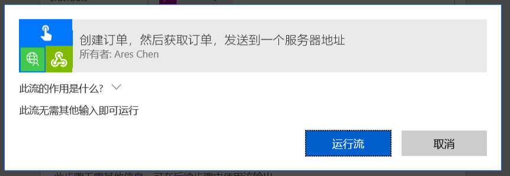](https://github.com/chenxizhang/office365dev/blob/master/docs/images/2017-12-20-10-08-17.png)点击“运行流”，很快你就能看到下面的结果[](https://github.com/chenxizhang/office365dev/blob/master/docs/images/2017-12-20-10-11-57.png)而且在我的服务器也很快收到了数据[](https://github.com/chenxizhang/office365dev/blob/master/docs/images/2017-12-20-10-12-46.png)在PowerApps中使用自定义连接器
===================

同样的事情，在PowerApps上面也是类似的。所以，你在PowerApps中也立即可以看到之前定义好的这个OrderService的连接。[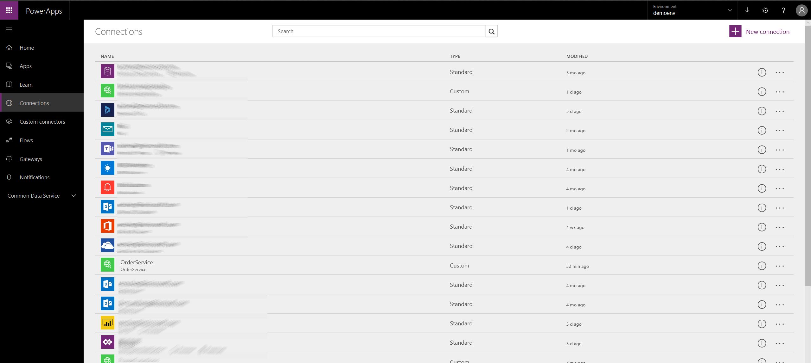](https://github.com/chenxizhang/office365dev/blob/master/docs/images/2017-12-20-10-18-23.png)在创建应用的时候，可以很自然地选择到这个数据连接[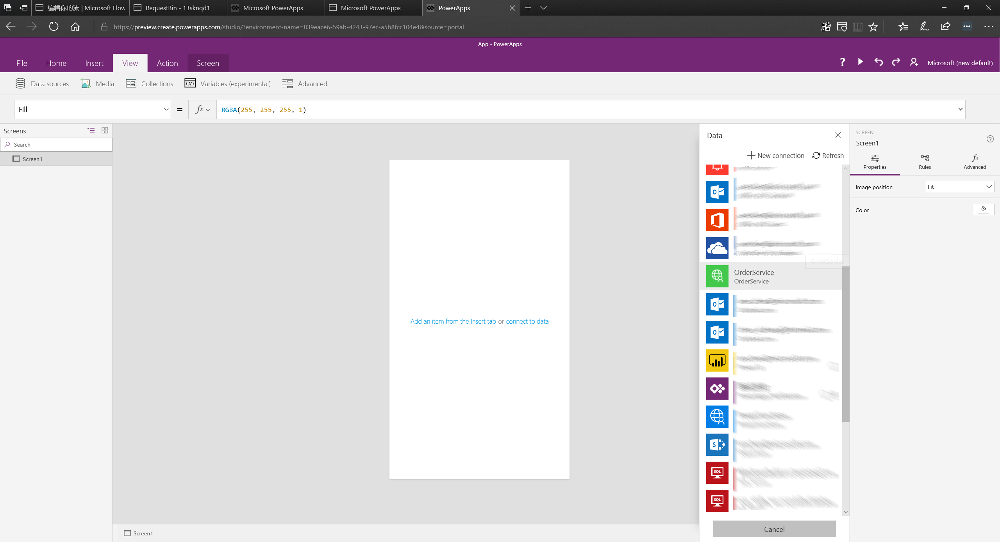](https://github.com/chenxizhang/office365dev/blob/master/docs/images/2017-12-20-10-20-34.png)建立连接后，在数据控件上面可以通过下面的方式调用方法。例如下面这个操作，是读取订单列表。[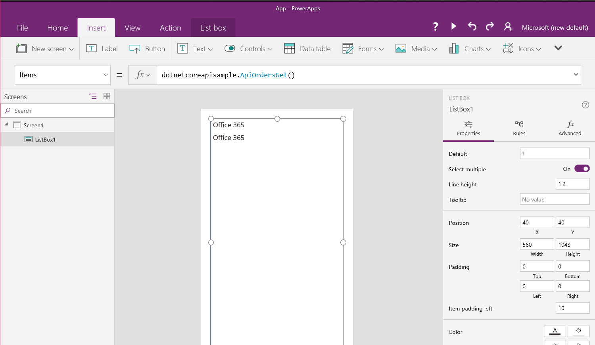](https://github.com/chenxizhang/office365dev/blob/master/docs/images/2017-12-20-10-26-28.png)如果要创建一个订单，可以参考下面的做法。[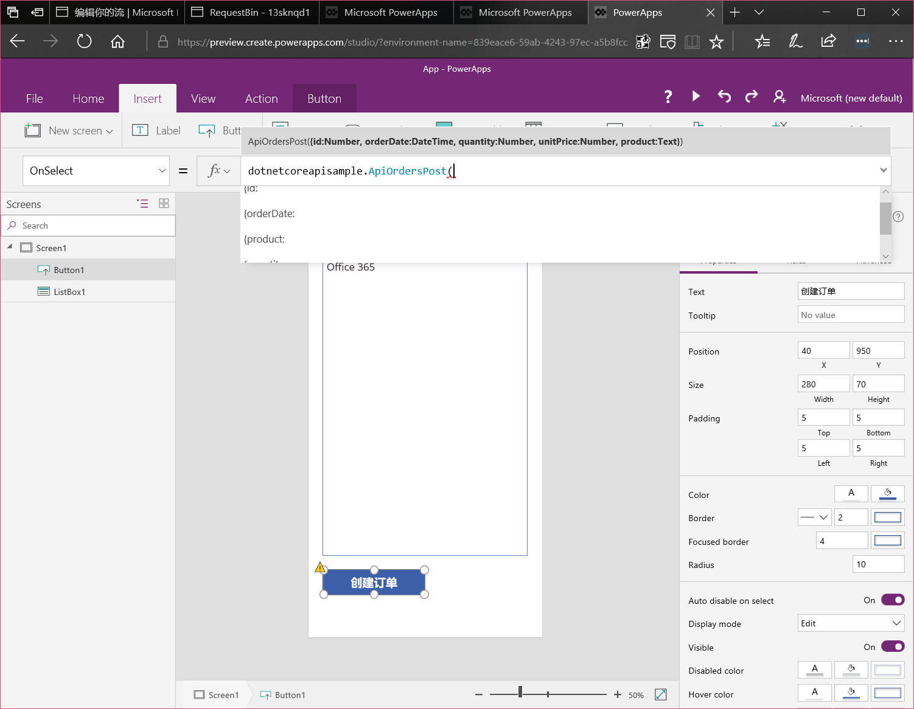](https://github.com/chenxizhang/office365dev/blob/master/docs/images/2017-12-20-10-28-21.png)Power BI自定义连接器的开发思路
===================

看完上面的介绍，大家对于创建Web API服务，并且将其用于PowerApps和Flow的过程有了感性的认识。我们可能还会很自然地联想到，这个服务和连接器能否也用于三剑客中的另外一个组件——PowerBI，用于数据获取呢？答案是：目前还不行。Power BI目前支持的自定义连接器的方式，目前是在Preview的阶段，其实现方式是比较特殊的，有兴趣的朋友可以参考下面这篇文章：[Data Connector SDK Developer Preview](https://powerbi.microsoft.com/en-us/blog/data-connectors-developer-preview/)结语
==

新一代的商业应用平台，它的强大依赖于强大的底层设计和灵活的应用架构。作为PowerApps和Flow的基础，连接器是一个核心的基础组件。微软提供的组件化架构，让开发人员可以使用自己习惯的方式开发Web API，并将其无缝地整合到业务应用的开发中去。


