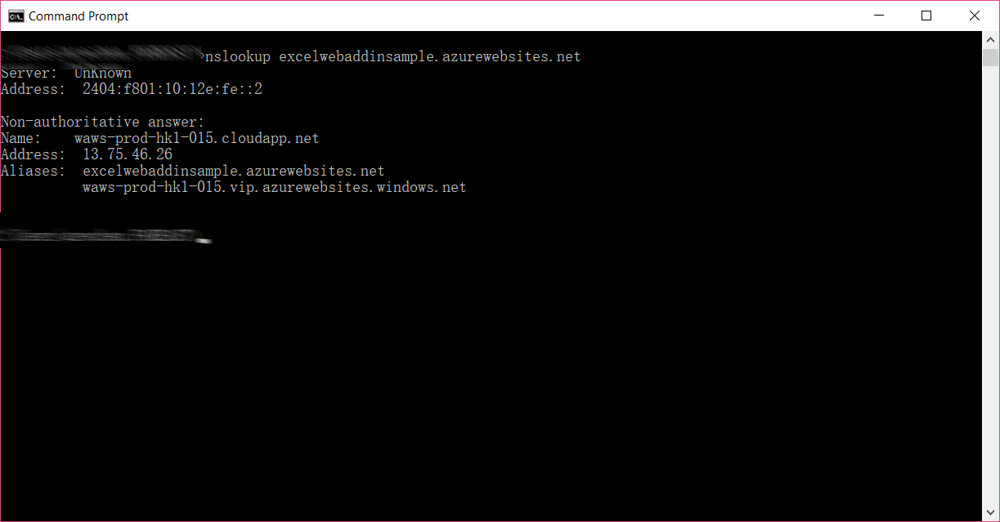
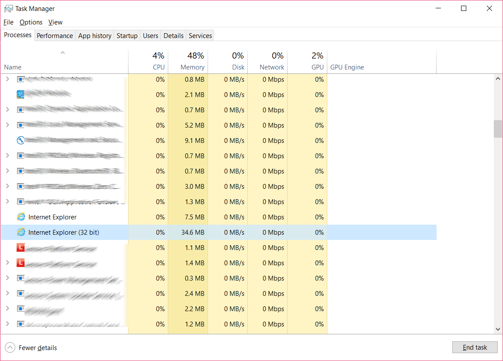
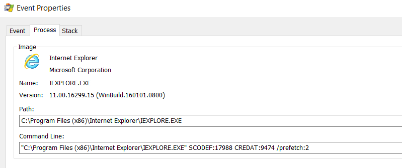
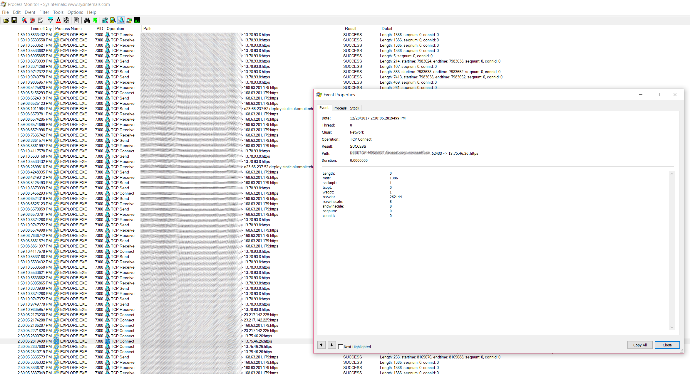
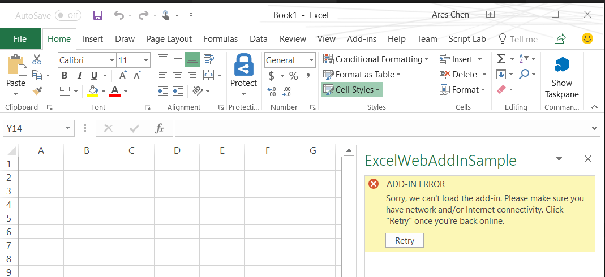

# Office Web Add-in的技术原理和开发常见问题剖析 
> 原文发表于 2017-12-20, 地址: http://www.cnblogs.com/chenxizhang/archive/2017/12/20/8074384.html 


> 作者：陈希章 发表于 2017年12月20日
> 
> 

我过去发表过一些Office Add-in开发的文章，并且也在不同的场合分享过新的开发模式及其带来的机遇。有不少朋友给我反馈，也讨论到一些常见问题，我这里集中地总结一下给大家参考。1. Office Web Add-in的适用场景这是很多人的困惑。我在[这篇文章](https://github.com/chenxizhang/office365dev/blob/master/docs/exceladdinsample.md)中详细对照了三种为Office开发Add-in的技术和表现形式，这里再总结一下新的Web Add-in适用的场合
	* 开发人员本身对于网络开发比较熟悉
	* 你希望这个插件能够跨平台使用
	* 你希望更加方便地进行集中部署和更新
	* 这个插件的功能除了Office内部的操作，还有大量的外部资源访问
	* 用户能随时访问网络，并且网络条件有保障
	* 用户对于运行速度的敏感度不是很高，并不是说Web Add-in的运行速度慢，是因为Web Add-in开发中很多操作都是异步执行的，所以会造成感觉上的运行慢的体验- 工作原理到底是怎么样的这也是很多人的疑问。我们可以稍微回顾一下历史，VBA是直接运行在Office进程（例如Excel）中的，它应该算是一个脚本，会有主程序动态加载，编译运行。一旦运行结束，则会释放资源。而VSTO则更为复杂，因为它是用`.NET`开发出来的托管代码，所以他本身是不能通过宿主程序直接运行的，而是需要从宿主程序（其实是COM）通过平台调用的方式（Interop）发起一个指令，然后由.NET CLR加载Add-in的组件，这个组件如果需要操作Excel的资源，又要通过平台调用的方式反过来调用COM。那么，今天的Web Add-in到底又是怎么样加载和运行的呢？它是通过一个独立的浏览器进程（例如IE）来运行的。下面我将详细解释这方面的原理。
> 在不同的平台上，Office Add-in所依赖的浏览器及其版本是不一样的，这给开发人员要提一个醒：浏览器兼容性测试还是很重要的。官方文档有提到对于浏览器及其版本的要求：<https://docs.microsoft.com/en-us/office/dev/add-ins/concepts/requirements-for-running-office-add-ins>。
> 
> 

通过nslookup命令，可以看出我目前这个托管在azurewebsites.net上面的范例插件，它的服务器IP地址是 13.75.46.26（注意，因为Azure平台有很多服务器，所以实际上针对一个域名可能会有很多IP地址，如果你用nslookup命令可能得到的结果跟我不一样）[](https://github.com/chenxizhang/office365dev/blob/master/docs/images/2017-12-20-14-26-45.png)在插件加载后，我们一般会在进程管理器中看到两个IE的进程。这里有一个细节，如果你的Office是32位的，那么它的核心进程会是一个32位的，你可以查看如果加载多个插件的话，它所占用的内存会逐步增加。但是，仍然是一个进程。[](https://github.com/chenxizhang/office365dev/blob/master/docs/images/2017-12-20-14-27-33.png)但是，如果你的Windows是64位的，此时它会另外创建一个64位的IE进程，这两个进程其实是一个调用的关系。从下图可以看出来32位的进程其实是在调用64位那个进程的。[](https://github.com/chenxizhang/office365dev/blob/master/docs/images/2017-12-20-14-35-37.png)如果要具体来证明这些进程是访问到我们那个插件的网站，可以通过进程查看器来观察[](https://github.com/chenxizhang/office365dev/blob/master/docs/images/2017-12-20-14-31-33.png)

- 如何在Web Add-in的Javascript代码中异步访问到远程的服务既然我们知道Office Add-in本质上是一个网络应用，根据你所选择的开发技术不同，对于访问远程服务资源的做法也不一样。如果你是用ASP.NET MVC来实现的，那么可能会简单一些，因为MVC本身就可以包含一些服务器代码。但如果你更加喜欢用Javascript代码来编程，你的服务资源调用，需要注意遵循一个两个重要原则：
	* 这个资源必须使用Https的方式提供，而且证书必须是合法的。如果部署到Azure的应用服务，则默认就带有了合法的证书，支持https访问。
	* 这个资源必须支持跨域访问。关于如何支持跨域访问，我另外有一篇文章可以参考:<http://www.cnblogs.com/chenxizhang/p/7975521.html>下面我这里有一个范例代码可供参考。我专门写了一个范例的API服务 <https://webaddinapisample.azurewebsites.net/api/values>，大家如果测试也可以直接使用它。
```
$("#run").click(() => tryCatch(run));

async function run() {
    await Excel.run(async (context) => {
        await $.get("https://webaddinapisample.azurewebsites.net/api/values").done(async function (result) {
            //这里一定要注意，必须是https地址，而且证书要有效，并且设置跨域访问
            var sheet = context.workbook.worksheets.getActiveWorksheet();
            var range = sheet.getRange("A1:B1");
            range.values = [result];

            await context.sync();

            
        }).fail(function (jqXHR, textStatus, errorThrown) {
            console.log(errorThrown);
        });


    });
}

/** 尝试执行某个方法 */
async function tryCatch(callback) {
    try {
        await callback();
    }
    catch (error) {
        OfficeHelpers.UI.notify(error);
        OfficeHelpers.Utilities.log(error);
    }
}


```
- 网络断开是否可以继续用这个问题的答案跟问题本身一样简单：不能。由于Web Add-in本质上是一个网络应用，所以没有网络，Add-in是无法加载的。[](https://github.com/chenxizhang/office365dev/blob/master/docs/images/2017-12-20-13-50-36.png)
> 据官方提到，有可能日后会有支持本地缓存的技术实现。但目前还没有看到这方面的路线图。
> 
> 

- 能不能通过代码增加菜单目前仅支持利用清单文件来定义界面元素，包括Ribbon和快捷菜单。如果你对这方面有兴趣，请参考 [详解Office Add-in 清单文件](https://github.com/chenxizhang/office365dev/blob/master/docs/officeaddinmanifest.md)。这可能是跟VBA和VSTO相比较而言，比较大的劣势，其他的功能方面，也并不是完全一致，这个还有一个不断发展的过程，好消息是，这些API还是快速地开发中。<https://dev.office.com/reference/add-ins/openspec>

- 怎么做基于事件的编程？面向事件的编程，可能是绝大部分开发人员根深蒂固的观念。其实Office Add-in本身就是面向事件的编程。所有的代码，都是从一个 `Office.initialize` 的事件开始的。再往深入地看，针对不同的宿主程序，不同的资源对象，是否还可以绑定事件并且进行响应处理呢？我们在VBA或VSTO中或多或少是可以这么做的，例如Workbook的Open事件等等。在Web Add-in中，事件通过一个特殊的做法来实现：Binding。但目前的支持是有限的，请参考官方文章：<https://dev.office.com/reference/add-ins/excel/binding> 。下面有一个简单的实例可供参考：
```
$("#setup").click(() => tryCatch(setup));
$("#register-data-changed-handler").click(() => tryCatch(registerDataChangedHandler));

async function registerDataChangedHandler() {
    await Excel.run(async (context) => {
        const sheet = context.workbook.worksheets.getItem("Sample");    
        const salesTable = sheet.tables.getItem("SalesTable");
        const dataRange = salesTable.getDataBodyRange();
        //创建事件绑定
        const salesByQuarterBinding = context.workbook.bindings.add(dataRange, "range", "SalesByQuarter");
        salesByQuarterBinding.onDataChanged.add(onSalesDataChanged);

        OfficeHelpers.UI.notify("The handler is registered.", "Change the value in one of the data cells and watch this message banner. (Be sure to complete the edit by pressing Enter or clicking in another cell.)");

        await context.sync();
    });
}

//这是事件处理代码
async function onSalesDataChanged() {
    await Excel.run(async (context) => {
        OfficeHelpers.UI.notify("Data was changed!!!!", "");

        await context.sync();
    });
} 

//准备初始化数据
async function setup() {
    await Excel.run(async (context) => {
        const sheet = await OfficeHelpers.ExcelUtilities.forceCreateSheet(context.workbook, "Sample");
        let salesTable = sheet.tables.add('A1:E1', true);        
        salesTable.name = "SalesTable";
        salesTable.getHeaderRowRange().values = [["Sales Team", "Qtr1", "Qtr2", "Qtr3", "Qtr4"]];

        salesTable.rows.add(null, [
            ["London", 500, 700, 654, null ],
            ["Hong Kong", 400, 323, 276, null ],
            ["New York", 1200, 876, 845, null ],
            ["Port-of-Spain", 600, 500, 854, null ],
            ["Nairobi", 5001, 2232, 4763, null ]
        ]);  

        salesTable.getRange().format.autofitColumns();
        salesTable.getRange().format.autofitRows();
        sheet.activate();

        await context.sync();
    });
}


async function tryCatch(callback) {
    try {
        await callback();
    }
    catch (error) {
        OfficeHelpers.UI.notify(error);
        OfficeHelpers.Utilities.log(error);
    }
}

```
- 能不能编写自定义函数这个问题很显然是一个Excel的开发人员问的。
	* 在VBA在是这么做的: [https://support.office.com/zh-cn/article/在-Excel-中创建自定义的函数-2F06C10B-3622-40D6-A1B2-B6748AE8231F?ui=zh-CN&rs=zh-CN&ad=CN](https://support.office.com/zh-cn/article/%E5%9C%A8-Excel-%E4%B8%AD%E5%88%9B%E5%BB%BA%E8%87%AA%E5%AE%9A%E4%B9%89%E7%9A%84%E5%87%BD%E6%95%B0-2F06C10B-3622-40D6-A1B2-B6748AE8231F?ui=zh-CN&rs=zh-CN&ad=CN)* 在VSTO中是这么做的：<https://blogs.msdn.microsoft.com/eric_carter/2004/12/01/writing-user-defined-functions-for-excel-in-net/>在Web Add-in的时代，目前已经提供了针对发烧友（Office Insider）的Developer Preview支持，请参考 <https://docs.microsoft.com/en-us/office/dev/add-ins/excel/custom-functions-overview>

- 能不能实现文档打开的时候自动加载某个Add-in可以，但是分两种情况。
	* 第一种情况，如果是Content Add-in（目前在Excel和PowerPoint中受支持），则自动就实现了，你可以创建一个文档，然后插入好这个Add-in，保存后，下次打开就自动会加载进来。
	* 第二种情况，如果是TaskPane Add-in（目前在Excel，Word，PowerPoint中受支持），则只有在没有添加VersionOverrides的情况下可以实现类似于Content Add-in 的效果，也就是说不能有自定义的Ribbon和Context Menu。
```
<?xml version="1.0" encoding="UTF-8"?>
<!--Created:ce44715c-8c4e-446b-879c-ea9ebe0f09c8-->
<OfficeApp 
        xmlns="http://schemas.microsoft.com/office/appforoffice/1.1" 
        xmlns:xsi="http://www.w3.org/2001/XMLSchema-instance" 
        xmlns:bt="http://schemas.microsoft.com/office/officeappbasictypes/1.0" 
        xmlns:ov="http://schemas.microsoft.com/office/taskpaneappversionoverrides"
        xsi:type="TaskPaneApp">

<!-- Begin Basic Settings: Add-in metadata, used for all versions of Office unless override provided. -->

<!-- IMPORTANT! Id must be unique for your add-in, if you reuse this manifest ensure that you change this id to a new GUID. -->
<Id>f43cc685-d5de-464e-a97c-520017b901a3</Id>

<!--Version. Updates from the store only get triggered if there is a version change. -->
<Version>1.0.0.0</Version>
<ProviderName>[Provider name]</ProviderName>
<DefaultLocale>en-US</DefaultLocale>
<!-- The display name of your add-in. Used on the store and various places of the Office UI such as the add-ins dialog. -->
<DisplayName DefaultValue="WordWebAddInSample" />
<Description DefaultValue="WordWebAddInSample"/>
<!-- Icon for your add-in. Used on installation screens and the add-ins dialog. -->
<IconUrl DefaultValue="~remoteAppUrl/Images/Button32x32.png" />

<SupportUrl DefaultValue="http://www.contoso.com" />
<!-- Domains that will be allowed when navigating. For example, if you use ShowTaskpane and then have an href link, navigation will only be allowed if the domain is on this list. -->
<AppDomains>
    <AppDomain>AppDomain1</AppDomain>
    <AppDomain>AppDomain2</AppDomain>
    <AppDomain>AppDomain3</AppDomain>
</AppDomains>
<!--End Basic Settings. -->

<!--Begin TaskPane Mode integration. This section is used if there are no VersionOverrides or if the Office client version does not support add-in commands. -->
<Hosts>
    <Host Name="Document" />
</Hosts>
<DefaultSettings>
    <SourceLocation DefaultValue="~remoteAppUrl/Home.html" />
</DefaultSettings>
<!-- End TaskPane Mode integration.  -->

<Permissions>ReadWriteDocument</Permissions>
<!-- End Add-in Commands Mode integration. -->

</OfficeApp>
```


