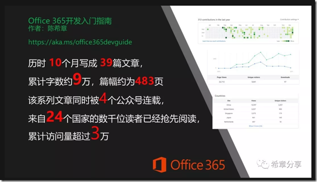

# 《Office 365开发入门指南》上市说明和读者服务 
> 原文发表于 2018-09-23, 地址: http://www.cnblogs.com/chenxizhang/archive/2018/09/23/9693103.html 

写在最开始的话

拙作《Office 365开发入门指南》上周开始已经正式在各大书店、在线商城上市，欢迎对Office 365的开发、生态感兴趣的开发者、项目经理、产品经理参考本书，全面了解Office 365带来的全新机遇以及在具体业务应用开发中的场景。

写作本书差不多花了我一年的业余时间，这其实是源于我从美国回来后，跟国内的开发者朋友们交流时许下的一个承诺。我最开始是将一些文章发表在博客上面，后来越写越多，目录也一再调整，到2017年底的时候，发现篇幅已经不小，而且累计的阅读量也有了一定的规模。

在跟公司领导沟通汇报了这个情况，也听取了技术社区朋友们的意见后，大家建议可以将这些文章集结成书。整理本书的过程又花了半年左右的时间，个中曲折和辛苦我已不愿过多提起，在此衷心感谢为本书的最终面世提供支持和付出努力的领导、同事，以及北京大学出版社的编辑（魏老师和孙宜编辑）。

虽然我竭尽了全力，想确保该书的内容和质量，但由于水平所限，可能其中仍然有不少可以改进的地方，敬请大家批评指正。另外，由于Office 365一直在不断改进，可能少数功能的界面或者用法与我写作之时已经有出入，敬请谅解，并且通过读者服务渠道跟我取得联系，谢谢大家支持。

 

读者服务渠道和安排

1. **购买渠道**。目前该书已经在全国各大书店以及京东、当当等网站可以购买，据说线上购买有一定的折扣。
2. **反馈渠道**。通过我的公众号（需要先关注"希章分享"）可以直接提交本书的任何反馈。另外，您也可以通过  office365devguide@xizhang.com 和我取得联系。
3. **专属服务**。为了帮助大家更好地使用本书，我接下来会为每一章录制一个有声课程，给大家讲一讲重点，并且提示一些最新的功能。这一批有声课程将于国庆节之前通过"希章分享"这个公众号推送，请大家留意。
4. **其他提示**。在微软和合作伙伴举办的Office 365相关活动——包括每年由微软组织Tech Summit、Microsoft 365 DevDays，以及由合伙伙伴和MVP技术社区组织的Office 365活动，本书很可能会作为奖品或者礼品送给到场的参会（赛）者，部分场合会有签名版本，欢迎大家多多参与。

 

 

内容摘要和阅读指南

微软的Office365是业界知名的生产力平台，从2011年6月28日正式推出以来，现在全世界拥有数以亿计的活跃用户，实现现代化办公；不仅如此，Office365对于广大的开发者来说，更提供了广阔的发展机遇，你可以利用这个平台所提供的能力，快速构建"云优先、移动优先"的应用，以全新的方式分发给全世界的用户。

这是第一本围绕Office365开发的中文图书，出自微软高级产品经理之手，不仅全面介绍了Office365开发的架构，也有丰富详实的案例，同时还有国内版和国际版的比较，相信对于开发者是一个实用性指南。

本书共分为六个章节，首先第一章会为读者回顾一下Office平台开发的技术和场景，并且引出Office 365开发的四个核心方向，第二章着重展开了基于Microsoft Graph的开发流程和案例，第三章详细介绍了全新的Office Web Add-in的架构和开发生命周期，第四章围绕SharePoint Online的开发技术进行探讨。第五章展示了Office365开发的另外一个新的领域和快速开发面向主题的商业应用程序实践，最后的第六章揭示了Office 365现有的人工智能技术，以及详细讲解了如何基于Office 365开发智能服务机器人的过程。

本书的定位首先是帮助广大的Office 开发人员实现从传统的、分散的客户端开发体验向Office 365提供的一致的、跨平台、跨设备的体验过渡，如果你已经有Office开发的经验（包括VBA和VSTO），这本书将带领你了解新的平台（Office365）及其带来的新的机遇，Web Add-in采用主流的Web技术实现，一方面可以让你的应用更加易于分发和更新，另外一方面也可以让你的开发技能进一步扩展，建议你先着重阅读第一章和第三章。如果是你已经有SharePoint开发的经验，通过本书你将了解到SharePoint Online与本地版本的SharePoint Server在开发模式上面的差异，通过阅读第一章和第四章你还将深入学习SharePoint Add-in和SharePoint Framework在设计上面的考虑和具体应用场景。

与此同时，独立开发商（ISV）的开发团队、项目经理、产品经理也可以从本书获得明显的收益，这是因为Office365提供了一套强大的接口（Microsoft Graph），你可以通过这种新的技术，将Office365的能力集成到你的解决方案中去，为你的客户提供更多独特的价值。这些能力既包含了Office 365标准的功能，例如邮件，个人网盘，文档协作，联系人管理，会议室和日程管理等等，也包括基于Office 365的大量数据来实现人工智能的能力。本书第一章、第二章以及第五章、第六章特别适合于此类读者。

 

