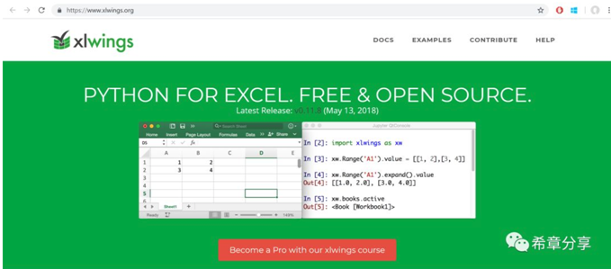

# Python在Office 365 开发中的应用 
> 原文发表于 2018-10-02, 地址: http://www.cnblogs.com/chenxizhang/archive/2018/10/02/9738018.html 

我在昨天发布的文章 —— [简明 Python 教程：人生苦短，快用Python](http://mp.weixin.qq.com/s?__biz=MjM5ODEyNjE5OA==&mid=2455455046&idx=1&sn=e9f334674b6deacdeb0d5483dced218b&chksm=b160925f86171b494e0b7f432e766af677353e1aa03d1fe018ba0cad3486af33b39f24fa5adc&scene=21) —— 中提到了Python已经在Office 365开发中全面受支持，有不同朋友留言或私信说想了解更加详细的说明，所以特意整理这一篇给大家参考。

 

我之前写的《Office 365 开发入门指南》一书，对Office 365开发进行了比较详细的阐述，有兴趣可以参考 [《Office 365开发入门指南》上市说明和读者服务](http://mp.weixin.qq.com/s?__biz=MjM5ODEyNjE5OA==&mid=2455454926&idx=1&sn=a069bd8162987b9bc3866a69fb1ed9ce&chksm=b16093d786171ac150a69f1b83ab26c8ff8a306d74cdb4440457d4602023efacd5803875f6a9&scene=21)

 

 

**Microsoft Graph SDK for Python**

 

如果你用Python开发了一个应用程序，希望调用Microsoft Graph来访问Office 365的数据，例如联系人列表，邮件处理，文件分享等。你可以通过下面的地址得到Microsoft Graph SDK，以及代码范例。

 

http://aka.ms/pythongraphsamples

 

 

**Office 365 Add-ins with Python**

 

Office 365 Add-ins包括Office Add-ins和SharePoint Add-ins，在新的Web Add-ins的这种框架下，Python可以很自然地开发以上两种组件，因为他们其实都是用一个manifest文件进行定义，然后核心内容都是用一个网站来提供。Python可以很方便地开发网站，所以非常简单。

 

这里有一个Office Add-in 范例 https://github.com/OfficeDev/Groups-API-Office-Add-in-Python-Sample 

 

 

你可以用任意你喜欢的方式来开发Python 网站，例如在Visual Studio中提供了Python工具套件。

 

 

除了上面的这种新型的Web Add-in，Python也可以通过传统方式与Office 应用程序交互，例如操作Excel，PowerPoint，Word等。请参考下面的介绍。

 

**Python with Excel**

 

有几个很好的Python模块能够方便地操作Excel的数据，包括读与写，**不要求本地安装Excel**。例如pandas, openpyxl, xlrd, xlutils 和 pyexcel. 详情可以参考下面的介绍：

https://www.datacamp.com/community/tutorials/python-excel-tutorial 

 

 

**Python for Excel**

 

利用xlwings模块，你可以很方便地Python应用程序中操作Excel文件（同时支持xls和xlsx），也可以在Excel中直接调用Python的脚本（通过RunPython函数），还可以使用Python为Excel自定义函数，**需要本地安装Excel**。请参考 https://www.xlwings.org/ 

 

 

**Python for Word**

 

使用python-docx这个模块，可以很方便地创建和修改Word文档（不需要本地安装Word）

https://pypi.org/project/python-docx/

 

 

**Python for PowerPoint**

 

使用python-pptx这个模块，可以很容易地创建或修改PowerPoint 文档（不需要本地安装PowerPoint）。请参考

https://python-pptx.readthedocs.io/en/latest/ 

 

 

其实还有很多，Python的模块都是开源的，由全世界的程序员贡献并分享，如果遇到什么需求，可以先用**pip search**命令搜索一下，也许已经有了现成的模块呢。

 

本文转载自微信公众号"希章分享"，有兴趣可扫描关注。

 

