# 人工智能第一课：使用分类算法预测糖尿病 
> 原文发表于 2018-11-26, 地址: http://www.cnblogs.com/chenxizhang/archive/2018/11/26/10018388.html 

原文链接：<https://mp.weixin.qq.com/s/nXFVTorYOm5LjRV5Cic2_w>

如果你不能用数据表示你所知，那么说明你对它所知不多；如果你对它所知不多，那么你就无法控制它；如果你无法控制它，那么就只能靠运气了。

—— 陈希章

 

 

不久前，我开始正儿八经地系统地学习人工智能，并且发起了一个结对学习的活动，目前已经有将近20位同学一起结对，详情请参考下面文章的说明—— [约你六个月时间一起学习实践人工智能](http://mp.weixin.qq.com/s?__biz=MjM5ODEyNjE5OA==&mid=2455455186&idx=1&sn=2ec54a0dff45ce90f699dc21a02c6bfd&chksm=b16092cb86171bdd13410385bf4fadf2da66106ea19afcf6c4a95e75bd694e6f537f9276f392&scene=21) 。

 

目前仍接受报名，但我会对人数总量做一定的控制，并且各位在加入之前必须想清楚自己能否真的花时间坚持下去，一定时间没有学习进度的会被请出群。

 

我之前承诺大家，会将在学习过程中的笔记分享出来。这是第一篇，也是我完成第一门课《Introduction to Artificial Intelligence》第一单元《Machine Learning》的一些心得。

 

我写的笔记，只是学习过程中的一些记录，或者一些思考，很有可能会有很多地方有错误，欢迎大家指出，帮助我提高。

 

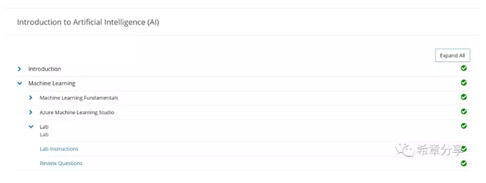

 

这门课是人工智能入门，它的内容分为四个部分：机器学习概述，语音和通信，计算机视觉，对话平台。

 

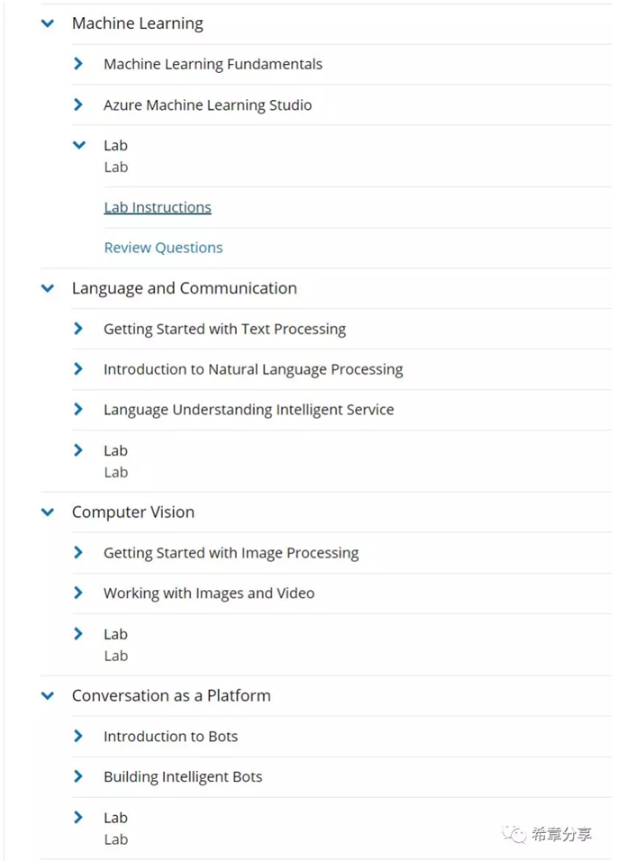

 

本节介绍了机器学习的基本概念，主要应用场景，并着重通过以Azure Machine Learning Studio为载体，讲解了导入数据、建立和训练、验证模型，发布成Web Service的全过程，通过完成本节学习，你可以对Machine Learning有些基本概念，而课后的练习是一个完整的范例，你可以了解如何通过分类算法建立模型来实现糖尿病的预测。（它分别使用了逻辑回归和决策树算法做比较，并最终选择了决策树作为最优解）。

 

机器学习的定义，有兴趣可以参考维基百科的说明：https://zh.wikipedia.org/wiki/%E6%9C%BA%E5%99%A8%E5%AD%A6%E4%B9%A0

 

机器学习是人工智能的一个分支。人工智能的研究历史有着一条从以"推理"为重点，到以"知识"为重点，再到以"学习"为重点的自然、清晰的脉络。显然，机器学习是实现人工智能的一个途径，即以机器学习为手段解决人工智能中的问题。机器学习在近30多年已发展为一门多领域交叉学科，涉及概率论、统计学、逼近论、凸分析、计算复杂性理论等多门学科。机器学习理论主要是设计和分析一些让计算机可以自动"学习"的算法。机器学习算法是一类从数据中自动分析获得规律，并利用规律对未知数据进行预测的算法。因为学习算法中涉及了大量的统计学理论，机器学习与推断统计学联系尤为密切，也被称为统计学习理论。算法设计方面，机器学习理论关注可以实现的，行之有效的学习算法。很多推论问题属于无程序可循难度，所以部分的机器学习研究是开发容易处理的近似算法。

 

看了这么一大段的介绍，其实还是会比较晕。其实最简单理解的话，**机器学习最重要的研究目标就是从大量的数据中找出来一些规律，并且能利用该规律进行预测。**

 

经过这么多年的发展，解决绝大部分问题的算法都已经存在了，我们现在很多时候要做的是收集和准备数据（包括清洗和整理），然后根据业务领域经验建模，并且选择不同的算法去训练模型、验证模型，发现和逼近最好的预测模型。下图是目前Azure Machine Learning 中支持的算法列表。

 

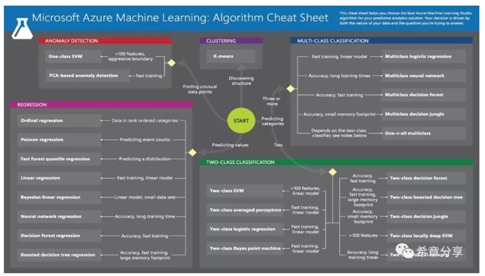

 

机器学习根据其原理分为

 

1. 监督学习
2. 无监督学习
3. 半监督学习

 

 

监督学习与非监督学习的根本区别在于训练集数据是否需要人为地进行标记。典型的监督学习算法包括回归和分类，而典型的无监督学习算法是聚类。半监督学习是介于两者之间的。

 

而关于回归（Regression）和分类（Classification），又有一些明显的区别，我倾向于采纳下面知乎网友的回答。

 

 

那么，回到我们这堂课的命题：通过机器学习来预测某个病人是否为糖尿病（及其概率），这是一个定性问题，它的预测是离散的，而不是连续的，所以这是一个分类的任务。

 

假设我们手工有15000个病例样本，分别记录了他们的血糖，血压，年龄等信息，以及他们是否确诊为糖尿病的数据。（这个Diabetic字段非常重要，而这其实也就是需要人工标记的关键信息）

 

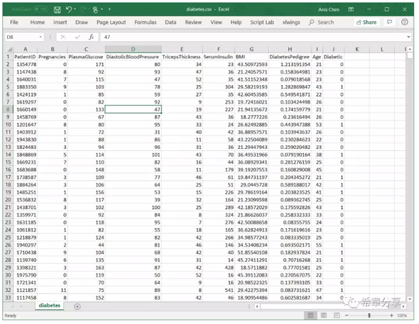

 

另外，还有一份数据是病人和医生的对照表，在本课程学习和作业中，虽然并不是必须的，但这符合真实场景的需要。

 

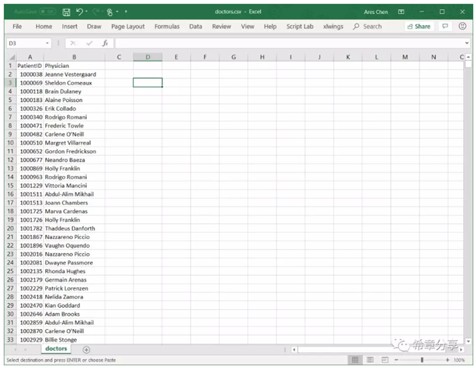

 

对于人工智能和机器学习而言，相比较看起来很酷炫的建模、训练、验证，其实很重要的工作都是在收集数据，有好的数据才会有真正有价值的人工智能。而收集数据中最关键的一个工作是定义哪些数据需要收集，例如上述例子，为什么我们去分析糖尿病时需要选择这些数据，而不是其他的。这里面其实已经有一个建模的过程，而这部分是计算机科学无法实现的，它所依赖的是自然科学和专家经验。

 

如果只是做这种预测，那么我要说，其实我在十几年前就已经能做出来了，那时候我记得"人工智能（Artificial Intelligence）"或"机器学习（Machine Learning）"并没有现在这么流行，人们更热衷于讨论"商业智能（Business Intelligence）"和"数据挖掘（Data Mining）"，我对SQL Server 的BI 和Data Mining还算有一些研究，所以做这种预测还是比较轻松的。

 

今时不同往日，SQL Server仍然还有这些能力。但真正的大数据时代，我们可能还需要云端的解决方案。微软的Azure Machine Learning 解决方案就是其中之一，而Azure Machine Learning Studio会提供你需要的一切。

 

 

下图是我创建好的Training experiment （用来做训练的实验）

 

 

作为一个强大的Machine Learning的工具，它预设了上百个组件，并且可以随时对数据进行可视化分析。

 

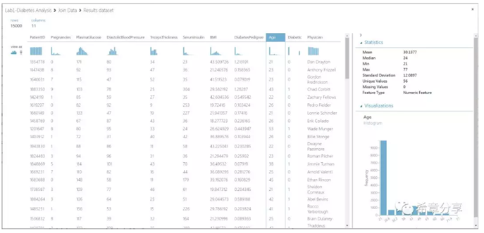

 

对于回归和分类算法，通常我们会在进行数据连接，规范化处理后，对数据集进行拆分，一部分（通常70%）用于训练模型，另一部分（通常30%）用于验证模型。如下图所示：

 

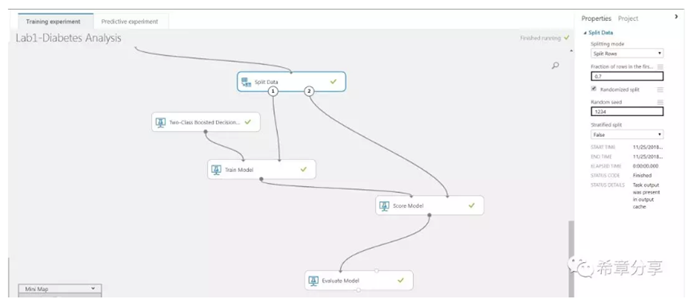

 

在最后一步是验证模型，通常我们会选择多个算法比对其输出结果。如下图所知这种输出，Accuracy 越高，则表示准确性越高，可信度也就越高。

 

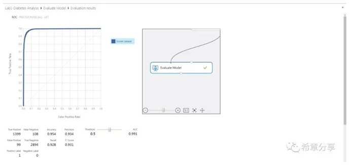

 

模型训练好之后，接下来就是怎么用于预测了。你可以通过创建一个Predictive experiment来实现这个需求。请注意，它其实跟之前的Training experiment看起来很像，只不过你仔细看的话，会发现input处不一样，而且中间的一些组件，它是引用到了Training experiment中的。

 

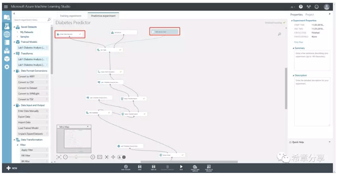

 

你可以一键将其发布为一个Web Service，以便支持客户端调用。

 

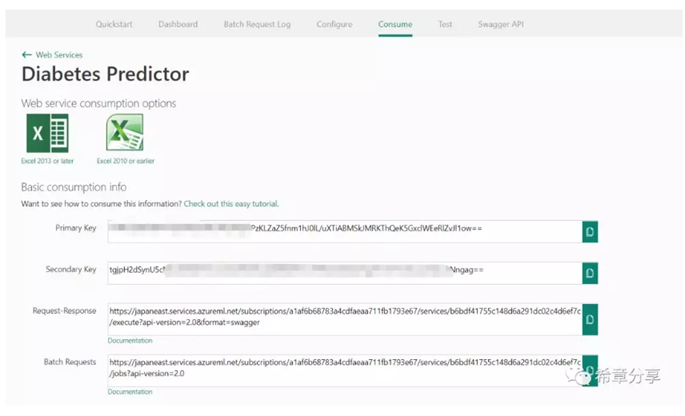

 

下图是在Excel中通过一个Add-in进行预测分析的效果（支持批量对数据集进行预测）

 

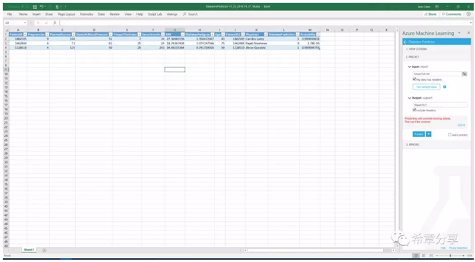

 

下图是我通过Python调用REST API进行预测的范例

 

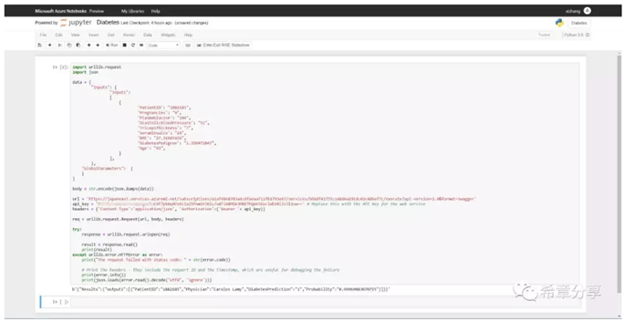

 

欢迎大家关注我的《人工智能学习笔记》，请关注本公众号，并扫描下面二维码收藏本系列文章。 

 

