# 如何加入Microsoft Teams 技术社区 
> 原文发表于 2018-11-19, 地址: http://www.cnblogs.com/chenxizhang/archive/2018/11/19/9985744.html 

作者：陈希章

时间：2018-11-19

 

概述
--

这个手册适合没有Office 365 账号的用户，你可以使用免费版立即开始使用Microsoft Teams，并且与微软的产品组专家，以及来自两岸三地的社区成员互动交流。如果你是现有Office 365用户，你可以跳过绝大部分步骤，提交申请后，按照第八页的提示切换到Microsoft (Guest) 这个组织即可。

 

第一步，通过<https://aka.ms/jointeamsdevcommunity> 提交申请
-------------------------------------------------

 

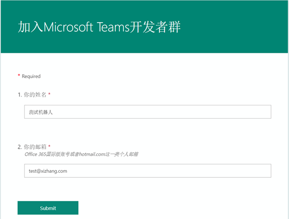

 

 

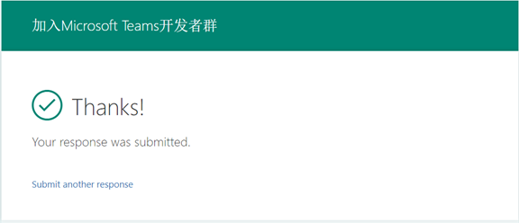

 

正常情况下，你会收到后台自动发出的邮件（立即），一般会在几个小时内开通你的账号。

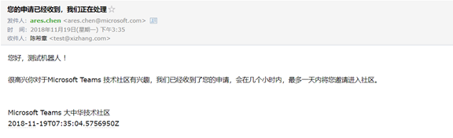

后台在处理时，你将收到下面的邮件内容

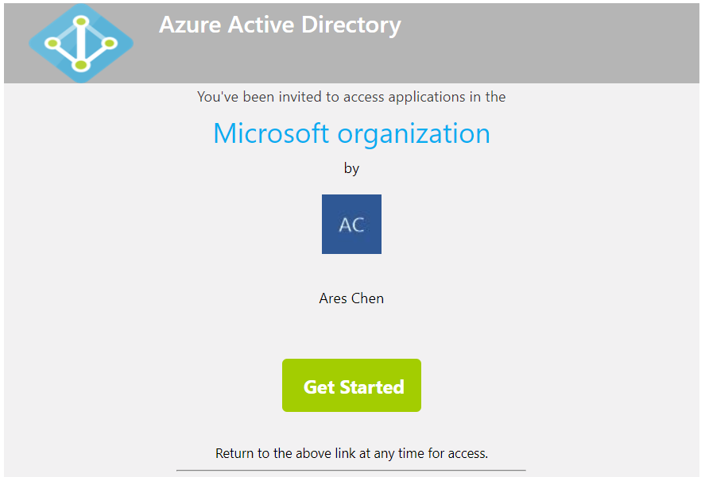

 

第二步，使用下面的地址登录使用免费版Teams
-----------------------

 

<https://products.office.com/en-us/microsoft-teams/free>

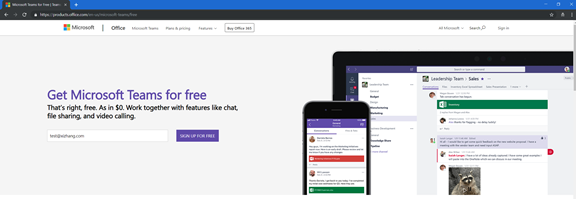

 

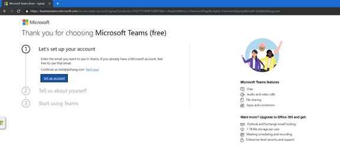

请点击"Setup account" ，这个过程是需要为你的账号创建一个对应的Microsoft Account

 

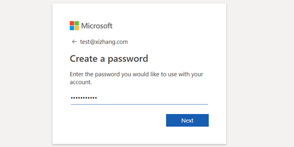

这个密码不是你的邮箱密码，你可以另外设置一个用来作为Microsoft Account的密码

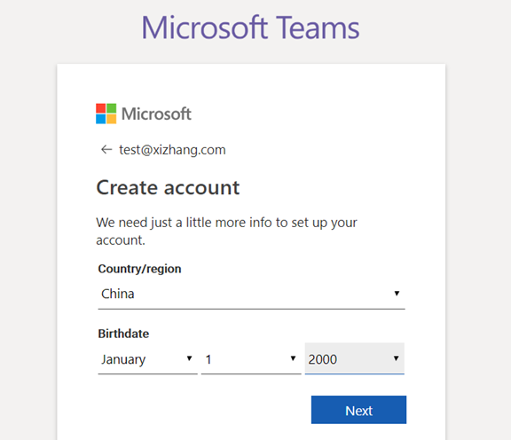

 

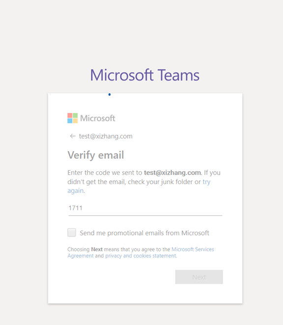

 

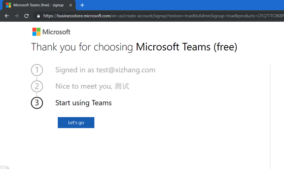

 

如果你看到这个界面，恭喜你，你已经拥有了免费的Teams应用了。

 

 

第三步，登陆Teams
-----------

 

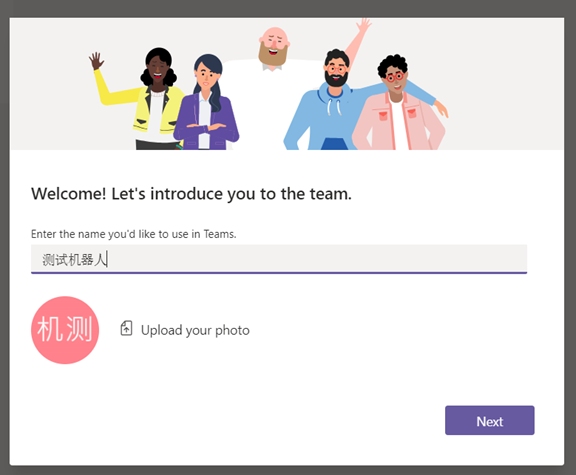

 

完成登陆后，你会看到为你分配的一个空间，这个代表你的公司用的Teams。如果有其他同事（跟你的邮箱后缀一样的）加入进来，你们是可以进行相互的沟通和协作的。

 

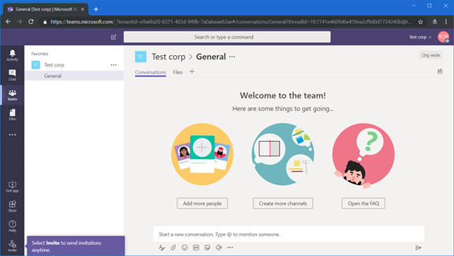

 

与此同时，你还可以加入其他公司创建的Team。例如我们这个技术社区，就是我在微软的环境中创建的，所以你要进入技术社区的话，需要点击一下你的头像左侧的下拉框，你会看到一个"Microsoft(Guest)" 的选项，如下图所示。

惊不惊喜！！！意不意外！！！

 

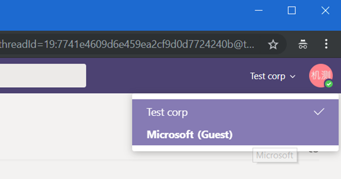

不要激动，你还需要提供一些信息才能正式加入组织…

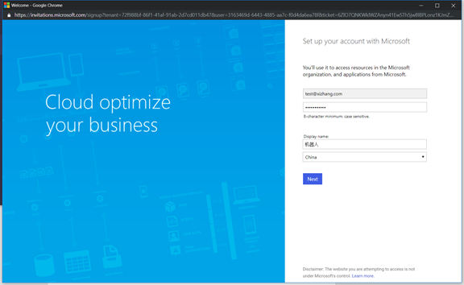

验证身份

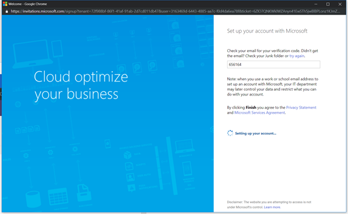

 

授予权限（对，没错，你必须Accept)

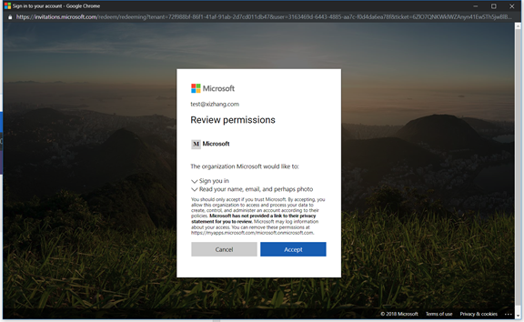

谢天谢地，终于等到你了

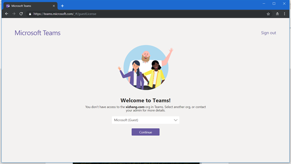

 

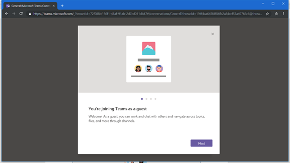

现在，你就可以愉快地在社区中进行技术讨论了。

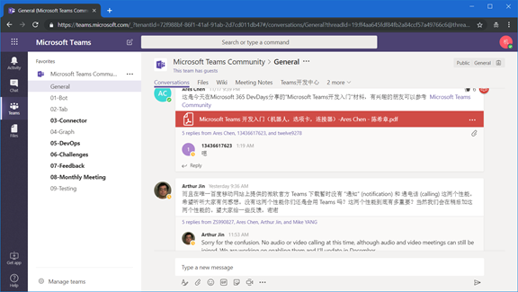

 

如果你要回到你自己的公司那个Teams 界面，你可以直接访问

<https://teams.microsoft.com>

