# 人工智能第二课：认知服务和机器人框架探秘 
> 原文发表于 2018-12-07, 地址: http://www.cnblogs.com/chenxizhang/archive/2018/12/07/10080911.html 

这是《人工智能系列笔记》的第二篇，我利用周六下午完成课程学习。这一方面是因为内容属于入门级，并且之前我已经对认知服务和机器人框架比较熟悉。

 

如有兴趣，请关注该系列 https://aka.ms/learningAI 

 

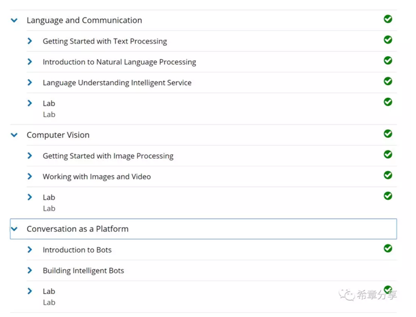  

但是学习这门课程还是很有收获，这篇笔记时特别加了"探秘"两个字，这是因为他不仅仅是介绍了微软的认知服务和机器人框架及其如何快速开始工作，更重要的是也做了很多铺垫，例如在讲文本分析服务（Text Analytics）之前，课程用了相当长的篇幅介绍了文本处理的一些技术原理，毕竟无论是微软的认知服务，还是其他厂商的服务，或者你自己尝试去实现，其内部的原理都是类似的。

 

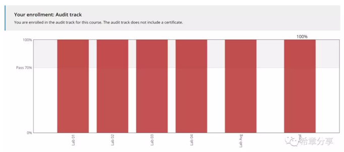

 

我将给大家分享三个部分的内容

1. 文本理解和沟通
2. 计算机视觉
3. 对话机器人

 

第一部分：文本理解和沟通

现在人工智能很火，花样也很多，可能大家不会想到，很早之前人类对于机器智能的研究，最主要就是在文本理解和处理这个部分，科学家们想要实现的场景主要如下

 

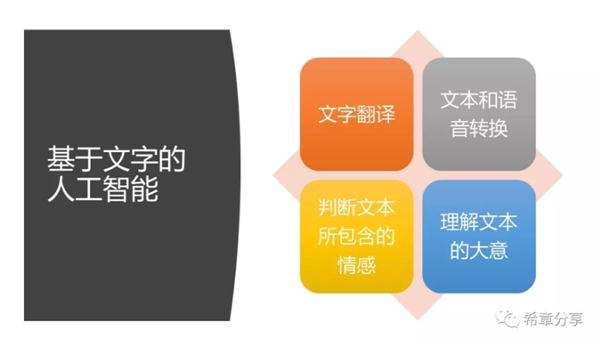

 

这跟人类本身的学习及成长是类似的，一旦机器掌握这些能力，其实就相当于具备了"听说读写"的能力。我据说微软二十年前创立研究院之处，主要的研究范围也是在这个领域，二十年过去了还在继续投资，不断优化这方面的能力，可见其作为人工智能的重要性。

 

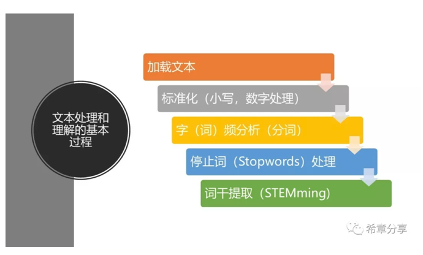

 

其实这里提到的大部分过程，可以理解为通常意义上的自然语言处理（Natual Language Processing——NLP）的研究范畴。

 

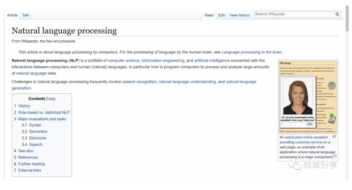

 

本次课程中使用python进行讲解，提到了一个关键的package：NLTK（Natual Language Toolkit），以及它的几个更加具体的库：freqdist 用来做字（词）频分析，stem用来做词干提取等等。

 

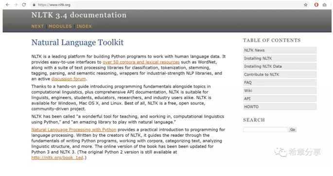

 

下面是一些基本的用法

 

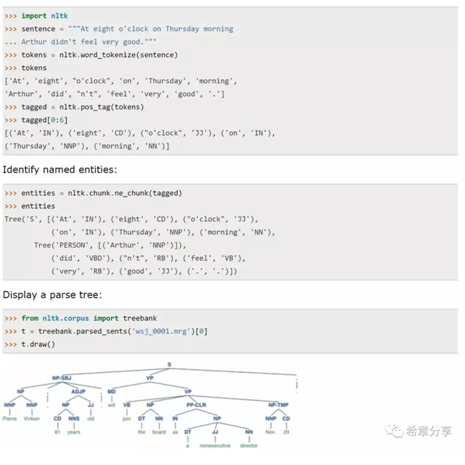

 

也就是说，其实你用NLTK能做出绝大部分文本理解和处理的场景，当然如果你用微软的认知服务（Cognitive Service），则可以省去很多基础性的工作，而是直接专注在业务问题上。

 

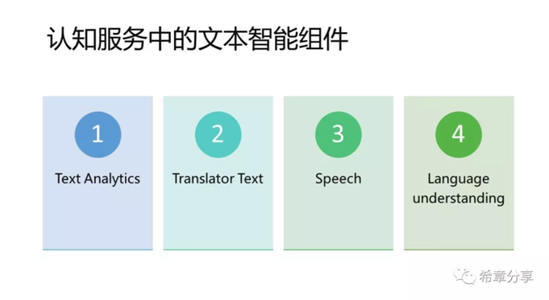

 

前面三种服务都相对简单，通常你只需要开通，并且调用相关的API 即可，例如 Text Analytics 可用来检测文本语言，识别其中的实体，关键信息，以及情感分析。

 

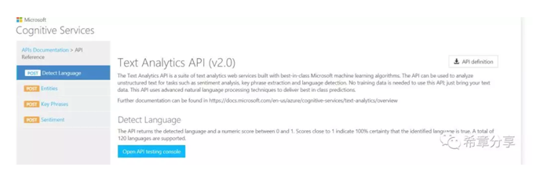

 

而Language understanding 则相对更加复杂一点，它的全称是Language understanding intelligence service （Luis），是有一套完整的定义、训练、发布的流程。换言之，Luis允许你自定义模型，而前面三者则是利用微软已经训练好的模型立即开始工作。申请Luis服务是在Azure的门户中完成的，而要进行模型定义和训练，则需要通过 https://luis.ai 这个网站来完成。

 

 

下面是我用来测试的一个模型的其中一个Intent （Luis能同时支持多种语言，甚至也能做到中英文混合文本的理解）

 

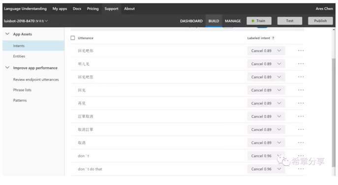

 

Luis最大的一个使用场合可能是结合本文最后面提到的对话机器人来实现智能问答。

 

第二部分：计算机视觉

 

如果说文本智能是尝试学习人类的"听说读写"的能力，那么计算机视觉则是尝试模拟人类的眼睛，来实现"看"的能力。

 

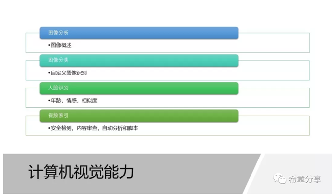

 

图像分析其实就是好比人类看到一个物体（或者其影像），脑电波反射过来信号，使得你意识到你看到的是什么。

 

 

这个能力用到了预先训练好的模型。这个可以通过认知服务中的Computer Vision这个组件实现。

 

但是，即便是上面的模型已经包含了数以百万计的照片，但相对而言还是很小的一个集合。所以，如果你想实现自己的图像识别，可以使用认知服务中提供的Custom vision这个能力来实现。

 

Custom vision拥有一个同样很酷的主页：https://customvision.ai/ ，通过这个网站，你可以上传你预先收集好的照片，并且为其进行标记，通常情况下，每个标记至少需要5张照片，然后通过训练即可发布你的服务，并且用于后续的图像识别检测（例如某个图像是不是汽车，或者香蕉之类的）。

 

 

人脸识别，则是特定领域的图像识别，这个应用也是目前在人工智能领域最火的一个，而也因为脸是如此重要，所以在认知服务中，有一个专门的API，叫Face API。

 

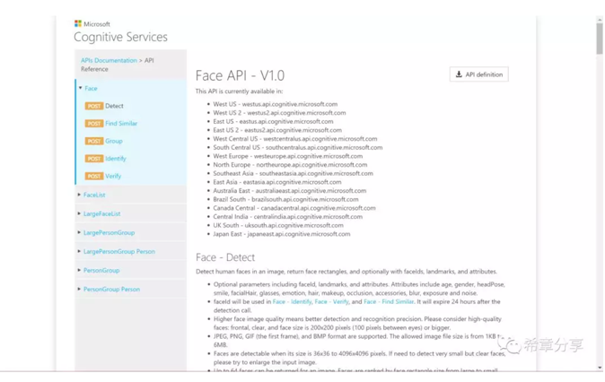

 

使用这套API，可以做出来很有意思的应用，例如

 

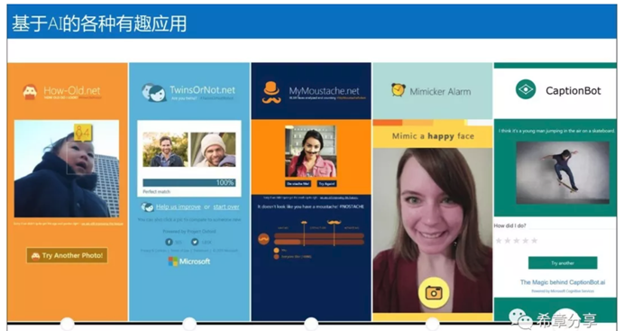

 

从技术上说，图像（Image）是由一个一个有颜色的数据点构成的，这些数据点通常用RGB值表示。而视频（Video）则是由一幅一幅的图像（Image，此时称为帧）构成的。所以，计算机视觉既然能做到图像的识别和理解（虽然可能会有偏差），那么从技术上说，它也就具备了对视频进行识别和理解的能力，如果再加上之前提到的文本智能，它就能至少实现如下的场景：

 

1. 识别视频中出现的人脸，以及他们出现的时间轴。如果是名人，也会自动识别出来，如果不是，支持标记，下次也能识别出来。
2. 识别视频中的情感，例如从人脸看出来的高兴还是悲伤，以及欢呼声等环境音。
3. 文本识别（OCR）——根据图像生成文字。
4. 自动生成字幕，并支持翻译成其他语言。

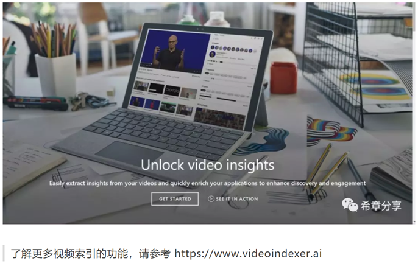

 

第三部分：对话机器人

 

我记得是在2016年的Build大会上，微软CEO Sayta 提出了一个新的概念：Conversation as a Platform, 简称CaaP，其具体的表现形式就是聊天机器人（chatbot）。

 

当时的报道，请参考 https://www.businessinsider.sg/microsoft-ceo-satya-nadella-on-conversations-as-a-platform-and-chatbots-2016-3/?r=US&IR=T 

 

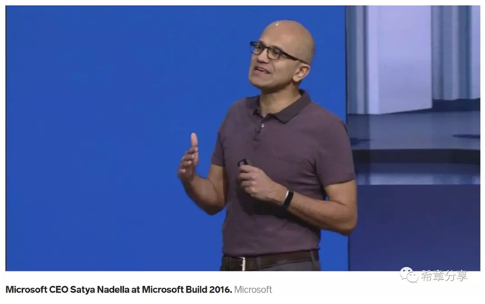

 

对话机器人这个单元，讲的就是这块内容。与人脸识别技术类似，机器人这个技术在这几年得到了长足的发展和广泛的应用，甚至到了妇孺皆知的地步。这里谈到的机器人，特指通过对话形式与用户进行交互，并且提供服务的一类机器人，广泛地应用于智能客服、聊天与陪伴、常见问题解答等场合。

 

创建一个对话机器人真的很简单，如果你有一个Azure订阅的话。微软在早些时候已经将机器人框架（Bot Framework）完全地整合到了Azure平台。

 

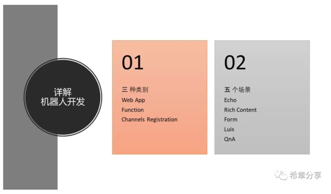

 

做一个机器人（Bot）其实真的不难，但要真的实现比较智能的体验，还真的要下一番功夫。目前比较常见的做法是，前端用Bot Framework定义和开发Bot（用来与用户交互），后台会连接Luis服务或QnA maker服务来实现智能体验，如下图所示。

 

我在11月份的Microsoft 365 DevDays（开发者大会）上面专门讲解了机器人开发，有兴趣可以参考 https://github.com/chenxizhang/devdays2018-beijing 的资料。

 

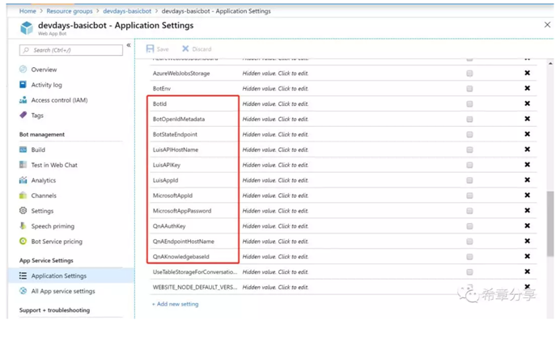

 

机器人框架 （Bot Framework）的一个强大之处在于，你可以实现编写一次，处处运行，它通过频道（Channel）来分发服务。目前支持的频道至少有16种。

 

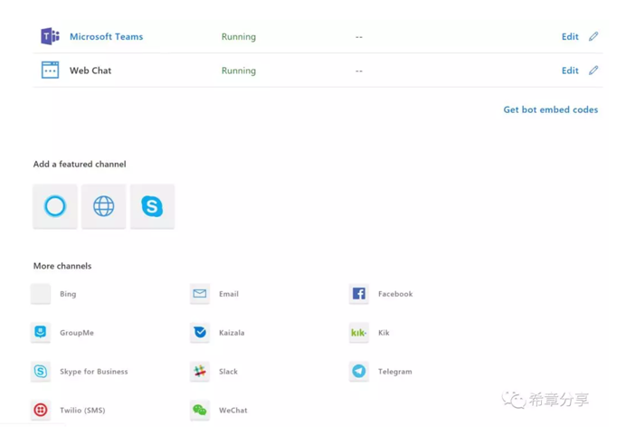

 

我自己之前用过Web Chat，Microsoft Teams，以及Direct Line和Skype for Business等四种。一直对Cortana这个场景比较感兴趣，这次通过学习，终于把这个做成功了，还是挺有意思的。

 

这项功能，还有一个名称：Cortana Skills，目前需要用Microsoft Account注册这个Bot）。

 

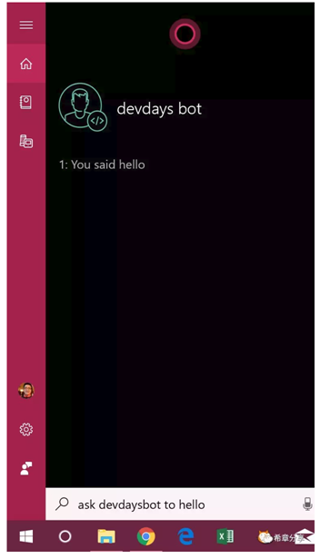

 

请通过 https://aka.ms/learningAI 或者扫描下面的二维码关注本系列文章《人工智能学习笔记》

 

 

 

 

