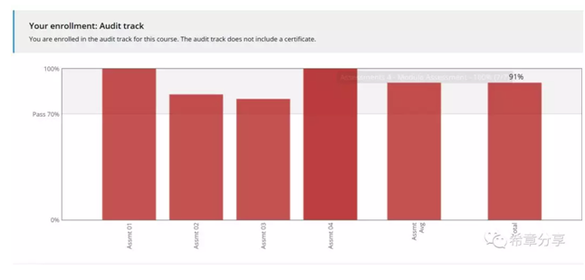
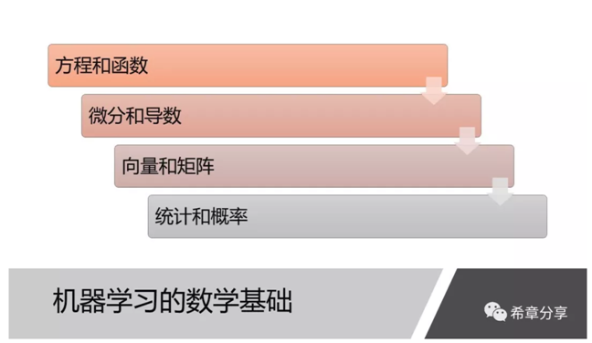
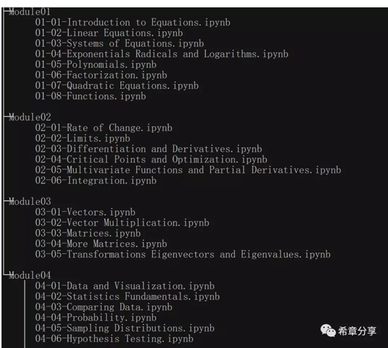
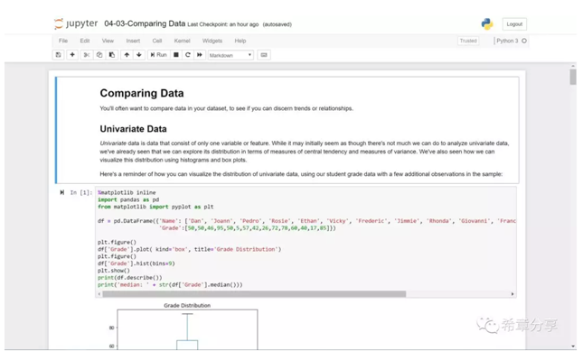
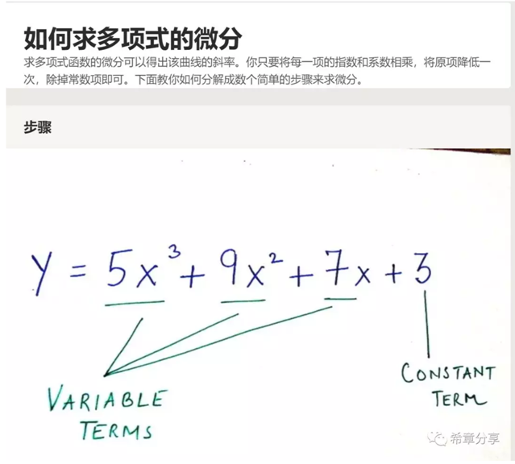
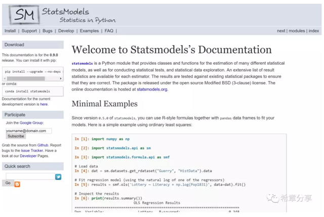
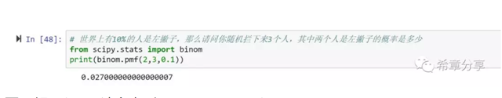
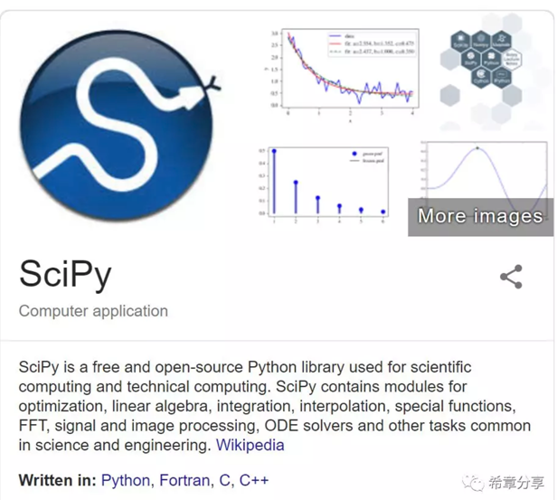

# 人工智能第四课：机器学习的数学基础 
> 原文发表于 2018-12-07, 地址: http://www.cnblogs.com/chenxizhang/archive/2018/12/07/10083601.html 

我断断续续利用在家休假的时间，完成了这门课程《**Essential Math for Machine Learning: Python Edition**》的学习，并且得到了总分91分。

 

 

这门课程的主要内容如下，虽然我们以前都学过数学，但大部分真的都还给老师了。学习这门课程中，总是隐隐约约有一种压力感，一方面总是觉得这些知识我应该知道啊，但另外一方面，看着那些题目却有一种无助的感觉。

 

 

 

学习数学很可能是有趣的，因为我在学习这门课程时，到处找资料，发现真的有一个网站叫 Math is Fun，而且有中文的版本（数学乐）。

 

英文网站是 https://www.mathsisfun.com/ ，中文网站是 https://www.shuxuele.com/index.html 

 

 

但无论如何有趣，前提是你能掌握它的一些基本原理。谢天谢地谢Python，因为有了numpy和pandas这些package，在理解和掌握上面提到的几方面数学知识过程中，我感觉到了前所未有的能力。我印象最深刻的是，在计算向量和矩阵运算的时候，使用numpy提供的array以及matrix类型，简直易如反掌。

 

 

课程附带了25个练习，是Jupyter格式的notebook。每个材料都丰富详实，可谓业界良心，真心为这些讲师点赞。

 

 

如果对Jupyter 还不太熟悉，建议访问 http://jupyter.org/ 

 

我另外还发现一个不错的中文网站 https://zh.wikihow.com 里面有不少数学方程求解的讲解。

 

 

最后，还给大家分享一个Python的统计分析库——statsmodels ，请参考https://www.statsmodels.org/stable/index.html

 

 

以及与numpy齐名的Scipy，在本课程中用到了它的stats模块中的binom类型来计算概率，非常实用。

 

要了解Scipy，请参考  https://www.scipy.org/

 

 

请通过 https://aka.ms/learningAI 或者扫描下面的二维码关注本系列文章《人工智能学习笔记》

 
 

