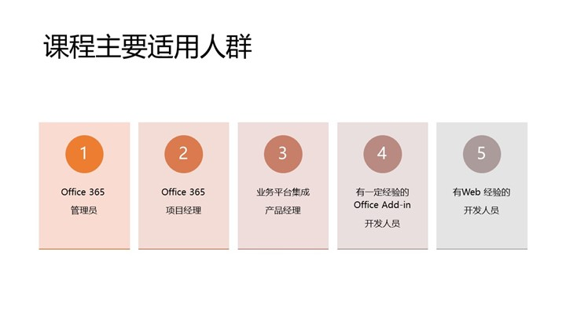

# 所有人都可以是开发人员——《Office 365开发入门指南》视频教程即将上市 
> 原文发表于 2019-02-12, 地址: http://www.cnblogs.com/chenxizhang/archive/2019/02/12/10363812.html 

 

今天是春节假期的最后一天，在这里给全国的朋友们拜个晚年，祝大家身体健康，晚年幸福啊。这个春节大家过的怎么样啊，我自己是在老家过的年，家乡的年味还是比较浓的，也再次感谢朋友圈的大家给我看了各地的风光和不同的过年方式。在这个春节假期里呢，我还做了一件特殊的事情，就是准备了这套《Office 365开发入门指南》的视频教程。大家知道，2018年9月份我的这本书正式上市发行了，这是我的第一本书，自己觉得写的水平一般，还有很多可以改进的地方。承蒙大家抬爱，我今年很可能会出第二版。这一方面是因为Office 365本身在不断进化，书中有些内容需要更新，另外我自己在这一年左右时间又有不少进步，总是按捺不住想要分享给大家的。与此同时，有不少热心朋友也跟我反馈，希望有一套视频教程，便于在移动设备上面，利用碎片化时间进行学习，为此我利用这个假期先准备了这一套视频教程，并且将以此为蓝本筹划书籍的第二版。

 

我们都不能否认，现在的社会已经跟以往有了较大的不同，我们生活在一个数字化的社会中，不管是工作上面还是生活当中，其实都已经完全离不开各种各样的软件了。而软件开发，这个在以往看起来很高大上的职业，其实也并不是那么高冷。我自己从事软件开发及相关工作有十多年了，截止到今天，我仍然为当初的选择感到幸运。学习软件的开发，不仅仅是掌握一门技能，更重要的是能以此来理解社会的运转方式和规则。对于我们这一代人来说，最早接触的软件很可能也就是Office吧，它是那么实用，而且也并不难学。我自己从学习Office的基本使用，做些简单的电子表格，到逐渐了解它的二次开发，及现在微软的Office产品研发团队任职——有机会了解这样一个服务于全世界数以十亿计用户的软件平台是怎么开发和运营的——我由衷地感到幸运，并且希望将一些心得体会分享给更多的朋友们。

任何公司都是一个软件公司。你不能假装看不到这种变化，即便你之前没有软件开发的经验，但尝试去用开发的角度去看看你周边影响你工作和生活的软件世界，我相信会对你有很大的帮助。所以从这个意义上说，我觉得所有人都可以是开发人员，而我的这个视频教程和书籍，也是为所有这些对软件开发充满好奇的人们准备的。

我曾经看过Linux的发明者Linus 的一本书，书名叫《Just for fun》，这本有点像他自传的书，披露了他很多不为人知的故事，以及Linux如何诞生的细节，但我印象最深刻的却是他提到的一个软件发展的理论，他说软件的进化跟很多事情一样，是分为三个阶段的，首先最早期是解决"生存"的需要，即为了某一些非常具体的问题而设计的，在那个时候工具化是最重要的诉求；再后来，随着越来越多的人使用软件，以及使用软件的程度越来越高，软件就会演变为一种"社会秩序"的载体，其实只要你稍微想一下，就会发现，现在很多的软件，其背后的逻辑就是现实生活及相关秩序的映射，所谓社会秩序，就是人们需要协作和沟通，人们会有各种各样的需求，这需要一定的规则（换言之，就是秩序）来保障。最后，Linus同学认为软件的最高境界是Fun，就是好玩。这个好玩是有深层次的意义的，一方面它给使用者带来精神上的愉悦，同时给软件开发者也带来充实和满足。Linus 认为Linux本身已经达到了这个最高境界，而他所声称的Fun就是指的Linux这个体系，全世界的人都可以使用Linux，也可以为Linux做贡献，这是多么好玩的事情啊。

 

我自认还不能和Linus相提并论，但我有一个极大的优势，就是我比他懂Office 365，而当我有时候静下心来想一想这套软件几十年的发展，也能总结出类似的三个阶段。在上个世界八十年代，微软单独发布的Word，Excel，PowerPoint等软件，可以算得上都是各领风骚，后面随之推出的Office套装更是笑傲江湖的杰作，据不完全统计，全世界使用Office的用户约为12亿，但无论如何，这个阶段还是解决用户个体层面的问题；然后在世纪之交的时候，因应社会的发展需求，微软在Office的基础上推出了一系列的服务器产品，包括邮箱服务器，文件和协同平台，音视频会议服务器等等，逐渐将协作和沟通理念引入进来，这也是很多公司逐渐走向规划化和现代化的一个重要基础，毫无疑问，作为信息化支撑的这些软件建立了一定的社会秩序。在2011年前后，微软做出重大的决策，整合了这些客户端和服务器产品，推出了全新Office 365云平台，并且经过8年左右的运营，目前Office 365的每月活跃用户超过1.5亿，而且这些年大力投资，Office 365已经朝微服务化、平台化、智能化的方向不断演进。这可能跟Linus所提到的Just for Fun有异曲同工之妙吧。

 

我利用几天时间梳理了一下新的教程大纲，在与原书尽量保存一致的基础上，也做出了一些大胆的调整。例如我专门增加了Office 365平台的大局观这个模块，是希望给大家从high level介绍一下Office365的体系、应用和开发平台框架，并且列出了大量可用的链接。这个模块可以免费试听。另外，我还调整了原书内容，把Office 365的部署和管理单独整理成一个模块，这个部分将给大家介绍Office 365与Azure的关系、用户和应用程序管理的知识，这不管是对于大家用好Office 365，还是要基于Office365进行开发都是很有帮助的。此外，本次教程删除了SharePoint的章节，我希望下次有机会单独来讲那个部分，因为知识点真的很多。其他的章节，基本上保持跟原书一致，但内容有很大的修订。

 

准备这套教程，对我而言也是一个再次回顾和学习的好机会，也尽量避免第一次写书时的一些问题，例如语言版本、截图问题等等。整个教程共7个模块，21个PPT，都是我一个字一张图地做出来的，然后准备演示代码，录制脚本，最后才真正录制。虽然大家最终听到每个课时的视频大约30分钟到45分钟左右，但为此要花费的准备时间，可能超过一天，甚至更久。另外，我感到欣慰的是，除了写代码用到了Visual Studio，所有其他工作，包括录制视频，都是通过Office 365来完成的，这也算是一个最佳实践吧。

 

课程大纲的清晰版本，请参考 <https://github.com/chenxizhang/office365dev/blob/master/v2/readme.md>

 

本次课程主要适用的人群有Office365管理员，项目经理，业务平台集成产品经理，和已经有一定经验的Office Add-in开发人员（例如VBA和VSTO开发者），还有就是广大的有Web经验的开发人员。但正如我之前所提到的，如今所有人都可以是开发人员，或者至少可以学习用开发人员的思维去理解周边的软件世界，希望你也有好奇心听听这门课程。

 

这个视频课程的部分章节还在加紧录制中，明天就又要正式上班了，我将利用业余时间抓紧完成所有视频的录制，争取在2月下旬正式上架和大家见面。本次教程配套的演示代码和资源分享，你都可以通过上面的这个Github库找到，另外如果你有兴趣买一本教材，可以在各大电商平台找到。最后提醒大家一下，因为这也是我的第一套视频教程，我为前2000位用户准备了一定的优惠，如果你希望在课程面世第一时间收到通知，以及领取优惠券，敬请关注我的微信公众号。

