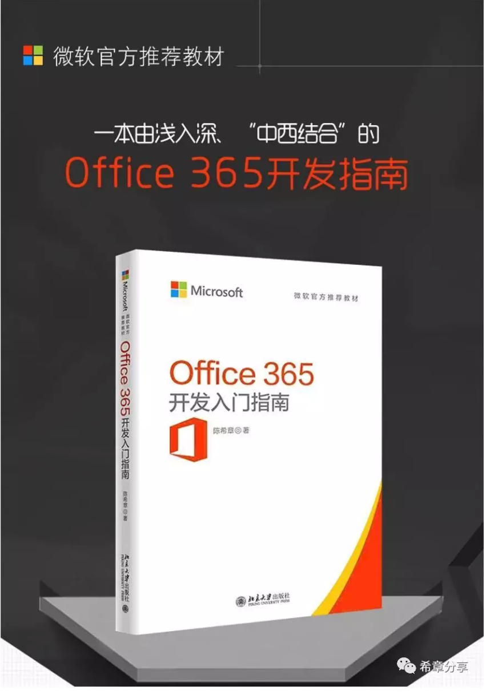

# 《Office 365开发入门指南教程》正式上线，限时优惠和邀请分享推广 
> 原文发表于 2019-02-23, 地址: http://www.cnblogs.com/chenxizhang/archive/2019/02/23/10421729.html 

我很高兴地通知大家，《Office 365 开发入门指南教程》已经正式在网易云课堂上线，你可以通过直接访问  https://aka.ms/office365devlesson 这个短地址进入课程主页。

 

 

这门课程取材自我所编写、北京大学出版社于2018年9月发行的《Office 365开发入门指南》一书，并且在原书基础上修订了大纲，增加了很多最新的内容，课程主要面向的观众是：Office 365管理员、项目经理、平台集成开发商、有一定经验的Office Add-in开发人员和有Web经验的开发人员。但其实任何对Office 365感兴趣的朋友们都能听得懂这门课程，而且可以极大地开拓你的视野，对Office 365平台有一个整体的认识。

 

**限时优惠**

 

为了答谢大家对拙作以及该视频课程的支持，我为前2000位订阅用户提供了一定的优惠，请在2月28日之前尽快在网易云课堂中完成兑换。

 

请注意，为了帮助大家尽快完成学习，治疗拖延症，本次课程必须在你购买之日起365天内完成学习，如果超过时限，你当然还可以继续学习，但需要另外再付费购买，而且不能再享受优惠。对，就是这么任性。

 

**邀请分享推广**

 

如果你觉得本教程还不错，愿意分享给其他有需要的朋友，我诚意邀请你通过分享来推广这个课程，我将拿出课程费用的5%作为答谢。请关注公众号"希章分享"，并且回复 "**课程推广**" 四个字了解详情，获取你的专属链接。

 

**课程服务**

 

1. 本次课程的资源（包括每个章节对应的学习资源，范例源代码），请访问：https://github.com/chenxizhang/office365dev，这是我的统一服务界面，你可以在提出问题，或者给我留言。
2. 课程建议，你可以通过 office365devguide@xizhang.com 和取得联系。
3. 关注公众号 "希章分享" 你可以不定时收到我的很多其他文章，尤其是针对Office 365开发方面的深度解析。

 

再次感谢大家，希望大家在2019年都有新进步！
