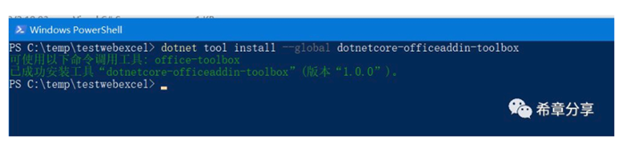

# dotnetcore-officeaddin-toolbox : Office 365 Add-in开发人员的工具箱 
> 原文发表于 2019-03-03, 地址: http://www.cnblogs.com/chenxizhang/archive/2019/03/03/10463910.html 

在上一篇文章（[.NET Core开源行动：一键创建Excel Add-in](http://mp.weixin.qq.com/s?__biz=MjM5ODEyNjE5OA==&mid=2455455757&idx=1&sn=b2f1a167c54f14bc01ccfe9042e54183&chksm=b1609f1486171602a05df8ec5475ea04426e522e13a7a3765b4f3cdf6312f967bb56fc545608&scene=21)） 中我给大家展示了一套为Office 365 Add-in开发人员准备的模板库，你可以通过 dotnet new excel & dotnet run 命令即可完成一个新的Add-in的创建和运行。

 

 

关于如何加载这个Add-in，上文中提到你需要将manifest.xml文件放在一个共享目录，然后在Excel中进行设置，实现所谓的sideload（旁加载）。但是有没有什么方式可以更加简单方便地实现这个加载的行为呢？**当然，有办法。**

 

我开发了一个基于dotnet core的工具，你可以通过下面的命令安装

dotnet tool install --global dotnetcore-officeaddin-toolbox

 

 

 

接下来就可以像下面这样的方式来运行这个工具啦

 

office-toolbox sideload manifest.xml excel

 

运行这个工具，会自动产生一个测试用的文档，而且会把你的add-in挂接上去，而且会自动打开Excel哦。

 

 

请注意几点

 

1. 目前该工具仅在Windows平台可用
2. 该工具目前要求有三个参数，第一个参数是相关的命令，目前仅支持sideload，第二个参数是manifest文件的位置，第三个参数是应用程序的名称，例如excel，word，powerpoint

 

该工具还会不断开发，增加其他命令，并且在 https://github.com/chenxizhang/dotnetcore-office365dev-templates-officeaddin  这里开源。
