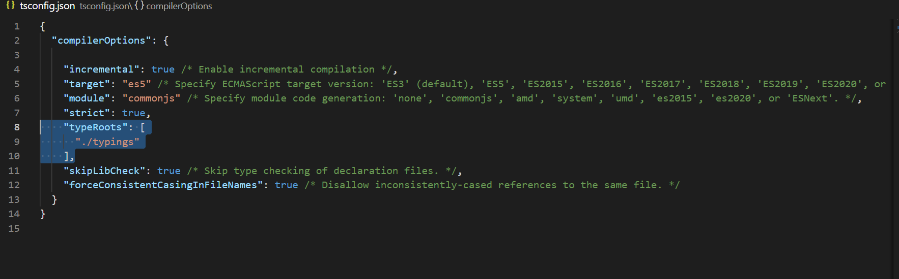
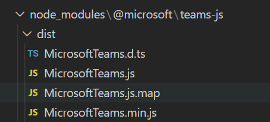
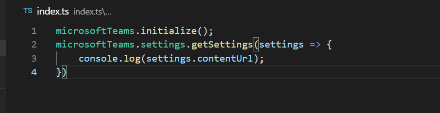
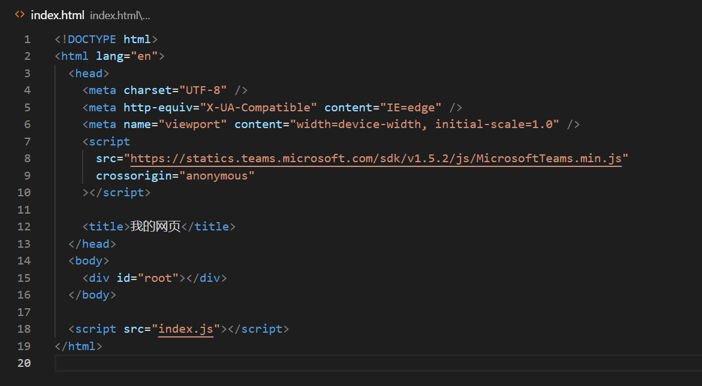

# 前端结合Typescript进行快速开发 
> 原文发表于 2021-02-06, 地址: http://www.cnblogs.com/chenxizhang/archive/2021/02/06/14382837.html 

这里介绍的是不使用任何的前端框架，保持初心，最简单的做法。以下总结，使用工具Visual Studio Code。

 

第一步：创建一个package.json文件。这个可以通过 npm init命令来完成。

第二步：创建一个tsconfig.json文件。这个用来定义typescript的编译选项。关键的一个设置如下，就是typeRoots这个设置。

第三步：在根目录下创建一个typings目录，并创建一个index.d.ts文件。在这个文件中，引用其他的d.ts文件。例如

/// <reference path="../node\_modules/@microsoft/teams-js/dist/MicrosoftTeams.d.ts" />

 

这些d.ts文件，可以通过 npm install 命令来安装标准的npm包得到。例如，如果我安装了microsoftTeams的客户端JS SDK（npm install @microsoft/teams-js ）,就会有如下的文件。

  

第四步：编写你的业务应用的前端代码逻辑，使用ts文件。例如

在这里写代码时有完整的智能提示。非常舒服。

 

第五步：运行 tsc 命令生成 js文件，并且在html文件中直接应用这些js文件，例如

