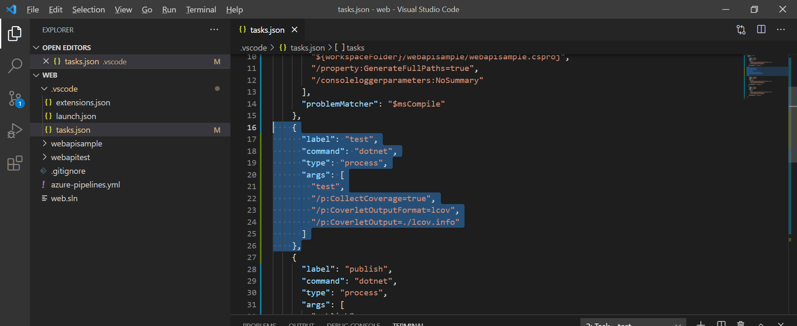
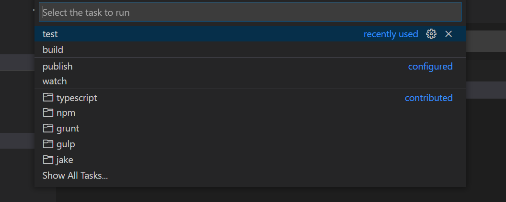
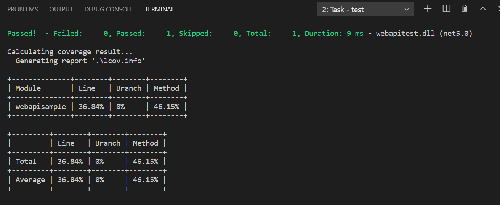
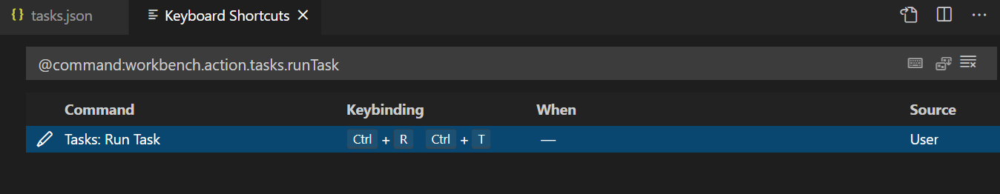

# 自定义Visual Studio Code任务命令 
> 原文发表于 2021-02-11, 地址: http://www.cnblogs.com/chenxizhang/archive/2021/02/11/14398022.html 

在这一篇文章（[.NET Core项目自动化测试和代码覆盖率审查](https://www.cnblogs.com/chenxizhang/p/14397983.html)）中，我提到了在项目中运行测试的命令。大致是这样的：

dotnet test /p:CollectCoverage=true /p:CoverletOutputFormat=lcov /p:CoverletOutput=./lcov.info

 

但这里有一个小问题，就是是不是每个项目中，或者每次要运行测试时都需要去写这么一段呢。当然可以通过想办法来解决。

你可以通过找到 .vscode这个目录中的tasks.json文件，添加如图所示这一小段来定义一个任务

 {

 "label": "test",

 "command": "dotnet",

 "type": "process",

 "args": [

 "test",

 "/p:CollectCoverage=true",

 "/p:CoverletOutputFormat=lcov",

 "/p:CoverletOutput=./lcov.info"

 ],

 },

要运行这个任务，可以按下CTRL+SHIFT+P 调出命令窗口，然后输入Run task，然后回车，可以看到它解析得到的任务列表

选择test，回车再回车，就可以看到这个命令在terminal中开始运行了

你甚至还可以通过定义快捷键的方式来减少步骤，例如我其实是定义了快捷键到Run Task这个命令。

 

 

 

