# 2021-02：Teams开发平台更新概述 
> 原文发表于 2021-02-19, 地址: http://www.cnblogs.com/chenxizhang/archive/2021/02/19/14417399.html 

作为2021年工作计划的一部分，我会在每月的第三个星期五发布Teams开发平台的更新报告，给大家整理和讲解最新的平台功能，以及特色场景。这是第一篇文章，我会挑选截至到2月份一些重要的更新，以后每月的更新，将针对当月的更新进行说明。

本期亮点
----

1. 移动端支持录音，录像，选择文件，以及二维码扫码识别了。
2. 会议工作区支持定制开发了。
3. Incoming webhook支持自适应卡片消息了。

 

2/9/2021 新增了对移动设备Native能力的更多支持。
-------------------------------

 

这次一股脑地推出了多项服务，包括支持录音，录像，拍照，选择文件，以及最重要的，终于支持扫码了。注意，这些能力仅对移动设备有效。

<https://docs.microsoft.com/en-us/microsoftteams/platform/concepts/device-capabilities/device-capabilities-overview>

要使用这些功能，需要在manifest文件中申请media这个权限。如下所示

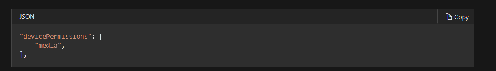

 

如果要实现扫码功能，可以使用Teams SDK提供的scanBarcode方法。

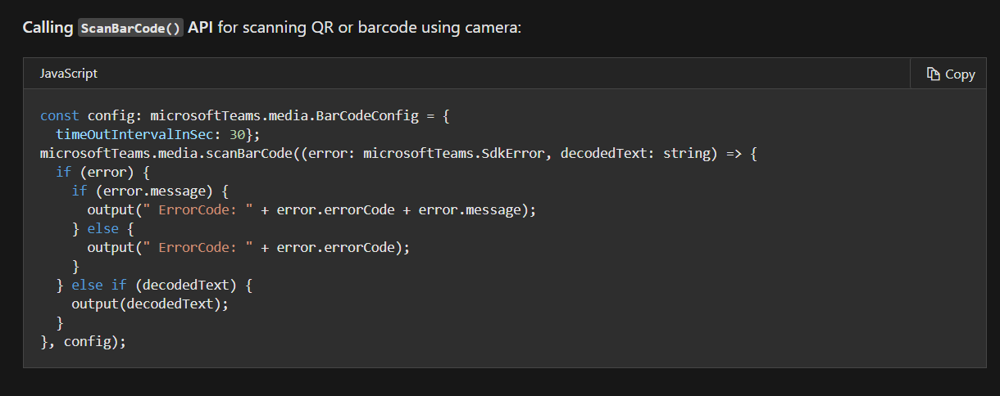

其他媒体功能如下：<https://docs.microsoft.com/en-us/microsoftteams/platform/concepts/device-capabilities/mobile-camera-image-permissions#media-capability-apis>

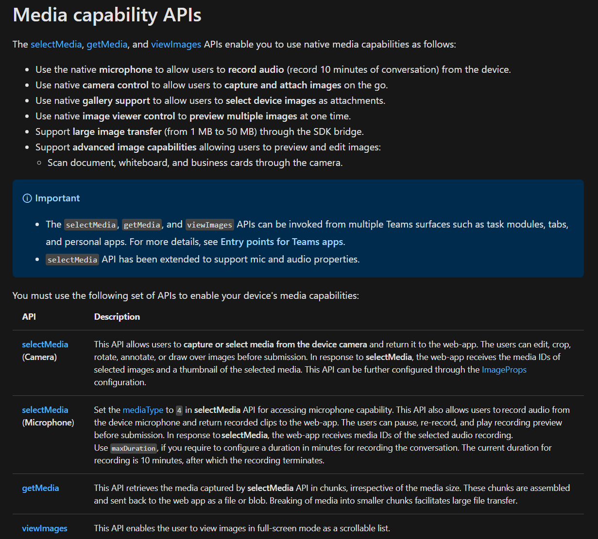

 

11/30/2020 单点登录支持
-----------------

 

    单点登录的开发，一直也是Teams Tab应用开发的难点。后台团队一直在努力，想通过自动生成代码的方式来简化。其根本的原因是因为Teams的应用开发，需要依赖AAD的身份认证，而真正搞明白AAD的人可能并不多，而且很多人也没有那么多耐心去学习。

我个人认为，这仍然是治标不治本的做法。也许以后可以有更好的做法吧。目前有这个，也算聊胜于无。

<https://docs.microsoft.com/en-us/microsoftteams/platform/toolkit/visual-studio-code-tab-sso>

 

这个更新提到的Microsoft Teams Toolkit, 是指在Visual Studio Code中的一个插件。你通过它可以生成项目，然后如果你需要实现SSO，你只需要勾选一个选项，它会自动帮你生成一堆代码。Again，我并不喜欢这些代码。

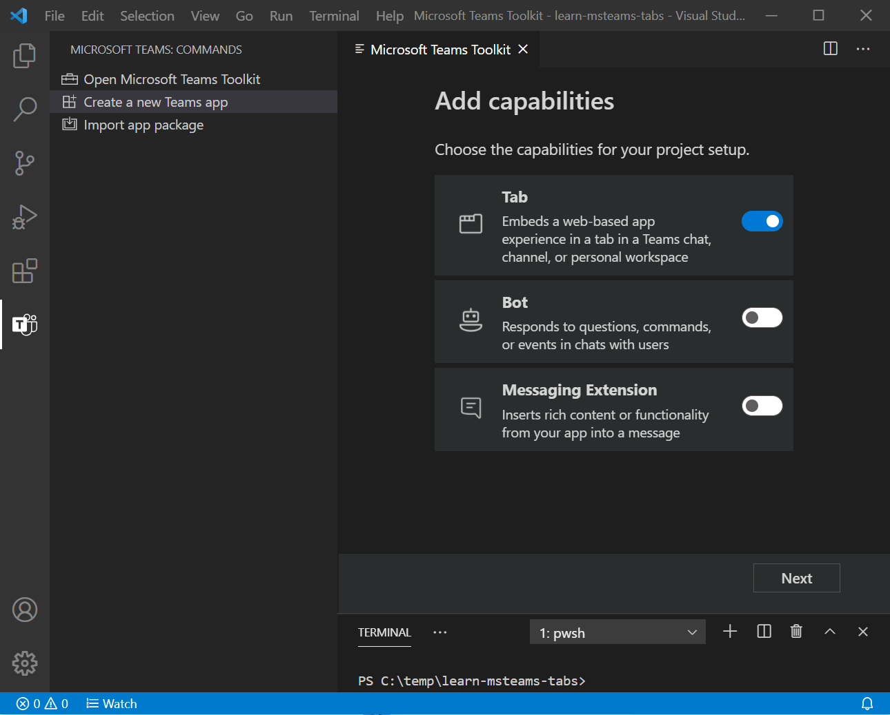

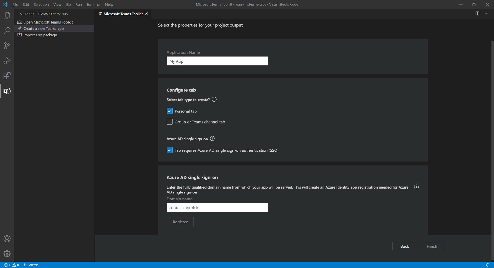

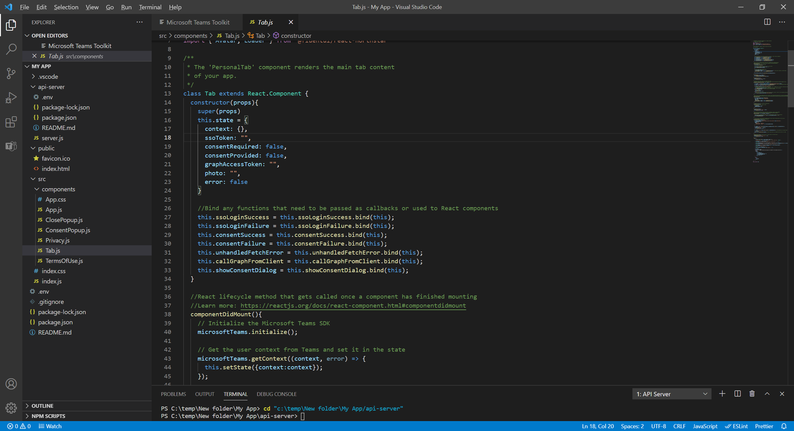

 

11/10/2020 Teams机器人设计规范
-----------------------

 

<https://docs.microsoft.com/en-us/microsoftteams/platform/bots/design/bots>

这里有很多不错的实践经验，可以让你在规划和设计机器人时事半功倍。

为了帮助开发者可以更好地设计UI/UX， 产品组提供了一套公开的UI 库，和范例，请通过下面的地址取用

<https://www.figma.com/community/file/916836509871353159>

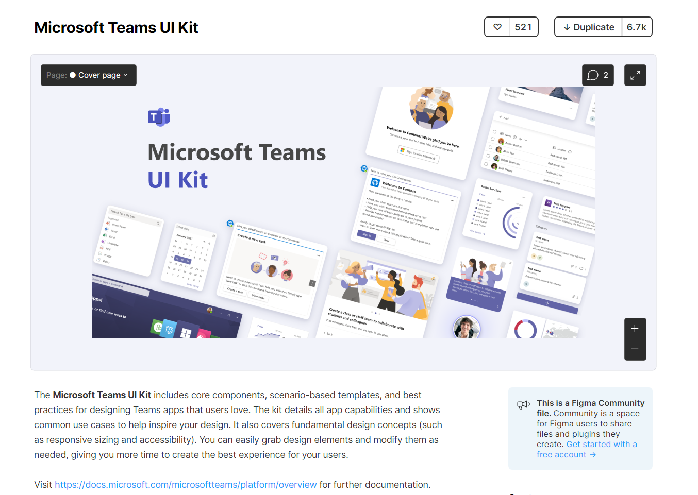

9/18/2020 会议工作区扩展 【预览】
----------------------

 

<https://docs.microsoft.com/en-us/microsoftteams/platform/apps-in-teams-meetings/create-apps-for-teams-meetings?tabs=dotnet>

众所周知，会议是Teams的一个核心功能，用户的活跃度很高。所以，如果能对会议这个工作区进行扩展，无疑将带来很多很有意思的场景（不管是会前，会中，还是会后）。这次的更新中，我们看到如下的能力。

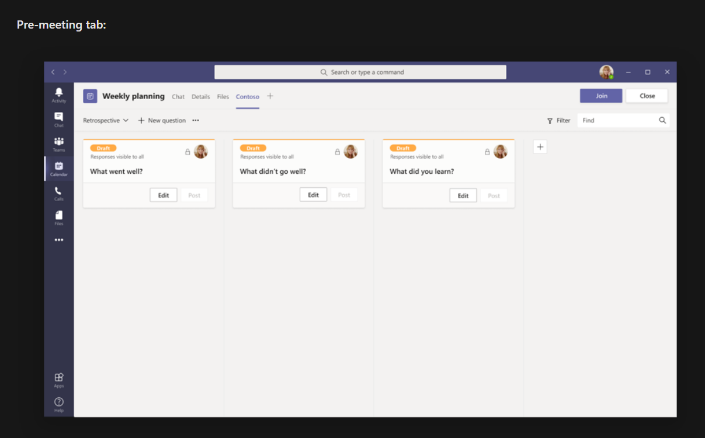

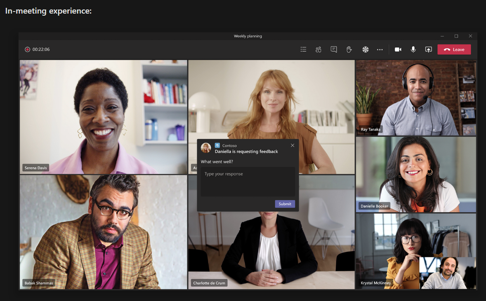

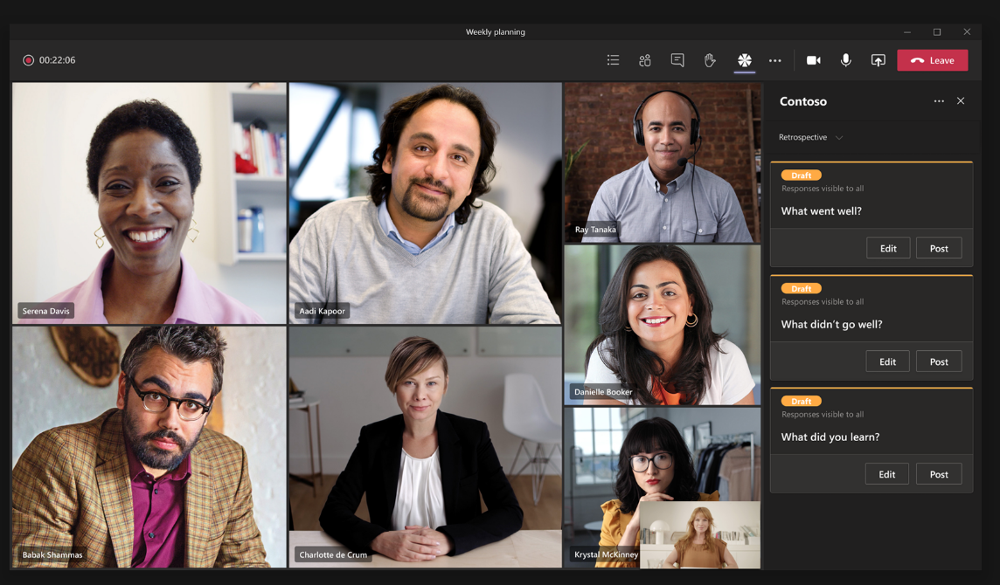

在你的应用中，可以通过下面的API进行交互设计

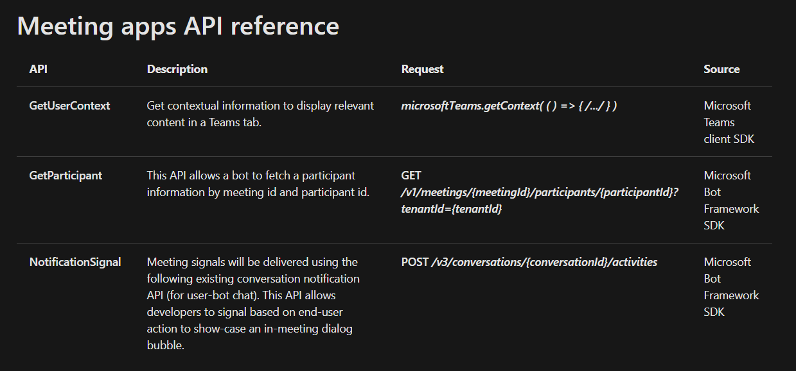

 

8/12/2020 在Incoming webhook中支持自适应卡片
-----------------------------------

 

<https://docs.microsoft.com/en-us/microsoftteams/platform/webhooks-and-connectors/how-to/connectors-using#send-adaptive-cards-using-an-incoming-webhook>

这是我很喜欢的一个更新。现在终于可以像下面这样发送自适应卡片消息了。以前也能发卡片消息，但那个消息格式是老的，跟新的自适应卡片不同。

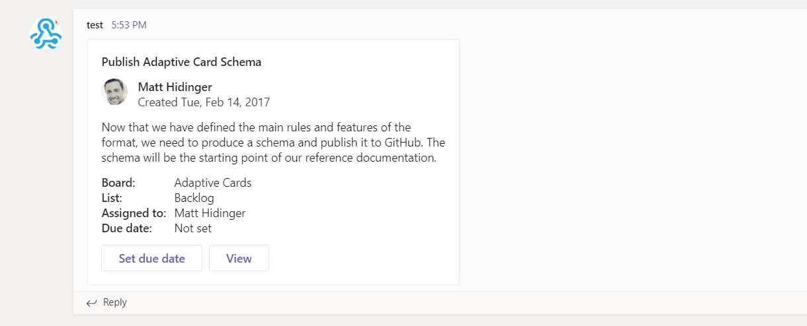

现在发送的语法如下

    上图中红色区域就是填入你需要发送的卡片定义即可。不要担心，你只需要在<https://adaptivecards.io/designer/> 设计好卡片，并且复制出来json，然后粘贴过来就可以了。

    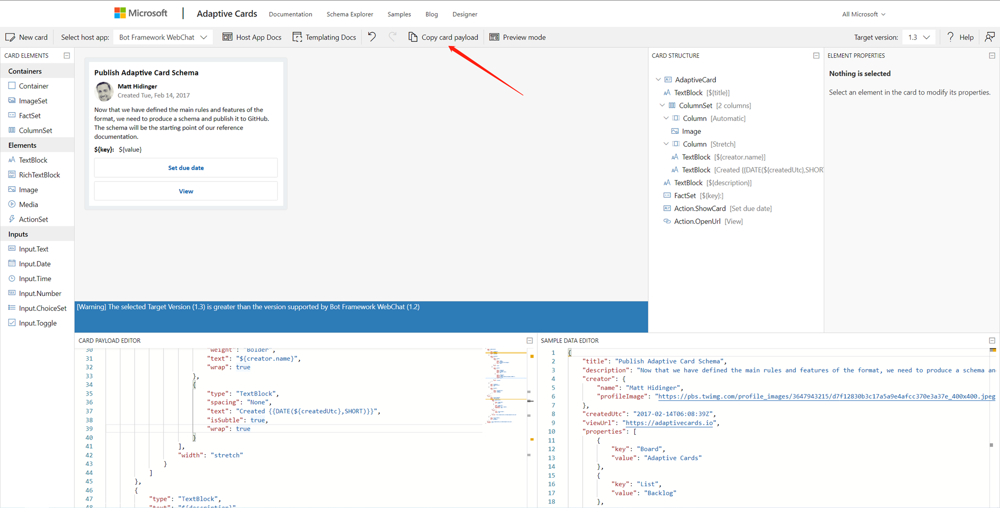

 

 

 

 

 

