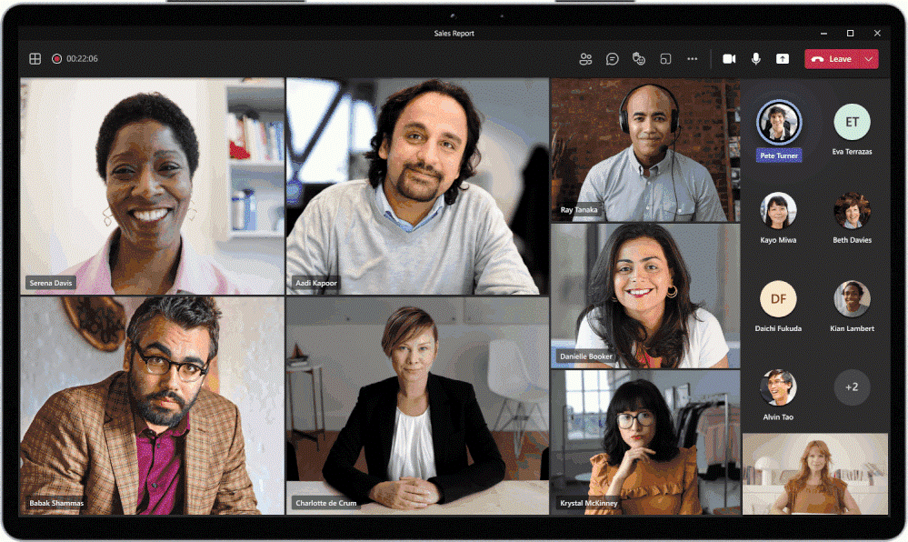
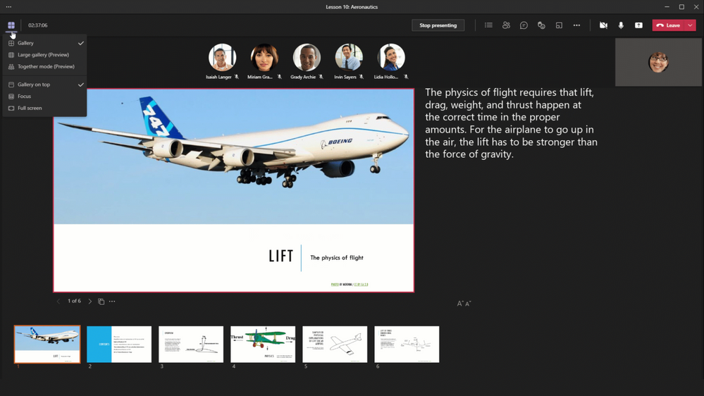
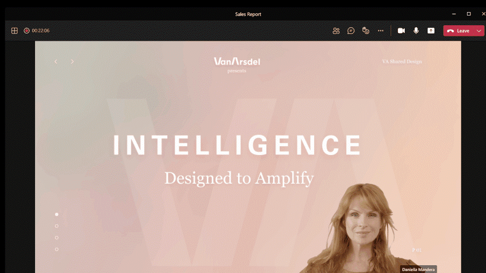
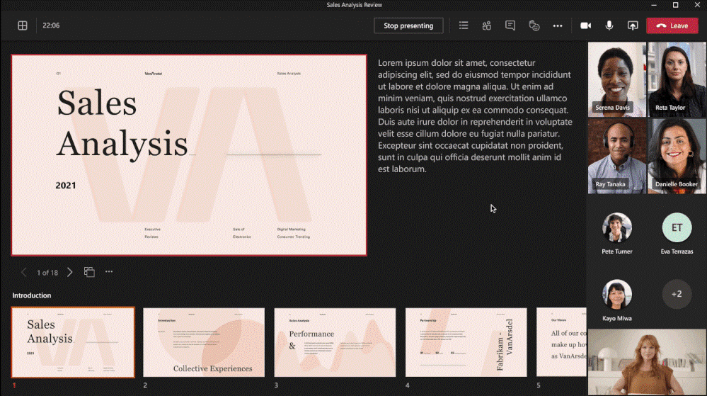
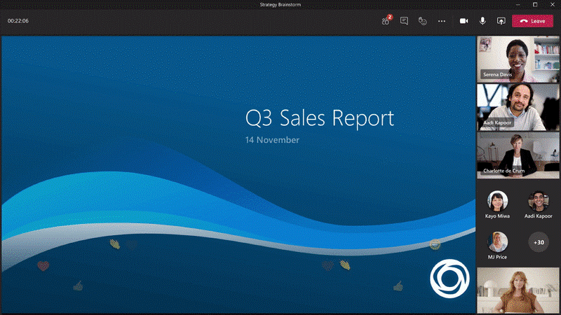
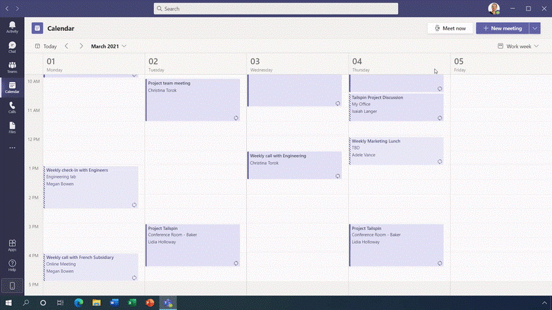
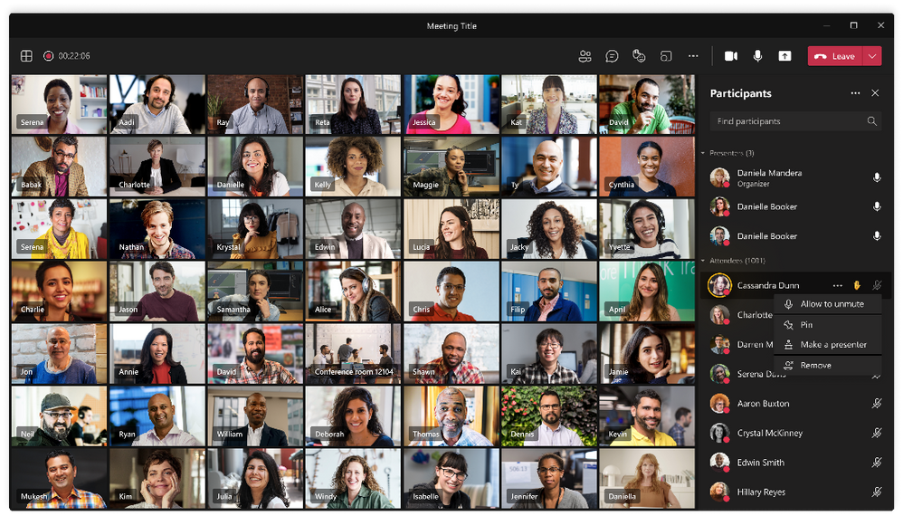
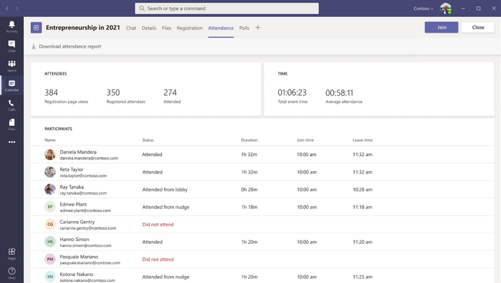
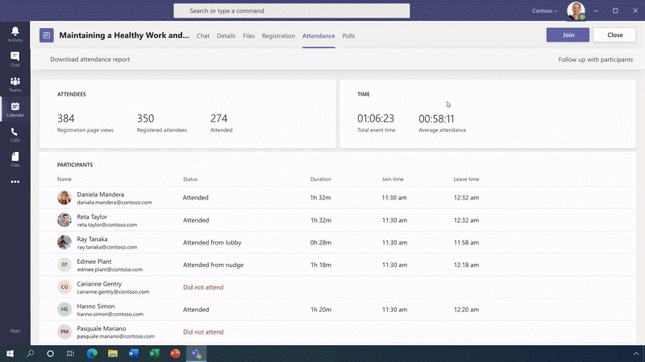

# Microsoft Teams 2021最新功能发布解读 – 会议篇 
> 原文发表于 2021-03-04, 地址: http://www.cnblogs.com/chenxizhang/archive/2021/03/04/14479625.html 

正在进行的2021年的Microsoft Ignite大会，发布了一系列跟Microsoft Teams相关的新功能，英文介绍请参考 <https://techcommunity.microsoft.com/t5/microsoft-teams-blog/what-s-new-in-microsoft-teams-microsoft-ignite-2021/ba-p/2118226> ，我这里用中文给大家做一个简单地解读，并加上我的一些批注。

我将用三四篇文章来分别解读，这一篇先讲会议功能（包括新的，和改进的功能）

1. **动态视图**

 

根据当前参与者人数，有没有打开视频，有没有分享桌面等信息，动态调整与会者看到的视图。

 

2. **视图切换**
 

提供了多个视图切换的选项，包括Gallery ，Large Gallery, Together mode, 搭配Focus, Full Screen总有一款适合你。

不得不说，这个会议视图的功能，设计也是一改再改，众口难调，包括有一阵把Full screen拿掉了，广大的用户抱怨很多，现在又加回来了。

 

3. **演讲者模式**
这个功能太需要了。就是可以在你做演讲时，可以把你的视频跟演示内容一起显示（有三种模式：Standout, Reporter, Side-by-side），我觉得都不错。

【备注】在我的版本中，还没有看到这个功能，文章里面说是很快可用了。

 

4. **PowerPoint Live 功能**
 

我们很多人在做演讲时，都习惯在PowerPoint 演示文稿中添加备注信息，以便自己更好地展开解说。以前在投影时，我们可以启用演示者模式，这样演讲者可以看到备注，而观众看到的是全屏的效果，两全其美。现在这个功能，在你用Teams 开会时也可以同样拥有了。

 

【备注】在我的版本中，还没有看到这个功能，文章里面说是很快可用了。

5. **会议中的气氛功能**
 

这个功能特别适合在开大型会议时，可以用更加醒目的方式显示用户的点赞、鼓掌、爱心发送等。下图中有点像浪潮一样的效果，看起来不错啊。照这样的思路发展下去，如果哪一天，在Teams 会议中出现弹幕，我是不会惊讶的。

 

6. **大型市场活动：会议注册和调查功能，直播功能增强**如果你要搞一场市场活动，可能涉及到会议注册和问卷调查的功能。以后你可以直接创建 Webinar 类型的会议。如下图所示。这个功能还是比较接地气的，也解决了很多实际的问题，以前要分散在几个系统去做的，现在一站式完成。

目前这种Webinar 的人数规模支持1000人，而且可以进行更加丰富的权限控制。

而之前就支持的在线直播的人数为10000人，现在扩容到20000人，并且进一步增强了参与者报表等功能。

7. 和Dynamics 365整合

 

把市场活动会议的后续跟进，整合起来，这当然也是一个很好的应用场景。

 

