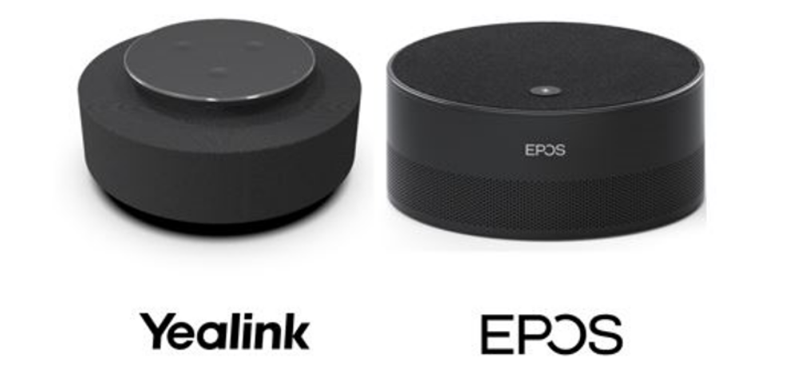
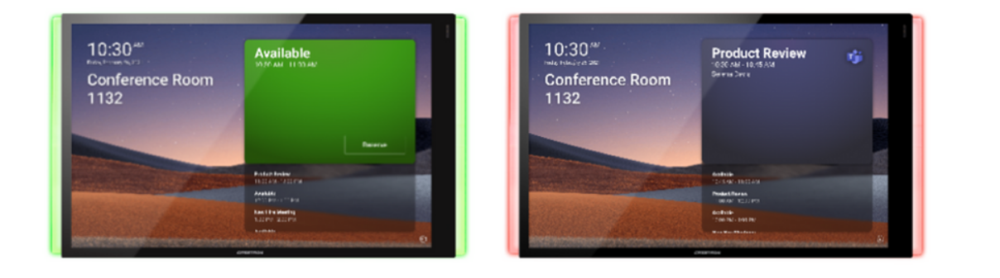
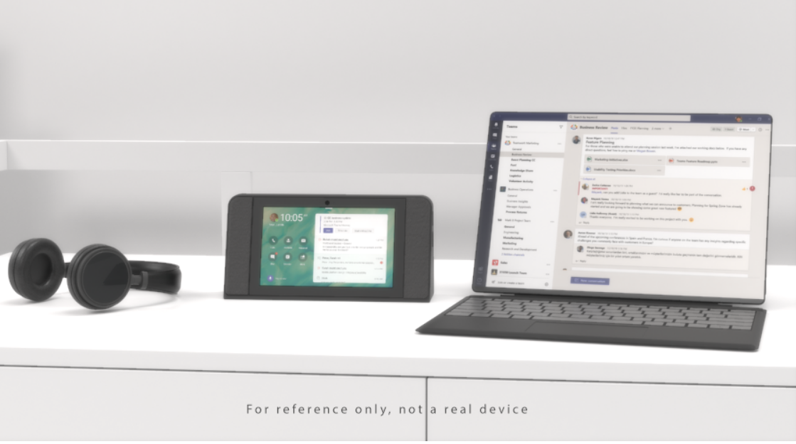

# Microsoft Teams 最新功能发布：通话及周边设备 
> 原文发表于 2021-03-07, 地址: http://www.cnblogs.com/chenxizhang/p/14495961.html 

正在进行的2021年的Microsoft Ignite大会，发布了一系列跟Microsoft Teams相关的新功能，英文介绍请参考 https://techcommunity.microsoft.com/t5/microsoft-teams-blog/what-s-new-in-microsoft-teams-microsoft-ignite-2021/ba-p/2118226 ，我这里用中文给大家做一个简单地解读，并加上我的一些批注。

我将用三四篇文章来分别解读，这是第三篇，针对通话及Teams周边设备。这两个部分的更新其实很多，非常强大。

 

支持第三方PSTN 提供商无缝接入
-----------------

PSTN公用电话交换网（PSTN——Public Switch Telephone Network），即我们日常生活中常用的电话网。Teams有一个很大的优势，就是可以直接作为软电话。微软自己有一套PSTN的网络，但与此同时，如果客户想要现有的提供商，以前可以通过专门的网关设备和相应的解决方案来实现。现在无需任何硬件，直接通过软件方面的配置就能实现。

详情请见 <https://techcommunity.microsoft.com/t5/microsoft-teams-blog/introducing-operator-connect-and-more-teams-calling-updates/ba-p/2176398>目前这个服务还在Preview的阶段，有望在年底前逐步公开使用。

另外，依靠微软自己的PSTN网络，Teams 还支持用电话拨入音频会议（Audio Conference)，例如一个会议，某些人员用Teams的VoIP，但另外一些人直接用电话线路拨进来，毫无违和感。目前这项功能，也可以直接跟第三方PSTN整合，有望在下个季度公开使用。

 

微软的呼叫计划（Calling Plan）进一步扩展
--------------------------

 

上面多次提到的微软PSTN，可以理解为微软自己在全球建设的一套基础的通话网络。在今年6月份之前，微软将完成新增8个区域建设，包括新西兰，新加坡，罗马尼亚，捷克，匈牙利，芬兰，挪威，斯洛伐克。届时全球将有一共26个市场的客户可以直接使用微软的Call Plan, 无需额外的基础建设。

 

客服中心和合规录制解决方案认证
---------------

 

基于Microsoft Teams,企业可以实现自己的客户中心，目前已经有多家合作伙伴的"客户中心"方案得到了认证。另外，Teams的通话或会议录制，也可以通过第三方的解决方案来实现定制化的合规保障，目前这块也已经有多个认证过的解决方案。分别请参考

<https://cloudpartners.transform.microsoft.com/contact-center-solutions>

<https://cloudpartners.transform.microsoft.com/compliance-recording-solutions>

 

在不同设备之间无缝切换通话
-------------

 

这是我非常期待的一个功能，我们都知道Teams既可以在电脑上接听通话，也可以在手机或者其他设备上。现在甚至支持，你在通话过程中，一键无感切换。这个功能将在近一两个月内可用。

 

低数据量模式
------

 

如果你的设备一直在WIFI的模式下，或者你已经属于先富起来的一部分5G的用户，你可能不会有这个需求。但Teams 现在支持低数据量模式，以便给某些网络条件不佳的用户更好的体验。用户可以根据自己的具体情况，设置 "一直使用（Always）"还是"仅在数据模式下（only while on cellular networks.）"

 

Teams Room设备上支持更多视图
-------------------

 

现在Teams Room设备上支持Together mode 和Large Gallery 视图。如下图所示。

 

智能区别讲话者
-------

 

通过一些第三方设备（如下面两款），结合"Microsoft Teams Intelligent speaker"的技术，即便远程开会，会议室中有多个与会者，远程的同事也可以清晰地知道具体是谁在讲话。目前支持最多识别10个人的声音。这个功能在自动字幕，以及会议摘要等场景还特别有用。我还没有用过，但挺期待的。

 

Teams 面板（Teams Panes）
---------------------

 

这是一块简单的面板，可以显示某个会议室的忙闲状态，会议信息，一般是安装在会议室的门口墙上。用户甚至可以直接通过这个面板预定某个临时会议。目前有两个合作伙伴提供这种面板，他们分别是 Crestron 和 Yealink.

Teams 显示设备功能增强（Teams Display)
-----------------------------

 

这种设备，特别适合放在桌上（最好有独立办公室），可以完成完整的Teams 呼叫和会议体验。增强功能包括：修改背景图片，会议互动，消息回复，以及可以通过Cortana 进行智能操作。目前支持的设备有联想的ThinkSmart view.

 

 

 

 

 

 

 

