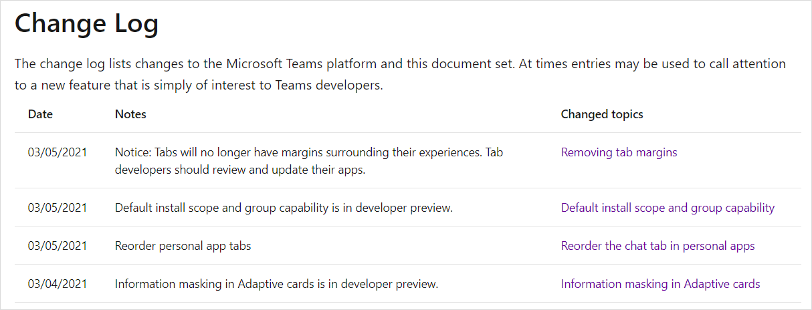
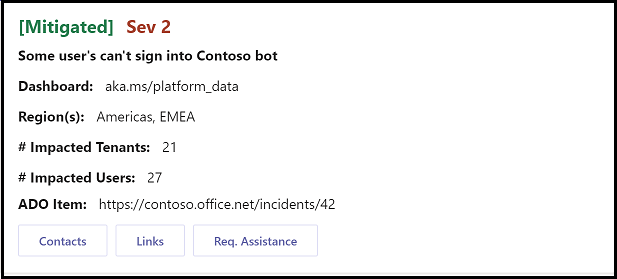
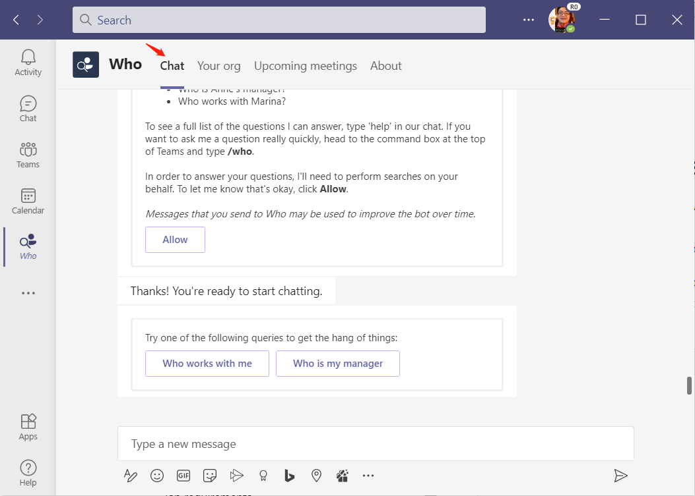
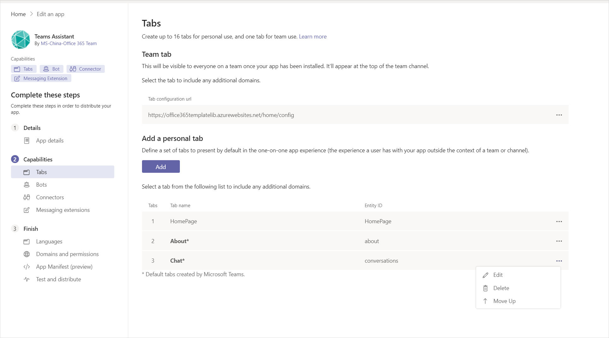
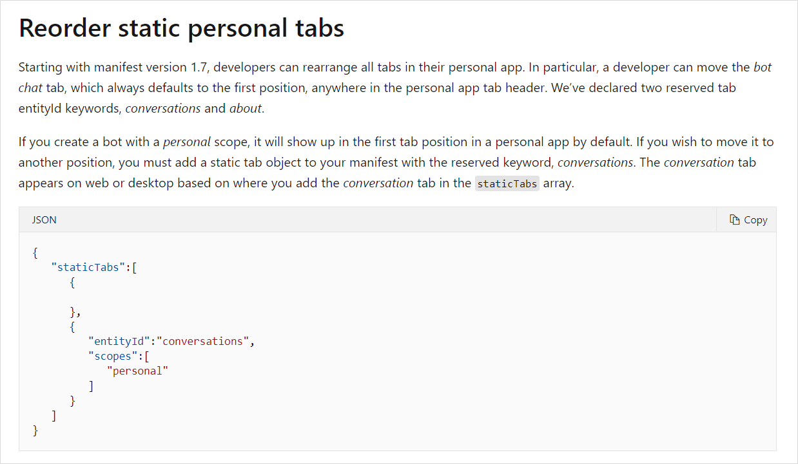
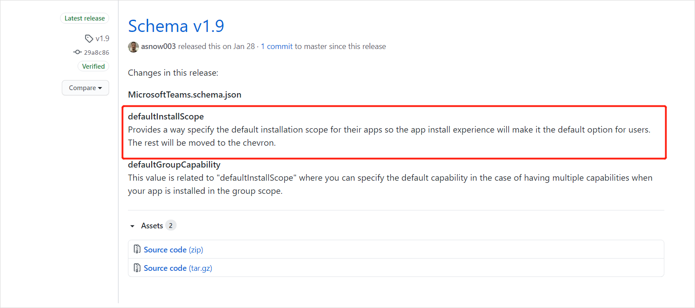
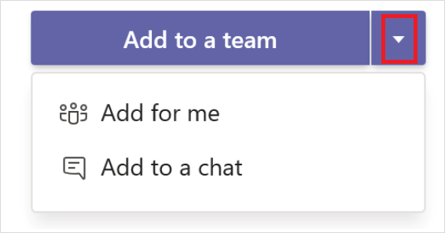
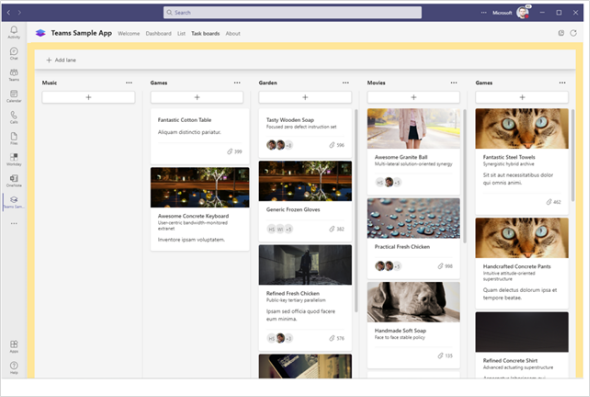
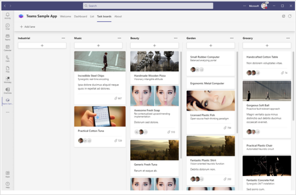

# Teams 开发平台月报（2021-03） 
> 原文发表于 2021-03-17, 地址: http://www.cnblogs.com/chenxizhang/p/14552354.html 

摘要
==

 

这个月的Teams 开发平台月报如期而至，这个月报会在每月中旬左右根据官方文档整理发布，并适当加上一些我的观察和见解，给大中华地区的合作伙伴或开发者朋友们参考。

本月到目前未知有如下的更新，共四项。下面将逐一展开。**对于开发者来说，最重要的一个更新是："支持对选项卡自定义顺序（Reorder personal app tabs）"**

一、在自适应卡片上支持掩码控件 【开发者预览】
=======================

 

自适应卡片是一种新的媒介形式，它不是简单的文字消息，也不是静止的图片消息，而是具有交互性、图文并茂、且能够在不同的设备（包括移动设备）上面自动适应的卡片，它不仅展示信息，更加有利于用户快速地完成更多工作。

在Teams平台的多个场合，都能使用自适应卡片，例如机器人的交互消息，应用弹出界面，外部信息推送等。

自适应卡片的交互性不仅仅体现为可以定义按钮，还可以让用户输入内容，并且根据这个内容与后台交互，反过来又可以更新卡片。

上图是让用户输入密码的文本框，在最新的开发者预览版（用户通过Teams客户端开启这个选项），支持对于某些输入框（尤其是密码框）提供掩码。

那么，是如何定义这种格式的卡片呢？很简单，你可以在定义这个控件时，指定isMasked属性为true即可。

 

更多详情，请参考 <https://docs.microsoft.com/en-us/microsoftteams/platform/task-modules-and-cards/cards/cards-format#information-masking-in-adaptive-cards>

 

二、个人应用选项卡顺序允许自定义
================

 

这个问题由来已久。所谓个人应用，是指我们在定义应用时选择scope时，选择了"personal"这个类别的应用。机器人和选项卡应用都可以定义是否为个人应用。问题就出在这里，如果一个应用，既包含了机器人，又包含了选项卡应用，那么默认情况下，机器人也会用一个选项卡呈现，而且这个选项卡会排在第一位。如下图所示

在很多时候，这可能也没有什么问题，有时候可能就很不友好。这取决于你这个应用中，机器人和选项卡应用谁为主次的关系。现在好了，你可以自由决定这些所有的选项卡的顺序了。机器人的那个"Chat"的选项卡，以及最后的"About"选项卡，都是可以调整顺序的。

如图所示，你可以在AppStudio中，通过可视化界面对选项卡进行顺序调整（Move up 或者 Move down)，你也可以通过直接编辑Manifest的方式来调整。如下

这个功能目前已经全球可用，请确保你的manifest版本号是1.7以上即可。

更多详情，请参考 <https://docs.microsoft.com/en-us/microsoftteams/platform/tabs/how-to/create-tab-pages/content-page#reorder-static-personal-tabs>

 

三、指定安装应用的默认范围【开发者预览】
====================

 

这个最新添加的属性，允许我们在manifest中指定当前应用默认安装的范围：个人，团队，群聊，会议等。这样也是为了提供更好的用户安装体验。

下图所示是设置了默认添加到团队。这个属性支持的值是：personal, team, groupchat, or meetings.

更多详情，请参考 <https://docs.microsoft.com/en-us/microsoftteams/platform/concepts/deploy-and-publish/apps-upload#add-a-default-install-scope-and-group-capability>

 

四、移除了选项卡默认的边距（margin）
=====================

 

这是一个很小的改进，从开发者角度无需特别做什么。简单地说，原先Teams 客户端在展示一个选项卡时，会有一个边距（margin），如下图所示

这样一来呢选项卡页面的尺寸就小了一点，另外就是这样显得跟外面的Teams客户端主界面有些不协调。改进后的显示效果如下

那么看起来是不是更加舒服一点呢？

 

 

