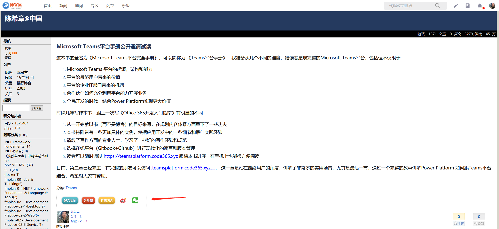
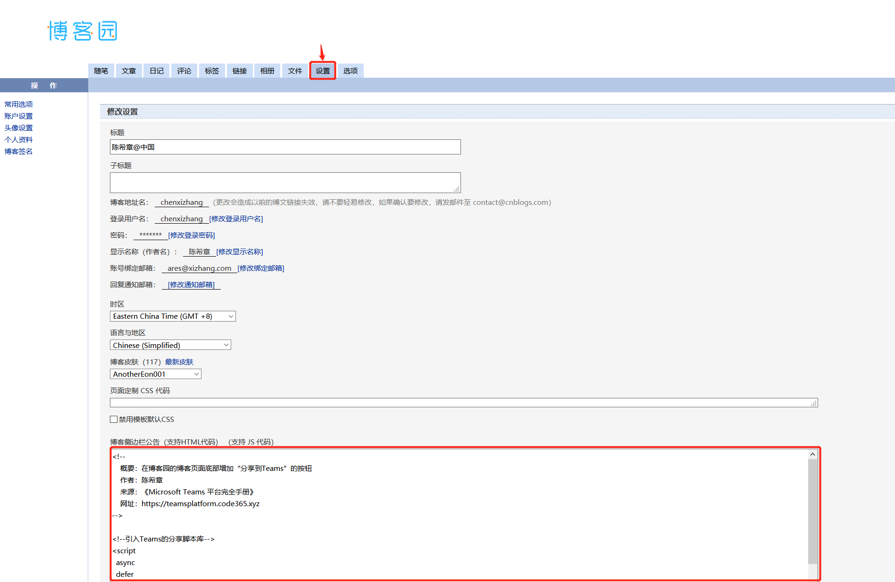
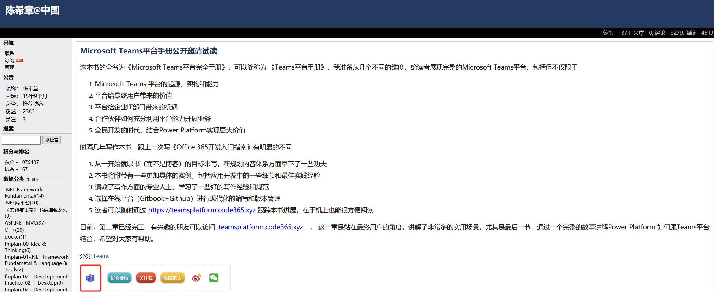
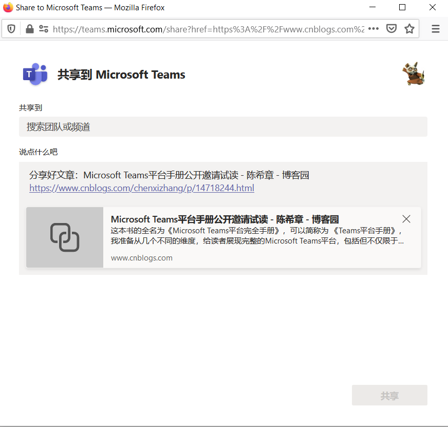
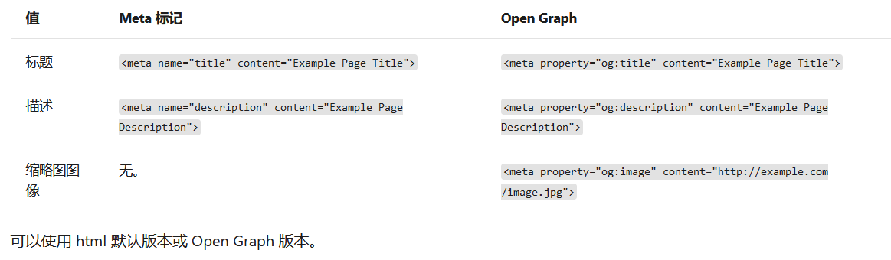
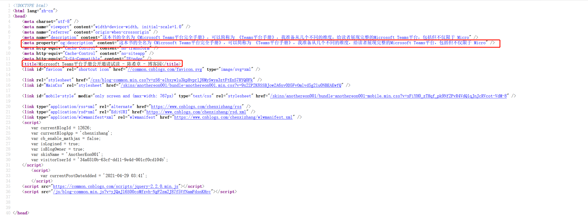

# 为博客园文章添加 “分享到Teams”按钮 
> 原文发表于 2021-05-03, 地址: http://www.cnblogs.com/chenxizhang/archive/2021/05/03/14726962.html 


 本文是《Microsoft Teams平台完全手册》的一部分，有兴趣请参考 <https://teamsplatform.code365.xyz> 


Microsoft Teams是一个围绕沟通协作的平台，信息分享是很重要的。那么，如果你有一个网站，如何让你的用户很容易地将网站内容分享到Teams呢？

下面通过实例讲解如何实现这个目的。熟悉我的朋友可能知道，我长期撰写技术博客，而博客园也是我认为中国做的很不错的博客平台，默认情况，目前博客园提供的模板中已经包含了一些分享的能力，包括分享到微博、微信等。下面我尝试为它添加分享到Teams的功能。

为网站添加“分享到Teams”按钮
=================

Microsoft Teams提供了一个专门的库，可以很容易地生成分享按钮。下面的完整代码，请大家参考一下，其实逻辑很简单，我在现有分享工具栏的前面插入了一个按钮，并且按照规定定义了有关的属性。


```
<!-- 概要：在博客园的博客页面底部增加“分享到Teams”的按钮 作者：陈希章 来源：《Microsoft Teams 平台完全手册》 网址：https://teamsplatform.code365.xyz-->​<!--引入Teams的分享脚本库--><script async defer src="https://teams.microsoft.com/share/launcher.js"></script><!--定义合适的样式--><style> .divblock { padding: 10px; border: #c0c0c0 1px dashed; display: table-cell; vertical-align: middle; }</style><!--在页面的合适位置放置这个按钮--><script> document.getElementById("green\_channel").setAttribute("class", "divblock");​ let sharebutton = document.createElement("div"); sharebutton.id = "green\_channel\_teams"; <!--这个属性很重要，决定了分享时提供给Teams的网页链接--> sharebutton.setAttribute("data-href", window.location.href); <!--这个按钮必须至少有teams-share-button 这个样式 --> sharebutton.setAttribute("class", "divblock teams-share-button"); <!--你可以通过属性设置分享的一些辅助文字说明--> sharebutton.setAttribute("data-msg-text", "分享好文章："+ document.title +" <br /> "); document .getElementById("blog\_post\_info") .insertBefore(sharebutton, document.getElementById("green\_channel")); shareToMicrosoftTeams.renderButtons(); document .getElementById("green\_channel\_teams") .getElementsByTagName("img")[0].style.marginTop = "10px";</script>​
```
现在可以把这段代码添加到我的博客后台设置中，请注意要添加到 “博客侧边栏公告” 这个区域，只有这里是允许JS代码的。

保存后，打开某个文章，就可以看到下方分享栏会多出来一个Teams的按钮。

点击此按钮，会自动弹出一个对话框，并且把相关文字和链接都按照规定组合好，你只需要在“共享到”这个框中搜索团队或频道，然后点击 “共享”按钮即可。

如果当前没有登录Teams，则在显示分享对话框前会提示用户登录。

网页元数据定义
=======

在分享到Teams时，会尝试进行网页的预览（如上图所示，通过链接可以解析得到标题和内容简介），以便给用户更加好的体验。那么这个是怎么实现的呢？

其实这个很简单的，你的网页只要按照下面的约定在Head中定义元数据即可。

考虑到对搜索引擎和不同平台的兼容性，我的建议是两个版本都定义。如果两者都定义了，Teams会以Open Graph定义的为准。

我们回过头去看刚才分享的博客园文章源代码

可以看出当前网页定义了title, description,og:description, 所以在分享时能解析出标题和描述，但没有定义缩略图，而且定义标题和内容摘要也不是特别规范。

感谢博客园提供的平台，以及允许自定义页面的能力。如果默认能把“分享到Teams”的按钮加上，并且在网页元数据这个部分能够规范一点就更好了。

​

