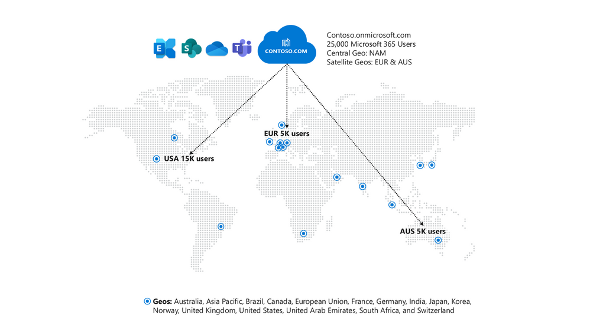
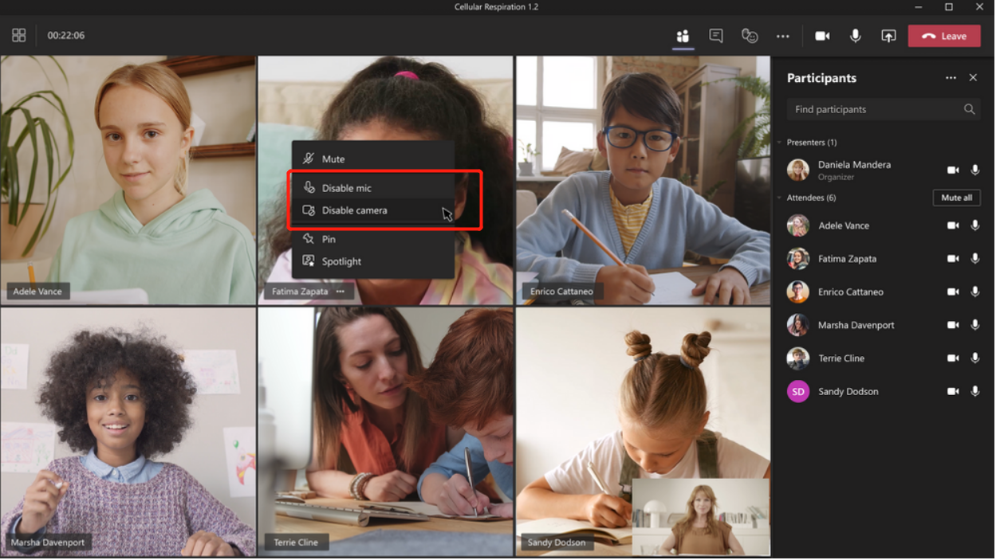
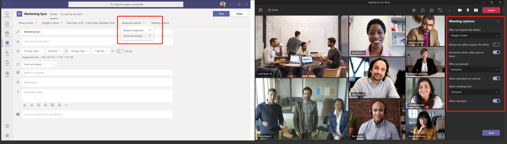
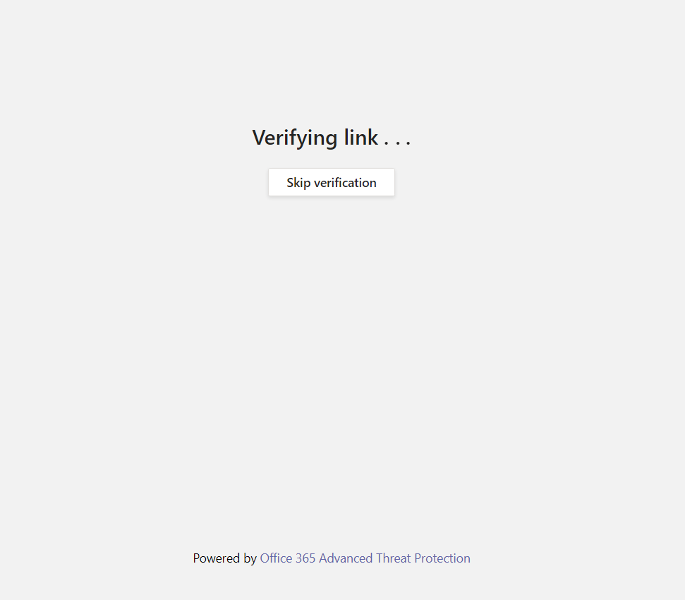
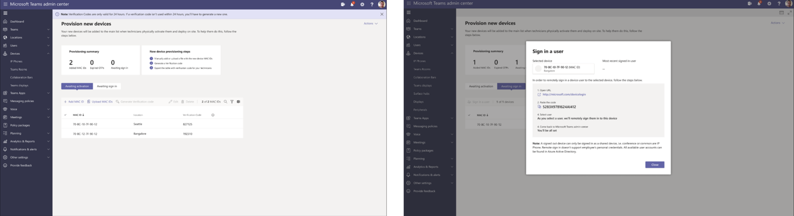
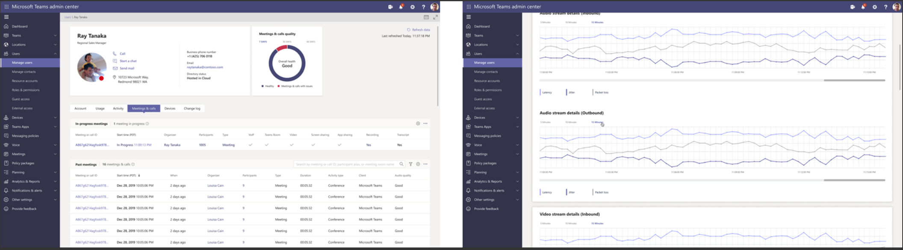
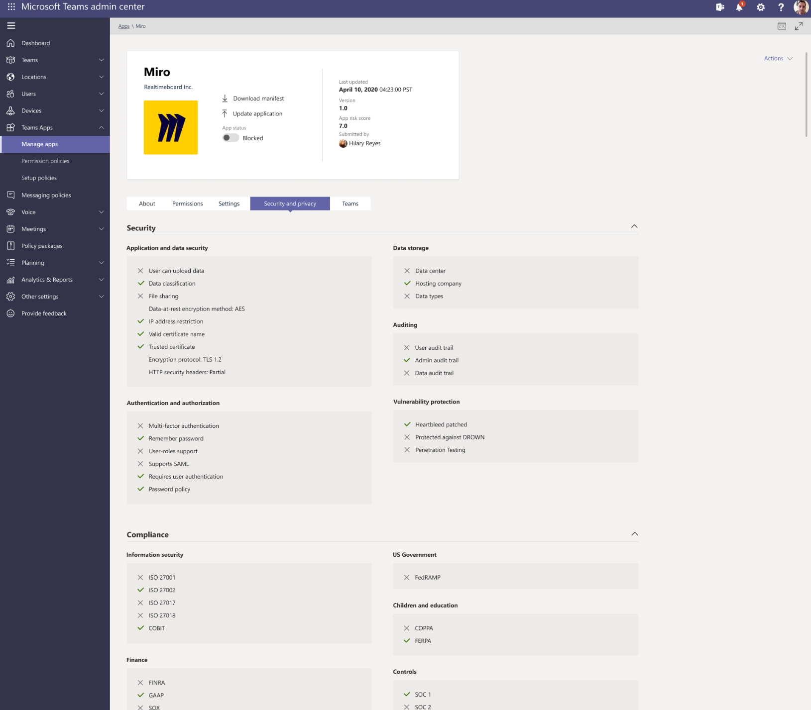
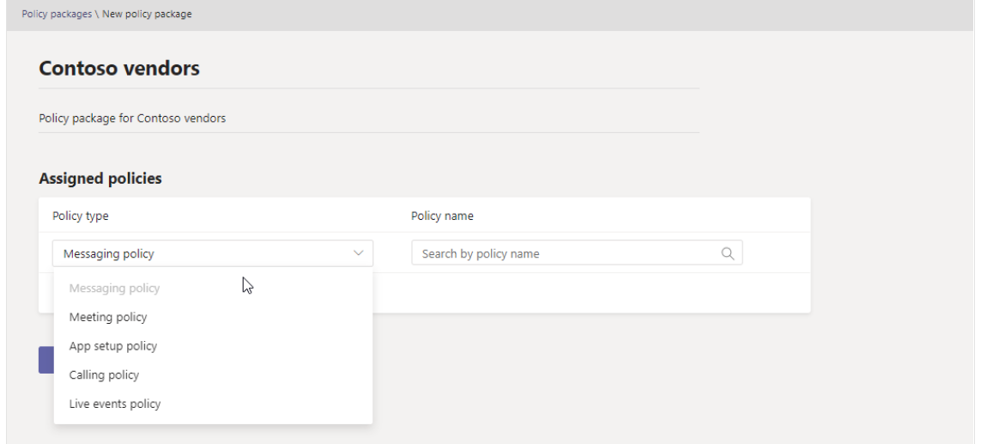

# Microsoft Teams最新功能发布 - 安全合规和可管理性 
> 原文发表于 2021-03-07, 地址: http://www.cnblogs.com/chenxizhang/p/14496666.html 

正在进行的2021年的Microsoft Ignite大会，发布了一系列跟Microsoft Teams相关的新功能，英文介绍请参考 https://techcommunity.microsoft.com/t5/microsoft-teams-blog/what-s-new-in-microsoft-teams-microsoft-ignite-2021/ba-p/2118226 ，我这里用中文给大家做一个简单地解读，并加上我的一些批注。

我将用三四篇文章来分别解读，这是第四篇，针对安全合规，隐私，以及给管理员提供的功能。

 

支持针对通话的端到端加密
------------

 

安全无小事。目前Teams 计划在本年底推出针对1对1 通话的端到端加密（**end-to-end encryption** (E2EE)) 支持，后期还将把此项技术应用到在线会议。

与此同时，为了满足不同公司的合规审查的需求，Teams 管理中心将提供针对此项功能的配置。

 

Teams Multi-Geo 支持
------------------

 

差不多在两年前，Office 365的核心模块（Exchange Online, SharePoint Online)开始支持Multi-Geo的功能，简单地说就是在同一个组织里，不同用户可以选择将以上模块的数据存在自己所在的区域，而不需要集中在存在某一个特定的区域。这样就为数据主权和相关的法规提供了支持。

很高兴在接下来的四月份，Teams也将开始支持Multi-Geo。

 

 

禁止与会者开启视频
---------

 

这个需求我曾经听到不止一个客户提出。在一些场合，由于部分参会者不熟悉，有意无意地打开自己的视频，可能会导致会议流程受到影响，或者引起尴尬的情况。此前Teams已经有选项可以控制音频（禁音）功能。

这个功能将在年内发布。会议组织者可以选择禁用某个参会者，或者禁用所有参会者打开视频。

仅邀请者可以参加的会议
-----------

 

这也是一个改进的功能。默认情况下，Teams的会议会有一个链接地址，只要有这个地址的用户，都可以加入会议。但对于一些重要的会议，你可能不希望不相关的人，有意无意地加入会议。之前Teams提供了选项对外部用户加入会议做出控制，例如外部用户，默认是作为来宾加入会议，会议组织者在选项中可以设置，如何让这些来宾加入会议。但对于内部用户，之前没有选项可以控制。

本月即将发布这项功能，可以让会议组织者设置，只有被邀请者才能加入会议。其他人，不管你是内部用户还是外部用户，都将跟上面提到的来宾体验一样，首先会在大厅等候，组织者决定是否允许他们加入会议。

Teams中的安全链接
-----------

 

为了减少客户受到网络钓鱼等的攻击，Microsoft 365在多个应用中，尤其是Outlook邮件中，通过安全链接的技术来避免攻击，其实简单地说，就是在原有链接基础上包装一个新的地址（微软特殊网址），这个链接点击后会在云端进行扫描（如下图所示），只有确定没有安全威胁后，才会重定向到实际的链接地址。这个月底之前，Teams 中也将提供安全链接功能，你再也不需要担心消息中的链接安全隐患了。

 

在Teams中共同编辑加密文件
---------------

 

共同编辑文档是现代协作和沟通中的一个富有价值的场景，尤其是多人、实时编辑的话，这个也是Office 365的传统强项（不管是从技术先进性，还是成熟度方面），不仅仅是在传统的Office客户端，还是Office Online，以及Teams中都可以可以的。

对于加密文件（通过RMS或者Microsoft Information Protection技术），情况有点不同。原先是需要通过Office 客户端才能进行共同编辑，现在也支持在Teams中直接共同编辑了。

 

全新的Teams Room Managed Service
-----------------------------

 

这个全新开发的，基于人工智能技术的托管服务，可以帮助企业主动地管理所有的Teams Room及相关设备，不仅仅是定期扫描风险、异常情况、缺失补丁等，并且可以主动地采取行动，让管理员的工作效率能够得到大大的提高。

 

远程设备部署
------

 

这个技术我都有点不敢相信。从功能说明是是这样的：我们将大大简化Teams安装设备的安装和配置，不需要物理机器登录，只需要知道MAC地址的话，管理员就可以在管理中心，对这台设备进行注册，然后分配一个可以用于登录的地址，以及一个验证码。用户在拿到移动设备后，输入以上的信息，后续就会自动地完成所有跟Teams相关的配置。

 

 

会议实时数据分析
--------

 

在今年年中（6月底左右），管理员可以实时地查看某个会议的数据分析，及时地给用户反馈，或者解决相关的问题。以往针对这类问题，管理员需要等到会议结束后，通过专门的诊断工具收集相关数据后才能进行分析。

 

 

匿名化用户数据
-------

 

这是进一步保护用户隐私的努力。虽然所有的使用量分析、统计报表都是只能由指定的角色人员才能查看，但是在这个月底之前推出一个新功能，是允许管理员启用匿名化用户数据。也就是说，所有的用户敏感信息（PII） 都会被脱敏，例如用户名，邮箱地址，用户id等。

不得不说，这真的是Teams相比较其他产品而言，极其独特的地方。我们始终把用户的安全、隐私、数据合规等放在第一位。

 

应用风险评估
------

 

在年底之前，管理员可以针对某个Teams App进行全方位，多维度的风险评估。如下图所示

 

来宾访问审查
------

 

这个月起，新增加了"自动来宾访问审查"功能，会针对不同的团队或组，定期组织审查活动，以确保在保证来宾访问的便捷性和安全性之间取得平衡。

 

策略打包和分发
-------

 

Teams 管理中心可以针对不同的功能指定策略，并且将策略指派给用户或某个群组。现在更进一步，管理员可以将多个策略，打包程一个package，然后将这个package分发给对应的用户或某个群组。

 

 

 

 

 

